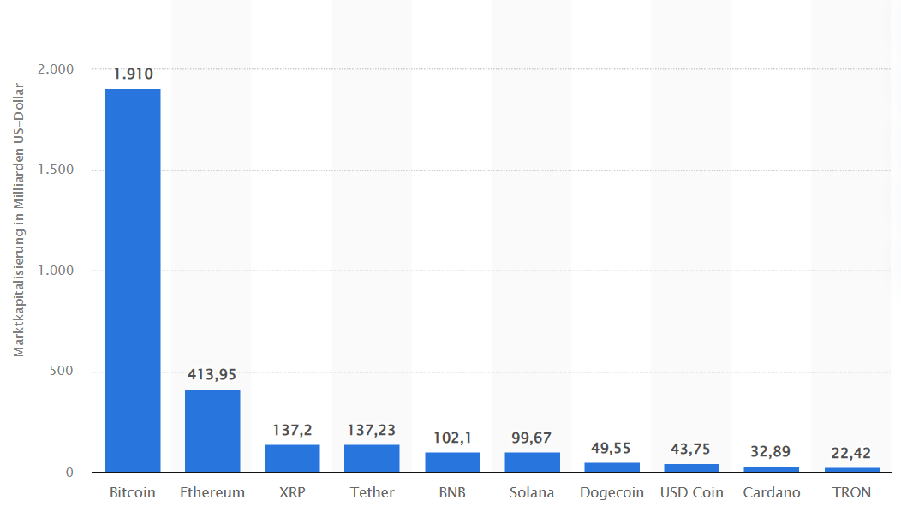
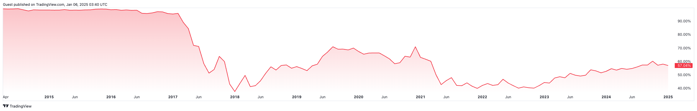

# Altcoin
"Altcoin" - kurz für «Alternative Kryptowährung» - steht für jeden Cryptotoken der kein Bitcoin ist.

BTC ist nicht nur der erste CryptoToken, sondern hat im Januar 2025 auch immer noch mit rund 60% der Marktkapitalisierung, gefolgt von ETH mit 20%  und XRP mit 8%. 

^ Marktkapitalisierung der 10 wichtigsten Token

---

^ BTC Marktkapitalisierung historisch

--- 

Altcoins are different in various ways from their consensus mechanism, to use case, or a combination of both.

Some altcoins have been developed to solve a problem with unique functions; others simply exist to rally and gather a community of investors and often speculators. The levels of adoption and network effects for each project vary.

The 6 common types of altcoins are:

* **[Stablecoins](#stablecoins)**
* **[Meme coins](#meme-coins)**

## Stablecoins
As the name suggests, Stablecoins attempt to offer relative price stability. Their market value is usually pegged to the value of a stable asset, like USD or gold.

This design characteristic lends resistance to (price) volatility, keeping the price as close to equal that of the asset it is pegged to. For example, USDC is pegged to the US Dollar and the price of 1 USDC should be equal to 1 US Dollar at any given time.

Typically, Stablecoins are backed by a reserve asset, as is the case with USDC & USDT – both are backed by and redeemable against the US Dollar. Algorithmic stablecoins are also out there; their smart contracts constantly adjust the supply of the stablecoin to maintain a price as close to a peg as possible. Algorithmic stablecoins, though, are yet to take-off following the collapse of the Terra Luna project.

In effect, stablecoins function like a fiat currency within a crypto space. They are often traded at high volumes, similar to cash in a traditional market, and are used as **vehicles to park funds in crypto**, perhaps as traders wait it out for the opportunity to roll into another type of cryptocurrency.

Examples are: USDC, 

## Meme coins
Meme coins are cryptocurrencies inspired by the social currency of the internet: memes. They could be directly inspired by a meme, like the well-established dog-themed projects Dogecoin (DOGE) and Shiba Inu (SHIB). Others are inspired by the cultural zeitgeist like Pepe (PEPE) and Peanut the Squirrel (PNUT), two newer meme coins which saw huge growth in 2024.

Anyone with an internet connection can fabricate and distribute a meme. And with the right technical knowledge, anyone can create and distribute a meme coin, too. A wave of celebrity-inspired or -endorsed coins have come and gone in the market, like these.

However, it’s the projects with more humble or even random figures heads that see the greatest investment and interest, particularly dog-inspired ones. While meme coins may lack any value beyond a cultural ideal, those invested get the feeling that they're involved in something greater. This community of coin evangelists help to grow or maintain interest in the asset through storytelling and social sharing.

Meme coins typically have a massive or unlimited supply, which accounts for their comparatively low per-unit price.

## Utility Tokens
This type of altcoin functions to provide a service within a network. They could be used as a means to gain access to a service, facilitate transactions, or earn rewards on a network. One example is XRP, a token designed to minimise the friction involved in cross-border transactions.

Another is TFuel, a coin that transfers value between users and providers on the Theta’s peer-to-peer video streaming service.

MATIC, the native token of the Polygon network has a variety of uses. It maintains network security through staking and is used as a gas token for transaction fees.

Investors usually invest in utility tokens because they believe in the potential of the underlying project. In a way, the token’s price value is a reflection of the value the project could provide to a wider audience.

## Play-to-Earn Tokens
This type is for gaming where users can earn cryptocurrency rewards. This can then be used to make in-game purchases (e.g. game-inspired NFTs), swapped into other cryptocurrencies or cashed-out into fiat currencies.

**Examples**: Axie Infinity that operates on the Ethereum blockchain

## Governance Tokens
Governance tokens give investors a say in how the project they are investing in is run. This democratised approach emphasises the decentralised nature of the project. Token owners not only use the protocol, they own it and shape it, too. Decisions are not made through a top-down, centralised hierarchy. A community votes together on any major platform changes.

Governance tokens usually exist as part of a DAO, or “decentralised autonomous organisation”. DAOs are not run by one central figure, rather users of the protocol abide by rules written into the code of the network, via smart contracts.

The level of sway investors have in a project is usually proportional to the size of their holding. An example would be Maker (MKR), which allows investors to vote on the operation of the MakerDAO platform.

## Security Tokens
Security tokens are often seen as the cryptocurrency equivalent to traditional stocks, whereby investors are entitled to dividend payouts as a share of the platform’s earnings.

Investors are attracted to these altcoins thanks to their value generating properties, which investors are familiar with given the stock market. However, these tokens have been subject to regulatory scrutiny due to their profit distribution mechanisms, which demand strict regulation according to senior officials such as the SEC’s (outgoing in Jan 2025) chair Gary Gensler.

Projects such as GMX & Synthetix, decentralised trading platforms (on the blockchain) reward token holders with a cut of the fees generated through those trading on the platforms themselves.

## Why Are Altcoins Important?

* Through the use of stablecoins, investors are able to **easily access the DeFi market**.

* Through the use of governance tokens, investors **can have a say in the direction of the projects** they have a stake in.

* Through the use of play-to-earn tokens, communities have found ways to **engage and benefit from the crypto ecosystem**.

