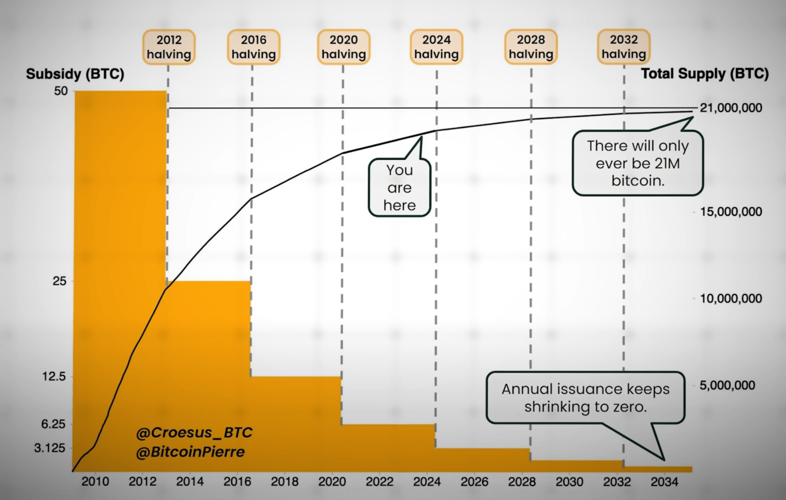

# BitCont Halving
-> [Mining](../M/Mining.md)
Heutzutage hängen spezialisierte **Mining-Computer** neue Blocks an die Blockchain, indem sie sich zuerst durch das Lösen eines komplizierter, mathematischer Rätsels dafür qualifizieren müssen. Für den damit verbundenen Stromverbrauch werden sie durch in jedem Block enthaltene Bitcoins belohnt. Bei der Gründung im Jahr 2009 waren das noch 50 BTC, heute aber nur noch - wegen dem im Code fix einprogrdammierten Halving-Prozess nur noch 3.125 BTC und so weiter bis im Jahr die fix encodirte Maximalmengen von 21 Millionen BTCs erreicht sein wird. Und  dann stellt sich natürlilch die Frage: was dann? resp. noch wichtiger: wann starten die damit verbundenen Probleme? Denn bereits im Jahr 2032 werden mit grosser Wahrscheinlichkeit bereits 99%+ aller möglichen BitCoins gemünzt sein.  

## Was nach dem letzten Bitcoin?
-> [Bitcoin Bureau auf Youtube](https://www.youtube.com/watch?v=z6zcS8IG-74&t=47s)

## Conclusion
When an answer on this remains in the dark, chances are good, that a better, alternative "coin" will take BTC's role and importance in the future. Problems have a tendency to be solved as mystic believes have a tendency to morph into hands-on realities.

