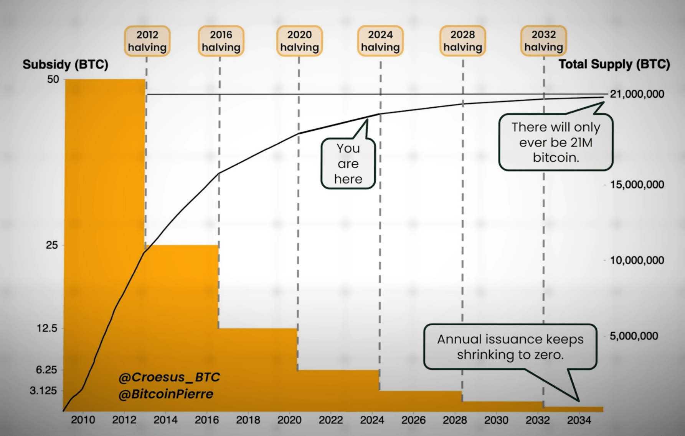

# Mining

* **[Solomining Bibel](https://yourdevice.ch/die-kleine-bitcoin-solo-mining-bibel/)**

* 
Heutzutage hängen spezialisierte **Mining-Computer** neue Blocks an die Blockchain, indem sie sich zuerst durch das Lösen eines komplizierter, mathematischer Rätsels dafür qualifizieren müssen. Für den damit verbundenen Stromverbrauch werden sie durch in jedem Block enthaltene Bitcoins belohnen (Bei der Gründung im Jahr 2009 noch 50, heute aber nur - wegen dem sogenannten Halfing - nur noch 3.125 BTC). 

Bei Kryptowährungen, die auf dem Proof-of-Work-Mechanismus setzen, werden neue Transaktionen durch einen Konsensmechanismus validiert, der sehr viel Rechenleistung beansprucht – auch bekannt als «Mining». 

Die Teilnehmenden, die ihre Hardware dazu bereitstellen, werden «Miner» genannt. «To mine» bedeutet auf Deutsch «schürfen». Das heisst, es werden neue Coins geschürft, indem die verfügbaren Computer Rechenaufgaben lösen. Weil es keine Formel zum Errechnen der korrekten Lösung gibt, muss geraten werden. Bis die richtige Zahl gefunden wird, benötigt es in der Regel etliche Runden des Ratens und Überprüfens. Als Belohnung werden bei erfolgreich gelösten Aufgaben neue Coins der entsprechenden Kryptowährung ausgegeben. Allerdings bedarf der ganze Prozess aufgrund der hohen Komplexität enormer Rechenleistung.

## Wie läuft das Mining genau ab?
Der Prozess vom Generieren eines Hashes bis zur Veröffentlichung eines gültigen Blocks sieht grob gesagt so aus:

### Block Template
Der Pool verteilt mit "mining.notify" ein neues Block Template, entweder weil die Transaktionen aktualisiert wurden oder weil das Netzwerk einen neuen Block gefunden hat.

Bei der Übermittlung eines Block Template werden gemäss Stratum Protokoll die folgenden Werte übermittelt:
jobId, prevHash, coinbase part1, coinbase part2, merkle_branch, version, bits, timestamp, clear jobs

### Generieren des Hashes
Der Miner ergänzt diese Daten um:
👾 extraNonce2 (selbst generiert)
👾 nonce (startet bei 0)
Aus diesen Daten wird der Block-Header zusammengestellt.

Der Block-Header wird zweimal durch die SHA256-Funktion gehasht.

### Variieren der Nonce
Wenn der generierte Hash nicht unter dem Work-Difficulty Target liegt, erhöht der Miner die Nonce um 1 und wiederholt den Hashing-Prozess.
Dieser Vorgang wird Milliarden Mal pro Sekunde wiederholt.

Wenn alle möglichen nonce-Werte (2^32) erschöpft sind, ändert der Miner:

1. die extraNonce2 oder
2. den timestamp (innerhalb erlaubter Grenzen)

und beginnt wieder bei 0 mit dem Hochzählen von den möglichen nonce-Werte (2^32 = 4'294'967'296)

### Übermittlung an den Pool
Wenn ein Hash gefunden wird, der unter der vom Pool vorgegebenen Work-Difficulty liegt, wird der Share mit "mining.submit" an den Pool übermittelt.

Bei der Übermittlung eines Shares werden gemäss Stratum Protokoll die folgenden Werte übermittelt:

id, userId, jobId, extraNonce2, ntime, nonce, versionMask

Der Pool überprüft den Share.

### Veröffentlichung eines gültigen Blocks
Wenn der gefundene Hash auch unter dem Netzwerk-Difficulty Target liegt, erkennt der Pool einen gültigen Block.

Der Pool stellt den vollständigen Block zusammen:

* Block-Header mit den vom Miner gefundenen Werten
* Coinbase-Transaktion mit Belohnung für den Miner
* Transaktionen

Der Pool broadcastet den Block sofort an verbundene Bitcoin-Nodes.

Die Nodes validieren den Block und leiten ihn weiter.

Andere Miner beginnen, auf dem neuen Block aufzubauen.

Der Pool sendet einen neuen Mining-Job mit einem neuen Block Template an alle verbundenen Miner.

---

## Solo-Mining (Lottery Mining)
Beim Solo-Mining versucht ein Miner auf eigene Faust, einen Bitcoin-Block zu finden. Im Gegensatz zum klassischen Pool-Mining, wo viele Miner ihre Rechenleistung bündeln und die Belohnung aufteilen, erhält der Solo-Miner die komplette Block-Belohnung (aktuell 3,125 BTC plus Transaktionsgebühren) - allerdings nur, wenn er tatsächlich einen Block findet. 

Dabei könnt ihr entweder eure eigenen Node betreiben mit einem eigenen Solo-Pool wie zum Beispiel Public-Pool von Benjamin Wilson oder über einen Solo Mining Pool eines bestimmten Anbieters arbeiten, der die Infrastruktur bereitstellt.