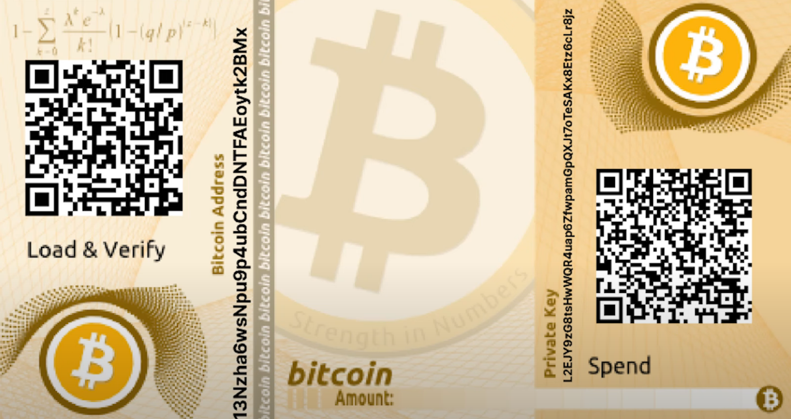
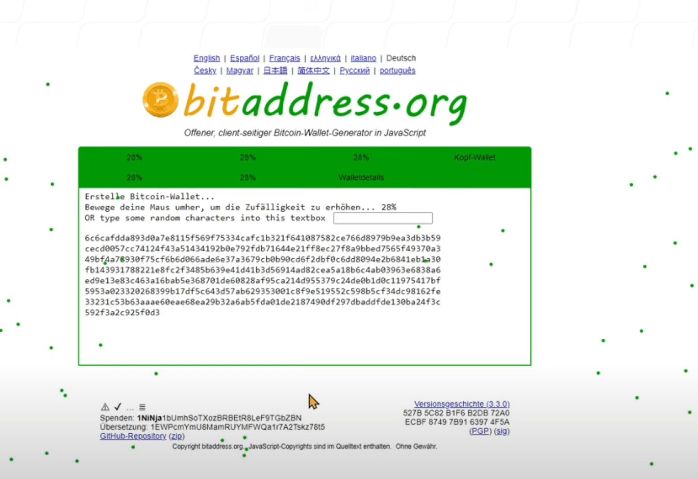

# Paperwallet
-> Generic [Wallets](../W/Wallet.md): Overview, Purpose and how to work with them

Eine Paperwallet ist ein Papierdokument welche alle Informationen (den [Public Key](PublicKey.md) und den [Private Key](PrivateKey.md) als [Seed Phrase](../S/SeedPhrase.md) und/oder als QR-Codes codiert) enthält, um damit Zugriff auf ein eigenes Cryptokonto zu haben. 

Anstelle von Papier können auch haltbarere Materialen wie z.B. Metallplatten verwendet werden.

Damit zählt eine Paper Wallet zu den sogenannten [Cold Storages](../C/ColdStorage.md) wie z.B. USB-Stick, Flashdrive oder Harddisk, welche permanent offline gehalten werden und somit nicht gehackt werden.

Ein Nachteil ist, dass auch Papier durch Feuer, Wasser oder Diebstahl verloren gehen kann oder kopiert wird.

## Paper Wallet selbst erstellen 
Dafür benötigt man 1. einen Internet-Anschluss, 2. ein Stück Papier und einen Drucker

1. Gehe auf **https://BitAddress.org** (oder z.B. LiteAddress.org für Litecoin) 

2. **Trenne anschliessend dein Gerät vom Internet** (dabei reicht es den Zugriff aufs Internet temporär zu unterbinden (unten rechts auf des Netzwerk-Symbol und dann "Trennen" klicken). 

    > **Hinweis**: der Generator ist ein **CLIENTSEITIGES JavaScript**. Der damit generierte Schlüssel wird damit immer OFFLINE generiert. Er könnte aber von einer Spyware gelesen und beim nächsten Connect mit dem Internet übermittelt werden!

3. Aktiviere nun auf der zuvor geladenen **https://BitAddress.org**-Page durch das **Bewegen der Maus** den eingebauten Zufallsgenerator (auf dem GANZEN Schirm bewegen, nicht nur in der grünen Box!!) **bis die Anzeige bei 100% steht**. 

    > 
    > **Hinweis**: Die Maus hinterlässt beim Bewegen grüne Punkte. Alternative kann man auch Zeichen in die Textbox eingeben.

4. Sobald die **100% erreicht** sind werden automatisch die beiden Schlüssel generiert und dann angezeigt. 

> Mit einem Klick auf dne [Generate New Address]-Knopf kann man sich mit der selbern Zufallszahl neue (QR-)Codes generieren lassen. 

Damit werden der öffentliche (grün links) und der private Schlüssel (rot rechts) der damit generierten Paper Wallet in hexadezimaler Form und als QR-Codes angezeigt. 

ACHTUNG: Diesen QR-Codes NICHT gleich scannen!

 und wählst die Anzahl der Adressen die nun generiert werden sollen (addresses to generate).

Nun klickst du auf die “Generate”-Schaltfläche, um neue Wallets zu erstellen.

Sobald die Wallets generiert sind, klickst du auf “Print”, um eine Kopie in Papierform zu erstellen.

Der Browser fragt nun, welchen Drucker du nutzen möchtest. Im Falle von Google Chrome kannst du die Seite auch als PDF-Datei speichern.

Nun schreibst du die öffentliche Adresse auf oder scannst den QR-Code der öffentlichen Adresse in eine Bitcoin App ein und transferierst die gewünschte Anzahl an Coins auf das Paper-Wallet.

Für Nutzer der Website Blockchain.info gibt es außerdem eine grundlegende Paper-Wallet-Option. Hierzu klickt man zunächst auf die Import/Export-Option und anschließend auf den Paper-Wallet-Link im linken Menü.

## Nachteile von Paperwallets
Paper Wallets sind für tägliche Transaktionen wenig geeignet weil, jedes Mal physisch auf das Papier zugegeriffen werden muss und das Papier damit schnell einmal kopiert oder beschädigt oder gleich ganz verloren gehen kann (man denke an die übereifrige Putze oder den Hund).  

## Vorteile von Paperwallets
Nebst dem, dass eine PaperWallet von jedermann einfach zu verwenden ist, man dafür nur Papier und einen Drucker braucht und man damit von Drittherstellern unabhängig bleibt, schützen Cold Wallets wegen ihrer Offgrid-Natur Schlüssel vor Hackern und Malware, und sind somit die **beste Option für die LANGFRISTIGE Verwahrung**.

## Risiken von Paperwallets
Das Risiko für einen Ausfall durch Materialfehler oder veraltete Software steigt mit der Zeit kontinuierlich. Auch könnte das Medium - inbesondere beim Gebrauch - gestohlen, verwechselt und/oder kopiert werden, könnte gleich ganz verloren gehen (die übereifrige Putze oder der Hund) oder fällt Feuer, Wasser oder einem Magneten zum Opfer.

## Backup von Paperwallets
Deshalb ist es **ratsam Backups von Cold Wallets auf unterschiedlichen Medien an verschiedenen Orten aufzubewahren und deren Lesbarkeit regelmässig zu überprüfen**

## Sicherheitsaspekte
1. Niemand sollte jemals dabei sein und zusehen, wie man eine Wallet erstellt oder verwendet: weder am PC noch am Drucker.

2. Niemals einen PrivateKey am PC mit Copy/Paste kopieren!

2. bitAddress.org erstellen private Schlüssel mittels BIP38-Algorithmus an. Dieser bietet eine Zwei-Faktor-Autorisierung für Paper Wallets.

3. Um jegliches Risiko von Spyware zu eliminieren, sollte ein neu aufgesetztes Betriebssystem verwendet werden. **Eine gute Möglichkeit ist es, einen USB-Stick oder eine DVD mit einer LiveCD Linux Distribution zu installieren**.

    > Verwende einen **air-gapped Computer**, dessen Betriebssystem von einem read-only Medium booted und keine Netzwerk-Hardware hat. Der Drucker darf keine Druckaufträge im zu Speicher lagern und muss direkt über ein Kabel mit dem Computer verbunden und WiFi ausgeschaltet sein.   

Sobald das Paper Wallet durch die Webseite aufgesetzt wurde, sollte es möglich sein, den Websitecode offline laufen zu lassen. **Deswegen sollte der Computer offline gestellt werden, bevor die privaten und öffentlichen Schlüssel erzeugt werden.**

Für besonders Vorsichtige ist es zu empfehlen, **das Paper Wallet nur auf einem Drucker zu drucken, der nicht mit dem Netzwerk verbunden ist**.

Darauf achten, dass der QR-Code beim Drucken nicht verschmiert (Titenstrahler!!) oder sich verzieht (schlechte Papierführung). 

## Tips zur sicheren Aufbewahrung eines Paper Wallets
1. Verpacke sie sicher. Vielleicht in einen versiegelten Plastikbeutel, um sie vor Wasser und Feuchtigkeit zu schützen.

2. Laminiere deine Paper Wallet und schütze sie damit noch besser.

3. Bewahre sie in einem Safe auf, um sie vor Diebstahl und Feuer zu schützen.

4. Denke darüber nach, deine Wallet bei einem Notar zu hinterlegen.

5. Ev. Kopien anzulegen und sie an verschiedenen Orten aufzubewahren, falls doch mal eine verloren gehen.

6. Teile niemandem mit, wo deine Wallets liegen!

## Tips für den Umgang mit Wallets
1. Seit euch 100% sicher dass die Zieladresse stimmt BEVOR ihr Geld überweist.