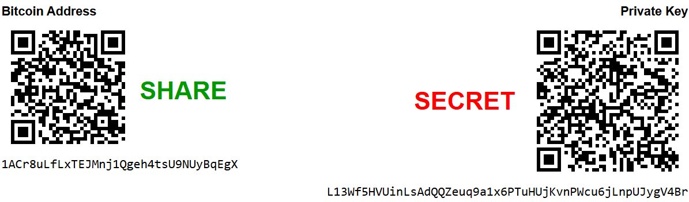

# Public Key: das Bankkonto

> Links steht der öffentliche Public Key. Er wird Bitcoin Address genannt und wird zuerst als QR-Code und darunter in kürzerer hexadezimaler Form angezeigt. 

> Rechts davon steht der geheim zu haltende Private Key ebenfalls als QRCode und in längerer hexidezimaler Darstellung. 

---

Der gemeinsam mit dem [Private Key](PrivateKey.md) generierte Public Key wird als **BitcoinAdresse** bezeichnet. Sie entspricht einem **Nummernkonto** deren Adresse Dritte benötigen wenn sie mir Bitcoins überweisen wollen.

Physisch ist ein Public Key eine hexadezimale Adresse die auf einen Slot der Bitcoin-Blockchain verweist wo mein aktueller Kontostand hinterlegt ist und auf den nur ich mittels [Private Key](PrivateKey.md) Zugriff habe. 

[Private Key](PrivateKey.md) und Public Key werden immer gemeinsam z.B. mit der App auf https://bitaddress.org generiert -> Details dazu findet man im Kapitel [Selbstverwahrung](../../b$/PROC/Selbstverwahrung.md)

ACHTUNG: Satoshi advised that **one should never delete a wallet.**