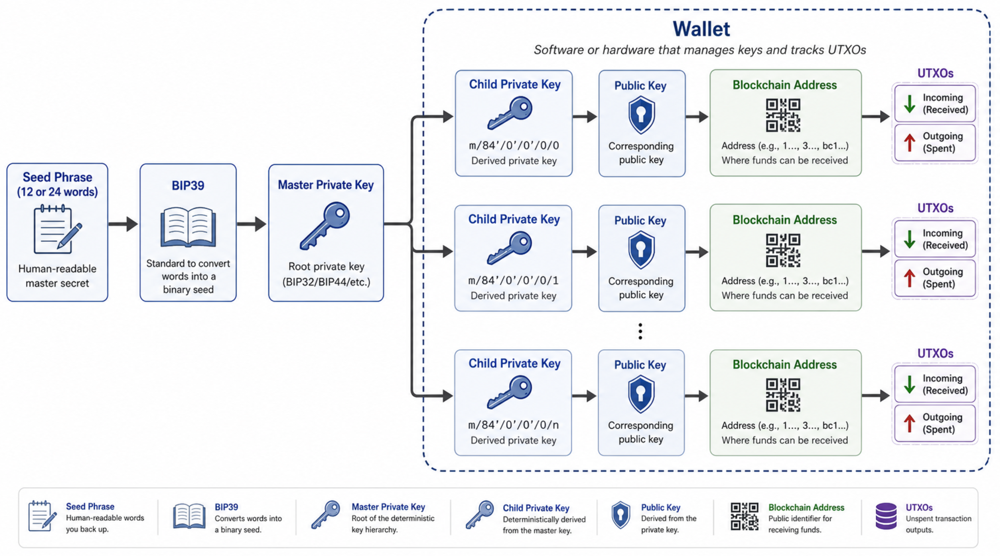

# Seed- oder Wiederherstellungsphrasen für MiniWallets
> (**Uebersicht only** für das generisches Crypto Glossar)

* **[Wallet](../W/Wallet.md)**

*  [**BIP39 Wordlist** im PDF Format](../B/BIP39_Wordlist.pdf)

* [SeedPhrase **im Detail**](../../b$/GLOSSAR/S/Seed.md)  

* [**SEED-Verwaltung**](../../../PRIV/_KEY/Admin/PW/SeedVerwaltung.md): Erstellen und Ablage von neuen Seedphrases

-> [**CRYPTO-Verwaltung**](../../../PRIV/_KEY/Assets/Crypto/_CryptoVerwaltung.md): Single Point of Entry Dokument für alles Crypto und damit auch Uebersicht über alle aktiven Wallets und Seedphrases im Einsatz.

* [BIP39 Wortliste](../B/BIP39%20Wortliste.md)
---

In DIESEM Dokument erkläre ich  

> **was eine [Seed Phrase](SeedPhrase.md) ist und wofür sie grundsätzlich verwendet wird**. 

Die konkrete Verwendgung im Kontext meiner CryptoAssets wie z.B. der [Relai-Wallet](../../../PRIV/_KEY/Assets/Services/R/Relai/_Relai.md), wird in einem separaten [Seed Verwaltungs-Dokument](../../../PRIV/_KEY/Admin/PW/SeedVerwaltung.md) beschrieben. 

## Was ist eine SeedPhrase?
Eine Seed-Phrase ist eine geordnete Liste von 12-, 18- oder 24 Wörter, die i.d.R. beim Erstellen einer neuen [(Mini-)Wallet](../W/Wallet.md) nach einem [BIP39](../B/BIP39%20Wortliste.md) genannten Verfahren einmalig aus dem in der Wallet gespeicherten PrivateKey generiert wird, um diese oder eine andere (kompatible) Wallet bei Bedarf wieder herstellen zu können oder (parallel dazu) eine weitere, externe (Backup)Wallet eines anderen Anbieters zu erstellen, mit der man ebenfalls auf die damit generierten Adressen und den darauf verbuchten Bitcoin UTXOS zugreifen kann.

ACHTUNG: **für [Life Wallets](../L/LifeWallet.md) verwende ich nur noch seedless HardwareLösungen** wie z.B. [Tangem Karten](../../../PRIV/_KEY/Assets/Products/Hardware/T/Tangem/_Tangem.md), die keine Seedphrases mehr benötigen. 

## Wie wird eine Seed erstellt?
Eine Seed (resp. eine Seedphrase mit 12/18/24 Wörtern) erstellt man i.d.R. nicht selber, sondern wird beim Erstellen einer neuen Wallet automatisch von der WalletSoftware aus dem zuvor von der Wallet zufällig generierten Masterkey abgeleitet und (auf expliziten Wunsch) in der WalletApp angezeigt. 

Die Seedphrase wird nicht in der Wallet gespeichert, sondern wird bei Bedarf immer wieder neu aus dem in der Wallet verschlüsselt gespeiherten MasterKey generiert. 

Diese Seedphrase ist beim Erstellen der Wallet SOFORT gem. [**SEED-Verwaltungs Konzept**](../../../PRIV/_KEY/Admin/PW/SeedVerwaltung.md) gem. Konezpt ["Seed Verwaltung"](../../../PRIV/_KEY/Admin/PW/SeedVerwaltung.md) im [CredNot-Booklet](../../../PRIV/_KEY/Admin/PW/CredNot.md) zu sichern. 

Wird die Wallet gelöscht oder sollte sie aus einem Grund nicht mehr funktionieren, ist diese Seedphrase noch das Einzige was bleibt, um wieder Zugriff auf die damit verwalteten BTCs zu bekommen (resp. werden weder Seed not MasterKey auf der Wallet gespeicher, derweil die damit generierten effektiven Private und Public Keys ohne letzte verschlüsselt beleiben, resp. auch nicht im Klartext vorliegen). 

Natürlich muss man der Wallet(Software) trauen, dass sie die für die Generierung des Masterkeys benötigte Entropy zufällig generiert und die damit generierte Seed oder den Masterkey nirgendswohin kopiert, sowie die davon abgeleiteten Schlüssel nach höchsten Sicherheitsstandards verschlüsselt hält (resp. ein Hacker ohne das Zugangspasswort zu deiner App diese Keys nicht aus dem auf deinem Handy installierten Code oder Daten unverschlüsselt auslesen kann!). 

## Wozu werden Seeds benötigt?
Am häufigsten dienen **Seeds der Authorisierung von Transaktionen**. 

Weniger häufig, aber umso wichtiger, sind Seeds bei der **Wiederherstellung der Wallet** (z.B. bei einem Handyverlust oder beim Wechsel auf eine andere oder weitere, resp. dem zusätzlichen Aufsetzen einer **BackupWallet** für eine alternative Zugriffsmöglichkeit auf die PrimärWallet und damit auf dasselbe BTC-"Konto" resp. BTC-Adressen mit den darauf verbuchten UXTOs. 

Bei der Wiederherstellung einer Wallet generiert diese an Hand der Seedphrase wieder den Privat-Key mit der sie wieder auf das zugehörige (anonyme) BitCoin-"Konto" zugreifen kann, resp. erhält man mittels Eingabe dieser SeedPhrase auch mit jeder anderen, auf einem beliebigen Gerät in einem beliebigen Moment und beliebiger Wallet-Software so über diese wieder Zugriff auf seine Bitcoins, resp. den Inhalt an den vom Public-Key abgeleiteten Blockchain-Adressen. 

Mittels Seed Phrases lassen sich die ansonsten unmerkbar kryptischen als 64HexString geschriebene Masterkey einfacher sichern und wieder eingeben.  

---

> ACHTUNG: 
Die Seedphrase ist das **100% EINZIGE Mittel um bei Verlust oder Ausfall deiner Wallet jemals wieder auf deine BitCoins zugreifen zu können**.   
Seedphrasen sind, bei entsprechendem Vermögen, **wichtiger als Autoschlüssel oder Bankkontonummern**.

## Mini- versus Life-Wallets
Die Speicherung von gem. [SeedVerwaltungsKonzept](../../../PRIV/_KEY/Admin/PW/SeedVerwaltung.md) verschlüsselten Seedsphrases im nur [Cred Not-Booklet](../../../PRIV/_KEY/Admin/PW/CredNot.md) gilt nur noch für meine [Mini Wallets](../M/MiniWallet.md) die ich für die täglichen Zahlungen, CryptoTrading, Evaluations-, Schulung-, Test- oder "Just4Fun"-Wallets benötige, wo mir Komfort, Preis und Verfügbarkeit von PaperWallets wichtiger sind, als State of the Art Non-Seed-Security. 

Für [LifeWallets](../L/LifeWallet.md) für den Zugriff auf substantielle Anlage-Konten ab CHF 1000.-- aufwärts verwende ich ausschliesslich VERTEILTE Cold/HarwareWallet-Technologien die OHNE Seedphrase auskommen und damit ohne physischen Zugriff auf mindestens zwei voneinander unabhängigen Chip-Karten die direkt über RFID ins Handy eingelesen werden, zu 100% nicht mehr gehackt werden können.

## BTC-Vermögen OHNE Wallets aus der Seedphrase ableiten
**Leider kann man den BTC-KontoStand nicht direkt aus der 12-Wörter SeedPhrase ableiten!** 

Stattdessen muss man die in einer Wallet verwendeten PrivatenAdressen ebenfalls von diesem Seed ableiten, resp. manuell das machen, was jede Wallet bei einer Wiederherstellung auch macht. Hierzu verwendet man in der Regel spezielle OfflineTools (man könnte das theoretisch auch von Hand, was aber sehr tiefes mathematisch/cryptografisch Verständnis erfordert). 

Anschliessend kummuliert sich der BTC Betrag aus der Summe der auf diesen Adressen vermerkten UTXOs. 

#### What the seed phrase actually does
Your 12 words are a BIP39 seed phrase; wallets convert it into a large “seed number,” then deterministically derive a sequence of private keys and addresses from it.

**The Bitcoin network never sees your seed or private keys; it only ever sees the derived (public key) addresses and their unspent transaction outputs (UTXOs) where wallets just scan those addresses on the blockchain to sum your balance.**

So to check the balance “without a wallet,” you still need to do what the wallet would do: generate those addresses, then query the blockchain.

#### 1. Offline Step: derive addresses from the seed
One common approach used by many in the Bitcoin community is:

Download an offline BIP39/HD wallet derivation tool (e.g. the well‑known “Ian Coleman BIP39” tool as an HTML file) on a clean machine, disconnect from the internet, and open it locally.

Enter your 12-word seed phrase into the offline HTML tool, set:

Coin: Bitcoin (BTC),

Derivation path to match your original wallet if you know it (e.g. m/44'/0'/0'/0 for legacy, m/49'/0'/0'/0 for nested SegWit, m/84'/0'/0'/0 for native SegWit).

The tool will list a table of derived addresses (first, second, third, etc.), each with a corresponding public address string starting with 1, 3, or bc1.

You can then copy a handful of these public addresses (they are safe to expose) to check on the blockchain.

#### 2. Online Step: check balances via block explorers
Once you have public addresses, you can use any block explorer to see balances:

Tools like BitRef, Mempool.space, Blockstream.info, or similar let you paste a Bitcoin address and show:

* Current balance,

* All past transactions,

* UTXOs.

Enter each derived address from the previous step into such an explorer to see if it contains BTC; your total balance is the sum of all UTXOs across addresses controlled by your seed.

These explorers never see your seed or private keys; they only use public blockchain data.

#### Why you can’t realistically do it “purely by hand”
In theory, you could implement the BIP39/BIP32/BIP44 algorithms manually and derive the addresses yourself, then query a full node, but this requires complex cryptography (HMAC‑SHA512, elliptic curve math, etc.).

In practice, everyone uses some kind of software to derive addresses, even if they don’t think of it as a “wallet”; the difference is whether that software is online, closed‑source, or untrusted.

## Relai specific derivation
Relai uses standard BIP39 12‑word seeds (recovery phrase) with **native SegWit Bech32 addresses all starting with (bc1…)** with derivation path starting at ***m/84′/0′/0′/0***. 

Threfore your Relai seed is compatible with tools like Electrum and other BIP39‑aware software.

With this 12 seed/recovery words you can  
1. either import them into an other BIP39‑compatible wallets or
2. or derive the same addresses in another tool (offline) and then manually check their balances ony by one on a block explorer. 

The Relai team themselves suggest that if you want to restore or access your Relai wallet elsewhere (e.g. if you used Relai only as a wallet), you should restore the 12‑word Relai seed in Electrum and use the BIP39 option.

In Electrum, you choose “I already have a seed,” enable “BIP39 seed,” and select native SegWit (which corresponds to the m/84'/0'/0'/0 path), then Electrum will show your transaction history and balance.

Once Electrum is set up, you can also export addresses and paste them into any blockchain explorer if you want to verify balances independently.

### Where the “knowledge” lives
The blockchain itself only stores UTXOs keyed by addresses (or script hashes); it does not know which seed or wallet owns them.

Your wallet’s job is to map “this seed → these derivation paths → these addresses” and then look up which UTXOs belong to those addresses, caching them locally so it does not need to rescan the entire chain every time.

So the wallet doesn’t have a preloaded list of “used addresses”; it recomputes them from your seed and discovers usage by scanning, using rules like the gap limit to decide when it has found all relevant UTXOs.

Do you want a more concrete, dev‑level description (e.g. pseudo‑code) of how a wallet scans addresses and applies the gap limit to find UTXOs?