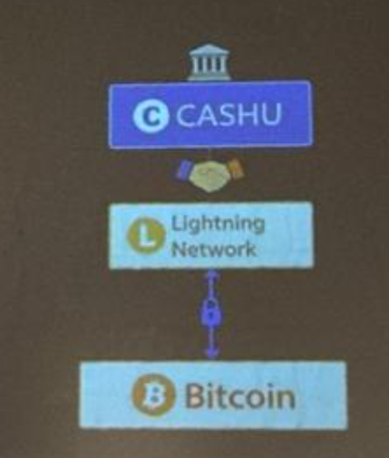
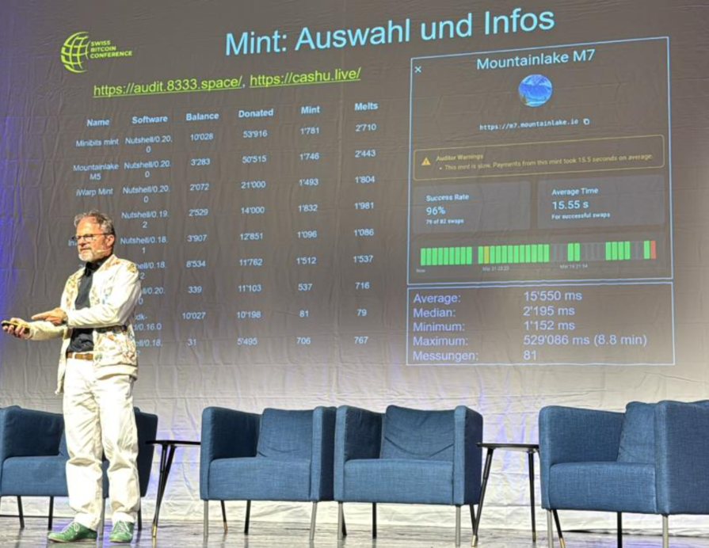
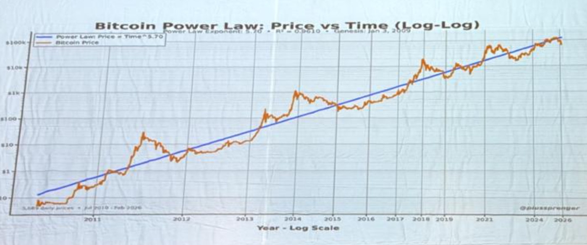

# Swiss Bitcoin Conferenz Kreuzlingen 2026
vom Freitag 24.  bis Sonntag 26. April 2026 für 199.-- im Vorverkauf

# Swiss Bitcoin Conference

* [Homepage](https://swiss-bitcoin-conference.com/)

* [Instagram](https://www.instagram.com/swissbitcoinconference/tagged/)

## ## Immediate Actions
1. Die Whatsapp Notes durchgehen und zusammenfassen

2. Mich in KI Agent 2 Agent Kommunikation auf der Basis von Lightning und/oder Cashu einlesen. 

3. Die BitAxe in Betrieb nehmen

4.  Das Lightning Buch lesen 

## Program
[ProgramLink](https://swiss-bitcoin-conference.com/programm/)

## Highlights
1. Habe mir für 259.-- **meinen ersten [BitAxe](https://bitaxe.org/) Miner** gekauft. 
2. Habe grosse Präsenz am Mikrofon
3. Zum ersten mal von **Cashu** und **Macadamia** gehört
4. zum ersten mal mit **BTC via Lightning** von der [_Mt. Pelerin Wallet ](../../../../../PRIV/_KEY/Assets/Services/M/MtPelerin/_Mt.%20Pelerin.md) bezahlt nachdem ich unkompliziert 50.-- überwiesen bekommen habe. 
  
-> https://dezentralshop.ch/product/bitaxe-gamma-v602-supersink-swiss-edition/

5. Das Notizenmachen mit dem iPhone hat sich bewährt
6. Im Spar kann man mit Bitcoin bezahlen
7. Die News folgen der Kursentwicklung, nicht umgekehrt!
8. Nach einer aktuellen kurzen Baisse hätte Gold weiterhin Potential nach oben (Mark J. Valek, Incrementum AG)
9. Mit Bitcoin kann man auch Tiere füttern :-)
10. Bitbox scheint DER Standard bez. SeedVerwahrung zu sein

## Links

* [BitBox Mentoring](https://bitbox.swiss/de/?utm_source=btcmentoring&utm_medium=webcast&utm_campaign=landingpage&ref=btcmentoring)
* [Pocket](https://pocketbitcoin.com/de) funktioniert super mit einer Bitbox zusammen
* [NadaNada.me](https://nadanada.me/)
* [btcMap.org](https://btcmap.org/)
* [BitRefill](https://www.bitrefill.com/ch/de/) mit BTC auf CHF lautende Einkaufsgutscheine zum Tageskurs erwerben
* [DezentralShop](https://dezentralshop.ch/)
* [DFX](https://dfx.swiss/)
* [Bitaxe aufsetzen](youtube.com/watch?v=zrNY8-2-jsI&source_ve_path=OTY3MTQ&embeds_referring_euri=https%3A%2F%2Fdezentralshop.ch%2F&embeds_referring_origin=https%3A%2F%2Fdezentralshop.ch)
## Bücher
Habe mir die folgenden Bücher gekauft: 

1. Das Lightning Prokoll verstehen
2. 
3. Privacy (mit Widmung von ) 

## Key-Lessons learned
* im **Bärenmarkt geht das Interesse bei Medien und Interessierten** zurück. Auch wird weniger mit BTC gezahlt und konsumiert  

* in den USA wird der **Stablecoin dem Lighting als Zahlungsmittel vorgezogen**.  

* Keine Klare Signale der USA/Trump ob sie Bitcoin unterstützen  

* **PowerLaw** (habe hier meine Fragezeichen).   

* **TravelLaw** (wenn grössere Beträge über offizielle Kanäle gesendet werden, dann müssen die diesbezüglichen Kundendaten mitreisen (MICA-Gesetz)  

* Es wird zunehmend schwieriger sich legal und offiziell BTC-Gewinne bei einer "normalen" Bank auszahlen zu lassen. Praktisch kein "Einzahlen" mehr ohne KYC möglich.   

* Rechtslage für das Versenden von BTC gegen Cash noch offen. Vermutlich legal bis zum Verdienst des Lebensunterhalts.   

* Zur Zeit sind die meisten BTC Warenhändler selber eingefleischte BTC Fans  

* Lightning Transaktionen gehen heute praktisch zu 99% problemlos durch.
* Mit LN kann man sich seine eigenen Zahlungskanäle optimieren. 

* **Wir müssen Bitcoin in der Masse als notwendiges Zahlungsmittel etablieren** damit die Masse genügend politischen Druck machen kann damit Bitcoins nicht abgestellt wird resp. Druck auf die Miner und aufs Onboarding/Deboarding ausgeübt wird. Hauptargument für Händler ist die im Vergleich zu Kreditkarten und Twint **tiefen Transaktionsgebühren**. Genauso wichtig is Self-Custody weil an den Börsen nicht klar ist ob diese überhaupt BTCs besitzen (Fall FTX). 

* Irgendwie scheint sich niemand über die volatilen Transaktionsgebühren Gedanken zu machen (wenn Miner sich zunehmend durch Transaktionsgebühren finanzieren).

### Zu viel Deutsch
Wer schnell redet, hat oft nicht viel verstanden, sondern nimmt anderen die Lust auf eine ernsthafte Diskussion. Und wenn niemand ernsthaft diskutiert, dann sind solche Claims oft nur der out of the blue gekünstelte Glaube an eine Sache, die nur innerhalb der eigenen Sekte Bestand hat, aber ausserhalb der Community weder verstanden noch akzeptiert wird. 

## Offene Fragen
Wie beeinflussen sich die Use Case "Wertspeicher" und "Zahlungsmittel":  Steigt der Wert wenn mehr bezahlt wird / oder sinkt er weil das Geld nicht mehr gehortet wird?)

## Setup und erster Eindruck
Scheinbar hat sich im dann gerade aktuellen Bärenmarkt (50% unter dem AllTimeHigh) die Teilnehmerzahl auch gerade halbiert und das öffentliche Interesse in Medien und Politik war praktisch Null (Kein einziger Politiker, niemand von der Gemeinde und nur eine knappe Handvoll Medienschaffender).  

Nichtsdestotrotz war die nun schon zum 4. mal ausgetragene Jahres-Veranstaltung super von Sasha organisiert, das Rednerportfolio so beachtlich und bez. der Gesamtthematik soweit umfassend und ausgewogen, dass sich jedermann mindestens auf einem abstrakten EinführungsNiveau mal einen ersten Ueberblick verschaffen konnte ohne gleich vom "KaninchenBau" verschluckt zu werden. 
Weiterhin ist die Community sehr zugänglich, nett und überraschend  "senior" was Wissen und Alter betrifft. Leider war die Anzahl der Frauen genauso wie die anzahl Junger unter 30 lediglich bei gefühlten 10-15 Prozent, und das trotz einer Women's only Session am Sonntag. 

## Inhalt
Eigentlich war für mich nichts wirklich neu, aber es war gut mal live mitzubekommen wie die Community intern tickt. 

Und DAS war dann auch die grosse Enttäuschung, denn ich konnte mich des Eindrucks einer sich hier selbstreferenzierenden Echokammer nicht erwehren, die sich selber ihre Semantik, ihren Standard und Grenzen setzt, die mit dem was draussen - resp. die gefühlten 99% der Nicht-Bitcoin-Affinen - tatsächlich ist, oft nicht viel gemeinsam hat und das was BTC kann oder könnte, als bereits in der Masse angekommen suggeriert und damit auch als Argumentationsbasis herangezogen wird die so nur innerhalb der Community Bestand hat (wenn es z.B. darum geht, den Nutzen des Bitcons zu definieren, der nun, mangels Erfolg sich wie von Satoshi ursprünglich gedacht als eCash zu etablieren, neu den Narrativ des Wertspeichers, resp. des digitalen Goldes bemüht). 

Im Gegensatz zur Internetrevolution oder der BioTechblase die ich aktiv mitgestalten durfte, bilden die Membersdieser Convention eine eher passive, genügsame Community von eher "Faulen", die sich zufälligerweise einen nach herkömmlichen Masstäben unverdienten Lebensstandard gönnen, den andere mit ihrer passiv trägen Einstellung wohl nicht hätten. 

Während WebEnthusiasten und BioHacker sich damals AKTIV an der Weiterentwicklung und vor allem der Verbreitung ihres Themas aktiv beteiligten, hört man hier dauernd nur die Argumente dass "es halt Zeit brauche", "man nur abwarten müsse", "man pragmatsich wäre", etc. um sich dann lediglich denkfaul auf die alten Wertsysteme zu beziehne, die auch ihre Zeit gebraucht hätten, um als solche akzeptiert zu werden (Dass die Leute damals einfach kein Geld hatten und man durch die Ausgabe von "Geld" auf der Basis von Gold zuerst einmal einen Wohlstand generieren musst wo die Leute auch was anzulegen hatten oder (als damalige primäre Selbstversorger) überhaupt Handel treiben zu müssen, wird dabei genauso ausgeblendet, wie der Fakt, dass sich heute - wie KI aktuell beweist - Technologie exponentiell schneller verbreitet als das Wissen um "neues Geld" damals). 

Mir schien es so in verschiedenen Gesprächen, dass sich die Community auf einen Narrativ geeinigt hätte, der dann mit Händen und Füssen sektierisch und religiös dadurch verteigt wird, dass jegliche real existierenden Bezugspunkte ausserhalb der eigenen Blase ausschliessliche mit dem Argumentarium der eigenen Blase "erschlagen" wird. 

Wenn z.B. 99% der Schweizer Bevölkerung nicht nur nicht weiss, dass man mit Bitcoin bezahlen kann, sondern das auch tatsächlich nicht kann, weil sie eben gerade nicht im SPAR einkaufen wo Bitcoin tatsächlich läuft, dann ist es einfach abgehoben und ignorant öffentlich zu behaupten dass Bitcoin momentan wäre als bloss spekulativer Wertspeicher. Genauso flach ist der Narrativ,  dass dich aktuellen Schwankungen des BitCoin-Kurses für "Geld" normal wären. Historisch gesehen ist das Einzige für welche solche Schwankungen "normal" sind nur Glaubensdinger ohne realen Wert!

Allein nur schon die perceptionelle Transission des Sinn&Zwecks von BTC vom ursprünglichen eCash resp. "Geld" zum heutigen "Wertspeicher" zeigt mir ganz klar, dass es hier immer noch primär um Glauben und Vermarktung geht als um effektiven Nutzen wie Nutzen ausserhalb der Blase heute immer noch verstanden wird. 

Insbesondere die KeyNote von Florian Bruce-Boye war für mich ein EyeOpener, für den zunehmender selbstbezogenen, beinahe schon sektenähnliche EchokammerCharakter dieser Community. Hatte er doch (gut) die Frage gestellt, ob BTC nur Glaubesnsache wäre, gerade mit seiner Reduktion von BTC auf einen von allem anderen losgelöster "Wertspeicher" die rein "esoterische" Glaubensnatur des Bitcoins bestätigt (schlecht). 

Und dabei bin ich kein Gegner des Bitcoins. Ganz im Gegenteil. Ich finde einfach, um den BTC in die Masse zu bringen kann man das SO nicht machen und wenn man das auch weiterhin tut, muss man sich nicht wundern wenn die Volatilität bleibt und die öffentliche Akzeptanz nicht vorankommen. 

### Man könnte Dinge besser erklären
Mir scheint dass Analogien nicht geeignet sind, um Bitcoin - zum Beispiel an Hand von Fotobüchern - zu erklären, weil die nun mal im täglichen Gebrauch nicht wie Bitcoin funktionieren. Diese Analogien greifen nur, wenn man Bitcoin bereits as is vestanden hat. 

Meiner Meinugn nach wäre es besser BitCoin an Hand des Mempools gerade life zu erklären. 

Insbesondere bei Walltes glauben die meisten auch nach dem Briefing immer noch, dass ihre Coins in der Wallet sind. 

## KI Agents bevorzugen LN als Mikropayments

## Im Spar kann man mit BitCoin bezahlen
Cyrill Thommen hat bei SPAR Schweiz die Bitcoin-Zahlung eingeführt. Primär ging es darum den Prozess so einfach wie möglich zu gestalten: Einfach einen aufgeklebten QR-Code scannen den die Verkäuferin bestätigt. 

Merkpunkte: 
    * Funktioniert nur wenn der GESAMTPROZESS einfach ist von der Kundenkommunikation, Kundeninteraktion, Einbezug und Schulung des Verkaufspersonals bis nach hinten in die Logistig und die Buchhaltung. Diesbezüglich gibt es mittlerweile Spezialisten die aber momentan noch darauf warten dass potentielle Kunden auf SIE zukommen und deshalb ihe BTC-Lösung noch nicht aktiv bewerben und vermarkten (-> [Jens Leinert](https://leinert.com/) / [CoinCharge](https://www.youtube.com/channel/UCr_MsO0btSQwbPIF4ktqYtA) 
    Aber Fakt ist: Man KANN mit Lightning bezahlen. Aus Kundensicht problemlos. Aus Anbietersicht lohnt sich die Integration (in die eigenen ERP- und Buchhaltungssysteme) nur bei grösseren Volumen.  

* Entwickler gehen im Spar ihre selbstentwickelten Wallets testen 

## Lightning
* Lightning Transaktionen gehen heute praktisch zu 99% problemlos durch.
* Mit LN kann man sich seine eigenen Zahlungskanäle optimieren. 

Mich stört dass man allgemein auch weiterhin von "BitCoin" redet obwohl man fürs Verständnis klarer vom LN-Netzwerk reden sollte/müsste wo es auch Sinn macht. Bei Anfängern immer nur von BTC (level one) zu reden macht Leute Sketptisch bez. Energiekosten, Transaktionsvolumen/Fees etc. 
## Cashu
Mit Marius Messerli

## Politischer Bitcoin ersetzen Politiker
Mit dem Schwurbler Marc Friedrich

## Powerlaw

Das "Powerlaw" zeige nach nur 5 Zyklen dass der Bitcoinkurs auch weiterhin steigen wird. Ich habe da Zweifel: 
1. Aktuell wird das PowerLaw nicht bestätigt. 
2. Funktioniert ev. in einem ungesättigten Markt. 
3. Vermutlich hauptsächlich der US-Inflation geschuldet
4. 

## Zur Rede von Florian "Ist BTC ein Glaubenssystem oder ein Wertspeicher?"

Historisch gesehen lässt sich die Volatilität des BTC als "Wertspeicher" nur dadurch erklären, dass er immer noch primär Glaube ohne realen Nutzen ist. Der Markt hat immer recht. Volatilität ist der Unterschied zwischen blossem Glauben von ein paar Wenigen und tatsächlich in der Realität mess- und vergleichbar angekommenem Nutzen für die Massen. 
Und wenn der BTC volatil bleibt, brauchen wir einfach ein besseres Narrativ, als BTC  für die Massen unbegreifbar und unzugänglich als "Wertspeicher" zu halluzinieren. 
Und für "Alternativen" müssen wir nicht weit gehen, sondern einfach wieder mal das Whitepaper lesen und dann halt auch mal umsetzen, anstatt nur darüber zu reden. 
Oder ist das neue digitale Gold das Gold des Mittelalters, wo sich ein paar wenige, reiche  Goldbesitzer in ihrer Community einen abklatschten und sich einen Scheiss darum kümmerten, mittels Bezahlsystemen und Währungen  Wirtschaftswachstum zu fördern? 
Aus meiner Sicht, ist  das aktuelle Framing um "Wertspeicher" der vorrevolutionär abgehobene SmallTalk des Adels, der primär mal seine eigenen Pfründe schützt, anstatt in eine massentaugliche Freiheitstechnologie für ALLE zu investieren. 

,  der sich nur ans Faktum klammert,  dass BTC im Vergleich zu Alternativen tatsächlich einen Wert hat aber 

## Meine Ziele
* Lernen wie man mit [Lightning](../../b$/GLOSSAR/L/Lightning.md) effugtuebt bezahlt.   

* Erkenntnisse aus erster Hand bez. CryptoPayment

* Kennenlernen er **CH-Protagonisten und Szene**

## Vorbereitung
* Auswahl der Sessions die ich besuchen möchte
* Laptop Ready machen

Muss mit Crypto bezahlen können

