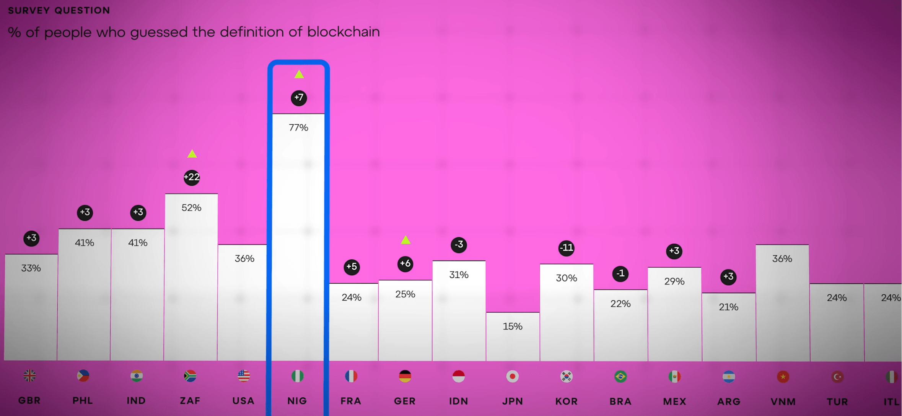
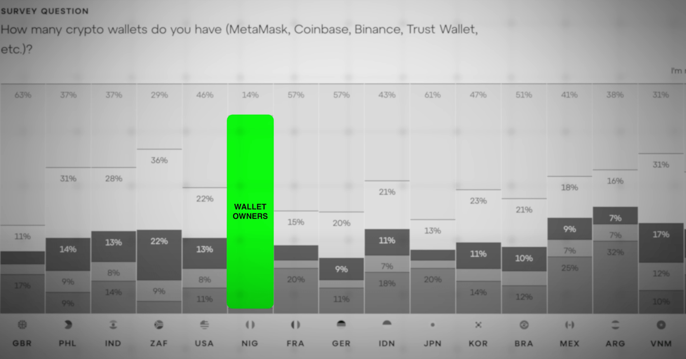
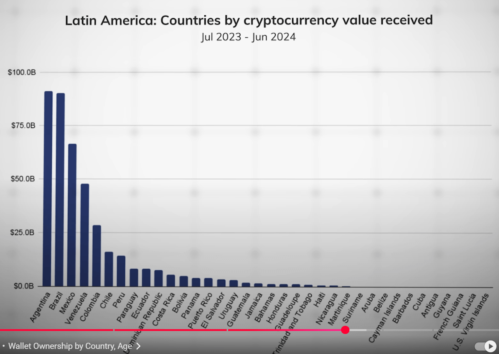
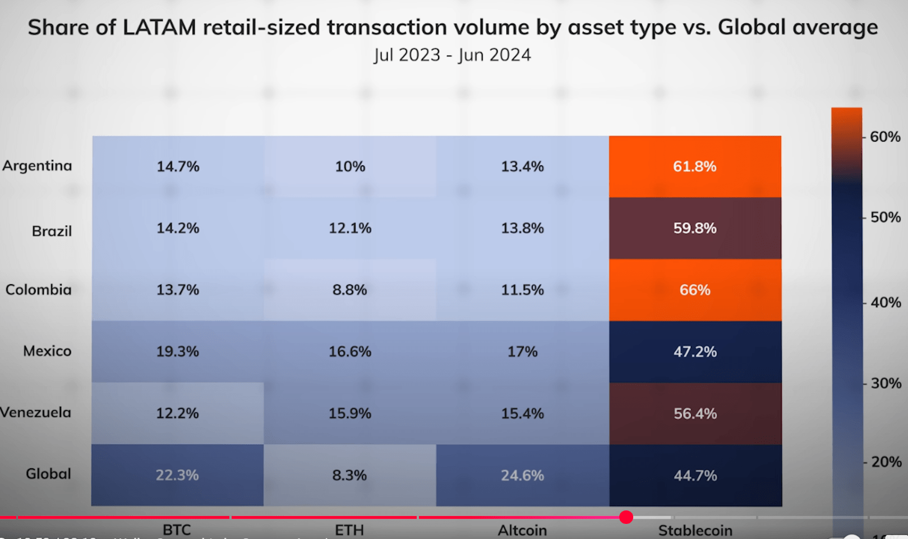

# Global Opinion about Crypto
Umfrageergebnisse von GovOrg von 18-65 Jährigen in 18 Ländern inwiefern sie wissen was eine Blockchain ist. 

1. Erstaunlicherweise können Nigerianer die richtige Definition für "Blockchain" deutlich besser wiedergeben als Bürger anderer Länder: 

Dies erstaunt aber nicht, weil Nigeria, zusammen mit Südafrika, bei der Crypto AdoptionRate ganz generell immer besser mit den führenden Ländern mithalten kann. 

Umgekehrt wissen nur 15% der Japaner, was eine Blockchain ist. Meine Conclusion:  Wenn nur ein kleiner Prozentsatz der Japaner sich besser informieren würde, hätte die Cryptoindustrie einen gewaltigen Zuwachs an neuen "Fans", rsp. ist damit ein weiterer Boom zu erwarten bis auch diese Märkte gesättigt sind. 

Auffallend ist Südkorea deren Adoption Rate über die letzten 3 Jahre um 11% gesunken ist! heisst: SüdKoreas Bürger leiden entweder unter Amnesie oder sie beschäftigen sich momentan wohl eher mit reiner Spekulation als mit CryptoInsights. 

Another question was about whether people think "whether blockchain-tech can reduce fake news?" (what is the purpose of a blockchain when not delivering 100% accurate, non-changable truth?). 
Anstonishly NOT believing that blockchains cannot fix fake is 60% up - with 40-60% more negative bias than have said that they do understand blockchains. Especially in Germany negativity towards blockchain-tech for fixing real world issues beyond cryptocurrency is immense. 

Auch bei der Frage ob sie 1,2,3 oder keine Wallets  besässen oder nicht wüssten was eine Wallet wäre sticht Nigeria heraus. 

SouthAmerica Crypto Adoption Rate

60%+ Crypto in LATAM is Stablecoin that fights the inflation of local currency

