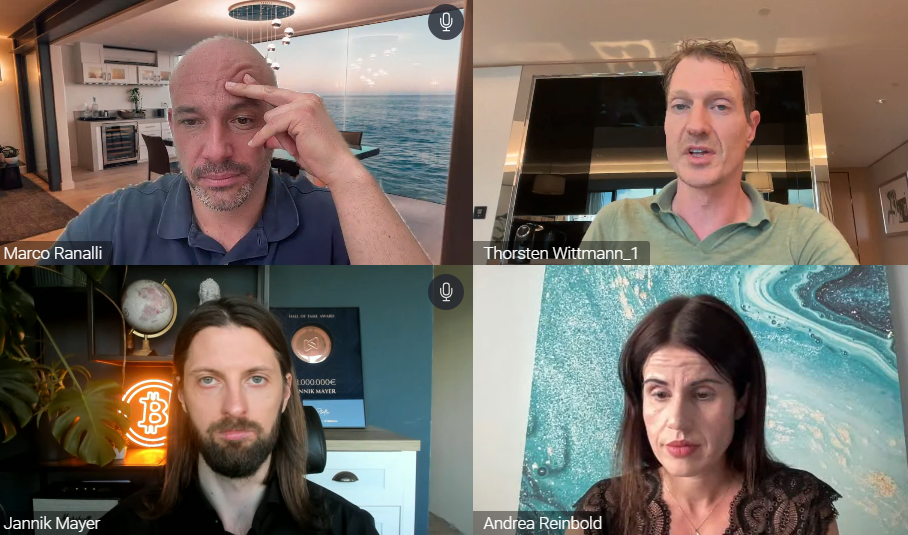

# Scam-Alert

* **Quelle**: https://bitcoin-schweiz.ch/scharlatane/

---

ACHTUNG: 
Viele neue Coins und Firmen werden nur zum Zweck der Täuschung erstellt: https://www.finma.ch/de/finma-public/warnliste/#Order=1

Auf dieser Seite von der Hochschule Luzern ist ein typischer Ablauf eines ‹Fraud-Investments› beschrieben:
https://www.ebas.ch/investment-fraud/

* **Inkompetenz**: Oft sind Dienstleister – wohl auch weil die ganze Technologie neu ist – überfordert. Beispielsweise Swissquote.ch, ein an sich angesehener, professioneller und kompetitiver Dienstleister für klassische Börsengeschäfte, bietet auch Handel mit Bitcoins an. Allerdings äusserst dilettantisch. So wurden z.B. der erwartete Fork vom1.8.2017 den Kunden nicht angezeigt. Noch schlimmer: die ‹abgespaltenen› Bitcoin-Cash wurden den Kunden fast 6 Monate lang vorenthalten! Meiden Sie Swissquote und andere Dienstleister wenn es um Kryptowährungen geht.
Besser, sie bilden sich weiter und verwalten ihre Kryptowährungen selbst.

## Selfchecks
### DomainFakes: Kontrolliere selbst, ob eine Domain wie z.B. in eigenem Namen oder versteckt über Panama registriert wurde wie zum Beispiel bsfnx.com: https://www.whois.com/whois/bsnfx.com. Dies ist bereits ein Alarmzeichen, auch wenn noch kein Beweis!

### DeFi Geschwurbel:
Gerne versprechen Betrüger Sicherheit durch Decentralized Finance (dezentralisierte Finanzmärkte), kurz DeFi genannt. Solche Dienstleistungen sind oft weder echt dezentral noch sicher. Abgesehen davon gaukeln Betrüger nur solche Dienstleistungen vor, aber betreiben gar keine echten Handelsplatformen.
Beispiele:  go.definanztraining.de, thorstenkoch.us (Thorsten Wittmann info@kryptopowerhouse.com) mit vielen Seiten wie defi-power.com, kryptopowerhouse.com und sehr viele Mehr.

## Quacksalberliste
Unter dem Namen `payback-inc.com` wird Betrugsopfer noch einmal Geld abgeluchst. Genauso wird `ledgerlock.net` verwendet um angeblich blockhierte Guthaben gegen Bezahlung frei zu kriegen – alles Betrug.

`krypto-haendler.com` zeigt ein Verhalten das sehr typisch ist für Betrüger: grosse Versprechen, Geld ergaunern und nie etwas zurückzahlen. Ebenso `blockchaindep.com` und auch `security-center.co` / `global-tbe.com` schmückt sich mit Blockchain ERA, Revolution etc. Ebenso sehr typtisch ist dass man kein Vertrauenswürdiges Domizil (Adresse) nennt und die Verantwortlichen nicht sichtbar sind. Dafür sind die Versprechen umso deutlicher – alles reiner Betrug. z.B. sei `infinity-consult.io/` in England domiziliert. Alles Lug und Trug.

Wir erhalten Anfragen bezüglich Nexo.com (nexo.io) sowie AAA Trading und blockchainconnect.me. Die Verluste können nicht lokalisiert werden, weil – was typisch ist für unseriöse Gruppen, dass diese keine Adresse, kein Domizil angeben.

Oftmals wenden sich sogenannte ‹Retter› an Betrugsopfer und täuschen vor, sie seien Anwälte, Ermittler etc. wie zB. federalcryptoinvestigations.net. 

firstwallet.de/ und profiwallet wecken Verdacht und sind daher nicht empfehlenswert: Sie behaupten, dass du dein Geld in ein Onlinewallet investierst. Das bedeutet, dass nicht du alleine, sondern andere Personen Zugriff auf dein Vermögen haben können. Die Gebühren, bestehend aus mehreren Prozenten plus einer festen Gebühr, sind unverschämt hoch. Im Impressum sind keine vertrauenswürdigen Angaben zum Standort und den verantwortlichen Personen zu finden, die überprüft werden können. Diese Kriterien deuten auf ein unseriöses Verhalten hin.

axiscapital.pro (nicht zu verwechseln mit derselben Domäne .com) nennen sich die Besten. Das Domizil sei auf Saint Vincent und den Grenadines. Die Kontaktadresse sei auf Dominica. Wer die Firma leitet wird nicht publiziert. Die Strategien sind in den höchsten Tönen und trotzdem diffus erläutert. Absolut typisch für verbrecherische Seiten.
Eine typische Masche von Verbrechern ist mit Prominenten zu werben wie z.B.: nordbayern.co/
Verbrecher mit einer üblichen Masche verwenden u.a. die Domänen global-wallets.info/ und esafecoin.com/
Sie bringen einem dazu, Bitcoin zu kaufen und diese an eine Bitcoinadresse zu senden, die nur vermeintlich einer Börse gehört. Letztlich meldet sich ein Vertreter der zwischen ihnen und der Börse verhandelt. Selbstverständlich verlangt er einen Vorschuss was ihren Verlust noch erhöht.
Betrüger versenden E-Mails von der Domäne wewe.global und Versprechen unter der Marke SP Online auf der Seite https://theperfectwaysformoney.com/ grosse Gewinne mit der Absicht, Geld zu ergaunern. Dieselbe Bande steckt auch hinter der Domäne https://luckpointseven.com
Eine grosse Palette bieten die Verbrecher https://www.daxiron.com/ an. Unterstützen tun sie nur bis du bezahlt hast, dann ist Feierabend. Logos von Banken und Kreditkartendienstleistern täuschen vor, dass man mit diesen Instituten zusammenarbeite, was falsch ist. Tatsächlich helfen sie dir Kryptowährungen bei Börsen zu kaufen um diese umgehend an daxirion.com zu transferieren.
Daneben betreiben sie viele weitere Seiten, wo auf ihre Leistung aufmerksam gemacht wird. Dreist: auch Seiten wo angeblich Opfern von daxiron.com geholfen wird, betreibt dieselbe Bande – auch hier lediglich gegen Vorauszahlung. Dann ist Schluss.
Auf youtube tritt ein Verbrecherteam mit Geschwafel und Versprochen auf unter den Titeln «Auto-Matrix Bonus», «CFX New Starter», «cryptofit mit Tenniscrypto«, Dein Weg in finanzielle Freiheit mit Erfolg» und auf
Instagram financialmindsetbytenniscrypto. Reine Abzocke. Wie oft, wird mit pseudo-Kompetenz versucht dich in die Pfanne zu hauen.
https://tagesschau.de-wirtschaft-technologie.net/ und ähnliche täuschen vor, sie würden vertrauenswürdige Medien vertreten!
Hier ist alles faul: https://bitcoinmotion.com/ grosse Versprechen, Logos welche Sicherheit und Vertrauen versprechen und eine künstliche Dringlichkeit – reines Betrügertum.
Grosse Verspechen, blenden Internetseiten bieten https://broker24.com/, Philipp Suhner, Go4Crypto.com und das dazugehörende Umfeld.
Oftmals nehmen Verbrecher Kontakt auf über Soziale Medien wie Facebook auf, loben ihre Erfolge und leiten dich dann auf eine Internetseite hin wie z.B, http://jpm999.xyz . Hemmungslos verwenden sie auch Logos von Grossbanken etc. und versprechen das Unmögliche, alles um von dir Geld zu erhalten. Bevorzugt wollen sie dass du mit Kryptowährungen bezahlst und nicht mittels Banküberweisung.
Verbrecher verwenden auch Instagram-Profile. Beispielsweise deutet https://www.instagram.com/cloe_patrah/ auf betrügerische Absicht hin.
OneCoin ist wohl der bekannteste Betrugsfall
Über https://www.luno.com/ mit aufffalend schönen Internetseiten, im selben Zusammenhang Luno Money Ltd mit Bankverbindung bei der LHV Pank in Tallin, wurden uns Dokumente mit betrügerische Machenschaften vorgelegt.
alpcoin.com ist reine Scharlatanerie.
Die Kryptowährungsbeschreibung ist ein Witz.
Zudem scheint es auch ein Schneeballsystem zu sein.
Im selben Umfeld scheint auch die Seite https://www.go4cryptos.com/ stehen. Sie ‹handelt› einzig mit dem Alpcoin und täuscht auch vor, dass dieser auf coinmarketcap.com gelistet wäre, was nicht der Fall ist.
Sonderbar ist auch, dass gemäss Handelsregister nur eine Person für A-COIN TECHNOLOGIES AG handlungsfähig ist, nämlich Ovo Prince Henry Modafe, von Schänis in Winterthur (Modafe ist der Familienname).
Alpcoin schreibt «supervised by the Swiss Financial Market Supervisory Authority (FINMA)». Das ist eine Falschaussage! Es handelt sich lediglich um einen Anschluss an eine SRO.
Zu Beginn des Jahres 2018 wurde die Internetseite alpcoin.com grundlegend überarbeitet. Nach wie vor wird viel versprochen, funktionierende Software wird aber keine angeboten, es soll offenbar lediglich Geld einkassiert werden. oder als PDF
Unsere Empfehlung: nichts bezahlen!
Artikel beim Blick vom 11.11.2018 oder als PDF
thebitcoinscode.com will dass sie Geld an eine Firma in Rumänien einzahlen. Seriöser Bitcoinkauf geht anders – Hände weg !
Tritt unter immer neuen Namen auf wie mama-system.com, crypto-bit.services, crypto-bit.stream, und viele mehr.
Betrüger betreiben und benutzen auch die Seite https://mycryptoconsult.io – kaufen sie auch hier keine dubiosen ‹Coins›!
Sanuscoin  hat jahrelang gelogen, d.h. weder gab es Coins noch Wallets. Sanuscoin sind aus derselben Gruppe wie Sanuslife.com.
Nachtrag Spätsommer 2018: die neue Version des Wallets transferiert die Sanuscoin tatsächlich. Aber man muss für jede Sanuscoin-Transaktion eine Gebühr mit Bitcoin bezahlen. Uns scheint das eine Geldvernichtung zu sein. Coinmarketcap.com kennt den Sanuscoin nicht; auch sonst ist uns weltweit keine gute Börse bekannt, die Sanuscoin handelt. Wir bleiben dabei: Hände weg! Der Transfer der Coins ist teurer als der Wert der Coins.
Swisscoin.eu verspricht viel aber erklärt auf ihrer Internetseite wenig. Das ist nicht seriös.
Die angegebenen Börsen wo angeblich dieser Coin gehandelt wird, geben ‹inaktiv› oder ein erbärmlich geringes Volumen an.
Ich rate vom Erwerb ab!
platincoin.com tritt wie eine echte Kryptowährung auf. Das Vokabular und viele Informationen deuten auf eine echte Währung hin. Immerhin ist es offenbar nahezu unmöglich, die Coins jemals wieder zu verkaufen. Ein Verkaufsversprechen ist das, dass sich der Coin sofern man bezahlt, vermehrt. Bei einer Kryptowährung kann das ein Kinderspiel sein – Werthaltigkeit zeigt sich eher bei Knappheit als bei schier endlosen Vermehrung. Der Mann hinter diesem Coin hat eine Vergangenheit beim Swisscoin bei diesem ist die Wertlosigkeit (Betrug) klar. Weitere Informationen dazu findet man auf  https://cryptoticker.io/de/platincoin-serios-oder-betrug/
digitalmoneymaker.de verspricht Reichtum ohne Arbeit. Es hat nichts mit Kryptogeld zu tun.
Über jenco-info.com/ respektive Joerg D. Wittke, Dubai, haben wir Mails von schlechte Erfahrungen erhalten – wir raten von jeglichem Engagement ab!
coinmama.com paycent.com backtrader.com sind weitere Seiten von Verbrechern.
Giracoin respektive girauono.com gibt keine Antwort. Die Internetseite funktioniert nicht richtig, telefonisch und per E-Mail ist niemand erreichbar.
Es wird vorgetäuscht, dass die Wirtschaftsförderung des Kantons Nidwalden die Firma Gira Financial Group AG oder den Giracoin unterstützen würde, was nicht der Fall ist. Der Giracoin wurde Gira Financial Group AG mit Firmenchef Gian-Carlo Collenberg ‹entwickelt›.
https://swissalpsmining.io wird teilweise von denselben Personen getragen die schon bei Giracoin ihr Glück versuchten. Nun wird behauptet, dass man beim Mining in den Alpen keine Kühlung brauche und trotzdem steht woanders dass man durch Wärmerückgewinnung Energie produziere. Woanders steht dass man leerstehende Gebäude nutze, das sei der Clou. Bei Mining dreht sich aber fast Alles um die elektrische Energie, nicht um die Lokalität. Wieso steht nirgends woher man diese bezieht und wieso diese günstig sein soll? Zum Wesentlichen, nämlich was und wie gemint werden soll steht nirgends! Wir raten zu hoher Vorsicht und vertiefter Prüfung!
Xaurum verspricht, mit Gold hinterlegt zu sein, dies sogar zunehmend. Woher das zusätzliche Gold kommen soll, bleibt unklar.
Zudem wird gesagt, dass es sich um einen Ether-Token handelt und trotzdem existieren eigene Nodes, sogar Masternodes könne man betreiben, wenn man sehr viele Coins habe. Technisch ist das enorm diffus respektive unmöglich.
Xaurum wird tatsächlich an einigen Börsen gehandelt, aber die Kurse sind stark gesunken, das Handelsvolumen ist extrem tief.
Unsere Empfehlung: Hände weg!
bitclubnetwork.com zeigt schöne Fotos und verspricht Vieles. Obwohl einiges plausibel dargelegt wird, fehlen Fakten, Adressen, Personen etc.
Unsere Empfehlung: bezahlen sie Nichts!
solidcapital.io ist keine Handelsplattform. Alles vorgetäuscht mit dem Ziel, von ihnen Geld zu erhalten. Dieses wird nie mehr zurückbezahlt.
LV Grow Markets http://lvgrowmarkets.com/ täuscht eine Handelsplattform vor, lockt mit hohen Gewinnen und verlangt nur Geld und bietet gar nichts!
Dasselbe MYCOIN BANKING mycoin-banking.com/ !
Unseriös sind viele mehr wie z.B. http://btcmillioner.co.ua/, http://btconline.biz.ua/ DavorCoin, auch geschrieben Davor Coin, Optioment und immer mehr!
the-cryptosoftware.com, verspricht ewige Einnahmen ohne Arbeit. Wer dort seine Telefonnummer angibt erwählt zahlreiche Anrufe von Beratern die einem Geld abknöpfen wollen.
https://bitcoindoubler.club lockt mit einer Verdoppelung der Bitcoin innert einem Tag – das kann keinesfalls seriös sein !
http://btc-generator.online/ täuscht eine Zahlung an die gewünschte Adresse vor, verlangt dann aber eine Vorauszahlung der Transferspesen – plump, gemein, unseriös.
Dasselbe mit https://aspenholding.com/de/ (auch «AspenHolding AAA Trade»)
Der Name «Bitcoin Profit» wird von diversen betrügerischen Seiten wie z.B. https://securelyriches.com und viele gefälschte Seiten verwendet!
Bicoin Era respektive https://bitcoinseraapp.com sind absolut unseriös – bekannte Masche, versprechen automatischen Gewinn auch ohne jegliches Wissen.
Dieselben Betrüger betreiben auch cohen-syndrome.org/, https://top5stockbrokers.com/, https://kryptoszene.de/, tomorrowcrypto.vip/ und Weitere!
Ein Bitcoin-Node erarbeitet keinen Ertrag. Masternode gibt es bei Bitcoin nicht. Wer solches behauptet oder behauptet, wie z.B. https://www.getnode.io/ ist unglaubwürdig. Die Seite https://masternodes.online/ erwähnt den Bitcoin richtigerweise nicht, aber Coins wie Bitcoin 2 (BTC2), Bitcoin Incognito etc. Wir raten dringend von solchen Produkten und Internetseiten ab.
Dreist, mit angeblich informativen Seiten Solches zu empfehlen, wie dies auf http://brigitte-scherzinger.com/ und https://www.krypto-magazin.de/ sowie https://blockchain-hero.com/ der Fall war! Ähnlich gibt sich https://bitcoin-informant.info/.
thebitcointrader.com verspricht unter Angabe von Prominenten ebenso Unmögliches – absolut unseriös! Dieselben leeren Versprechen werden unter dem Titel Cryptosoft gemacht. Wir erhalten nur E-Mails über schlechte Erfahrungen.
Dasselbe, nur ein neuer Name tut ‹Blazing Trader› auf blazingtraderprogram.com und janellajheraldstore.com unter dem Label ‹The Crypto Revolution› oder ‹The-CryptoRevolt.com›. Billigste Masche und hohe Versprechen und Lügen ohne Ende. Es werden laufend neue Domains aufgeschaltet, immer dieselbe Betrugsmasche, z.B. primebitprofit.co
Laufend neue Domains und Namen: The Bitcoin Code nun auf der Seite https://bitcoincodesoftapps.com aber genauso unseriös wie immer.
Oft werden bekannte Persönlichkeiten genannt die mit diesem Bitcoin Trading System grosse Erfolge garantieren – absolut unseriös.
Auf https://locussharedexpedition.info/ wird mit DJ Bo Bo gelogen welcher angeblich mit diesem System Geld verdient hätte – Lug und Trug.
Dieselbe Masche wendet unter dem Schlagwort SuperStar https://bitcoinsuperstar.tv/ und https://coincierge.de/bitcoin-superstar/. Hier wird mit einer Methode die dein Vermögen automatisch vermehrt geworben, gleichzeitig werden auch Prominente erwähnt – alles reiner Betrug.
Hemmungslose Lügner und Betrüger betreiben mit derselben Masche die Seite immediate-bitcoins.com/ mit dem Titel «Immediate Bitcoin» respektive «Immediate Earnings». Hier ist ein totaler Verlust ihres Geldes sicher.
Verbunden sind diese Seiten mit 10percentchallenge.org unter dem Titel 10 percent challenge oder BS bitcoin storm mit der Seite bitcoins-storm.com.
Einige Börsen gaukeln echte Konti und Trandingfunktionen vor. Auch gibt es die Möglichkeit ein ‹Konto› zu eröffnen und sich per Computer anzumelden. Oft hat man einen persönlichen Berater der/die einem anruft. Nur kommt nie Geld zurück. In diese Kategorie gehören u.a.: elcurrency.com/ und viele mehr!
Über folgende Seiten haben wir tragische Machenschaften erfahren: https://www.traden.eu/, https://toptrader.eu/, https://gr.citycapital.trade/en/, https://client.toptrade.fm/, https://webtrader.toptrade.fm/, securityinvest.info und Weitere!
Markus Miller selbsternannter KryptoExperte. Wir sehen seinem Namen mit Foto auffallend häufig auf Seiten, welche extrem unseriös sind. Seien sie extrem vorsichtig, wo immer «Kryptoexperte Markus Miller» steht! Insbesondere der Investor-Verlag, der aggressiv E-Mail-Adressen und Telefonnummern sammelt, zitiert diesen angeblichen Experten Markus Miller regelmässig. Er wird dort z.B. mit «Chefanalyst von Kapitalschutz vertraulich»  bezeichnet. Letztlich geht es darum Geld, anfangs EUR 250.- unter riesigen Gewinnversprechen einzukassieren. Anschliessend wird jeweils mehr gefordert.
Zur selben Gruppe gehört auch die Seite www.geopolitical.biz, https://www.investor-praemien.de/ und https://www.investor-boersenwissen.de/ eben meist unter dem Titel INVESTOR VERLAG.
Der Markus Miller warnt bezüglich anderen Verbrechern, z.B. warnt er vor EXW Wallet exw-wallet.com/ auf Linkedin, dabei ist er selber ein Betrüger 🙂
finanzpraxis.com verspricht mit der sogenannten «Wallet App» riesigen Gewinn ohne Risiko. Alles deutet auf schamlosen Betrug hin!
Eine Firma die sich KeyMarkets nennt verspricht per E-Mail und am Telefon Bitcoin zu kaufen sofern man ihnen Geld überweist. Allerdings liefert diese Firma nie etwas – es sind Verbrecher.
https://platincoin.com/ verspricht alles Gute und viel Erfolg – die einzige Bedingung ist, dass man zuerst Geld bezahlen muss. Eine alte Masche neu verpackt.
Die Menge an neuen Coins und auch an Tokens steigt rasch. Auf Distanz gehen, oder vor einem Investment zumindest seriös abklären sollte man z.B. von folgenden Coins:
TRON, BitShares, Bitcoin Diamond, Populous, Bitcoin Private, Dentacoin, Emercoin
Diese Aufzählung kann selbstverständlich nicht abschliessend sein!
Mit Mining sucht ein Thomas Horvat ‹von Sachs & Seligman› in welcher lediglich Kretzschmar, Philipp, deutscher Staatsangehöriger, in Zürich eingetragener Gesellschafter ist, unter dem Label ‹Priva Suisse› für eine Firma mit Projekt in Serbien Geld. Die Mining-Erlös-Versprechungen sind überrissen, wir raten von einem Investment dringend ab.
Folgende Coins werden gemäss cryptoexchangeranks.com als scam-coin bezeichnet:
Lightpaycoin, DasCoin, PACcoin, FirstCoin, Steneum Coin, BridgeCoin, PutinCoin, PeepCoin, ColossusXT, Swisscoin, Rise, TrezarCoin, Vsync.
Auf der Seite http://best-bitcoin-invest.info/ macht Birgit Overbeck Reklame für GlamJet. Allerdings wird nicht der gleichnamige Coin erklärt sondern hauptsächlich die Gewinnaussichten die man hat wenn man bezahlt! Zudem wird die Seite nicht gepflegt, die erwähnten Daten bis dann was möglich sei liegen bereits Mitte Oktober 2018 in der Vergangenheit.
Die Seite https://glamjet.io/ hat tote Links, z.B. auf das Whitepaper – Täuschung und Betrug sehen genau so aus!
doubly.io (hiess früher MY CRYPTOBIT) stellt sich als Allrounder dar mit Schwerpunkt auf dem Vertrieb.
https://www.mycryptobit.io/ verlangt einen monatlichen Beitrag, die App handle dann automatisch, man benötige keinerlei Kenntnisse.
Suspekt ist u.a. die Forderung der App nach der API bei einer Kryptobörse (Exchange). Damit könnte My Cryptobit (.io oder .info oder .help) das gesamte Guthaben verwenden. Die App hat 50 Kommentare, alle extrem positiv. Verdächtig ist, dass diese alle ein ähnliches Vokabular verwenden.
Wir raten dringen von einem Engagement ab!
btcglobaltrades.com vermittelt private Agenten die einem helfen, tausende von Prozenten Rendite zu erwirtschaften – z.B. Instagram @joandavis17
unseriöser ist kaum noch denkbar.
Bitcoin-Käufer die mit Bargeld bezahlen und die oft bereit sind, einen Mehrpreis zu bezahlen, haben vermutlich Schwarzgeld oder kriminelle Absichten. Meiden Sie solche Hinterhof-Händel!
Bitbond vermittelt Darlehen, die Darlehensgeber haben meist Kryptowährungen die Darlehensnehmer hingegen meist USD. Ich habe über Jahre (ab 2016) rund 50 Darlehen gewährt, insgesamt nach Berücksichtigung des erhaltenen Zinses rund 1/3 des Einsatzes verloren. Bitbond hat offensichtlich sehr viele Schuldner die die Darlehen nie zurückbezahlen oder sind schwach im Inkasso. Trotzdem dass ich vorwiegend in die allerbeste Schuldnerkategorie ‹investiert› habe ist letztlich ein massiver Verlust entstanden!
Verschiedene Token, Security-token etc. werden oft telefonisch oder per E-Mail zum Kauf angeboten. Meist wäre ein Kauf des Gutes oder der Dienstleistung besser als über das Vehikel Token. Auch wenn ein regulierter Token ist nicht sicherer als das eigentliche Gut das er verkörpert. Einen Token zwischen dem Gut/Dienstleitung und dem Käufer/Eigentümer zu legen stellt höchstens ein zusätzliches Risiko dar.
investor-verlag.de bewirbt mit wechselnden Personen und Projekten seine Investmentideen. Oftsteht ein guter Tip mit riesigen Gewinnaussichten im Vordergrund. Wir raten dringend ab!
https://ducatus.net/ und https://centuriongm.com/ weisen alle Merkmale von Betrügereien auf !
Telefonanrufe von den Nummern +46 188 00 80 51 und 043 550 03 60 wollen einem schädigen.
Folgen Sie nie einem Link von aufgrund eines Telefonates!
Erpresser die manchmal ein Passwort kennen das man auf einer Internetseite angegeben hat behaupten, sie hätten Videoaufnahmen und wollen Lösegeld auf die Bitcoinadresse 14fvP8g17nRLAUbnpV8t4q41Xtm7AZZkG1 oder 12EMAbSboa1nvg518vcjvogSL4aDwaUCv9 . Bezahlen Sie nichts, es handelt sich um einen Bluff.
Sandro Aeberhard, Zürcherstrasse 189, 8953 Dietikon, verkauft vergoldete Medaillen mit Bitcoin-Logo. Der Wert dieser Medaillen beträgt wenige CHF. Trauen sie ihm keinesfalls. Er lügt und betrügt ohne jegliches Schamgefühl. Seine mobile Nummer ist +41 76 453 42 89 und seine E-Mail lautet sa@rentyourdream.ch
Falls Sie Angaben (Foto, Arbeitsort, Firmen, Betrugsmaschen, Freunde, Bekannte, Partner) von ihm haben melden sie uns diese!
Artikel im «SonntagsBlick» vom 28.10.2019 über Scharlatane im Bereich der Kryptowährungen. Und online:
https://www.blick.ch/news/wirtschaft/kryptowaehrungen-die-liste-der-scharlatane-der-bitcoin-der-aus-der-kaelte-kam-id9046018.html
-> melden sie uns weitere Verdächtige!

SRF news vom 16.2.2021:
https://www.srf.ch/play/tv/tagesschau/video/bitcoin-betrugsfaelle-nehmen-zu?urn=urn:srf:video:9a24eada-2b66-4700-a861-511b4ae2f9a2

Oft sind Dienstleister – wohl auch weil die ganze Technologie neu ist – überfordert. Beispielsweise Swissquote.ch, ein an sich angesehener, professioneller und kompetitiver Dienstleister für klassische Börsengeschäfte, bietet auch Handel mit Bitcoins an. Allerdings äusserst dilettantisch. So wurden z.B. der erwartete Fork vom1.8.2017 den Kunden nicht angezeigt. Noch schlimmer: die ‹abgespaltenen› Bitcoin-Cash wurden den Kunden fast 6 Monate lang vorenthalten! Meiden Sie Swissquote und andere Dienstleister wenn es um Kryptowährungen geht.
Besser, sie bilden sich weiter und verwalten ihre Kryptowährungen selbst.

---

Die Typen von "Krypto Powerhouse": Marco Ranalli, Thorsten Wittmann, Jannik Mayer, Andrea Reinbold
