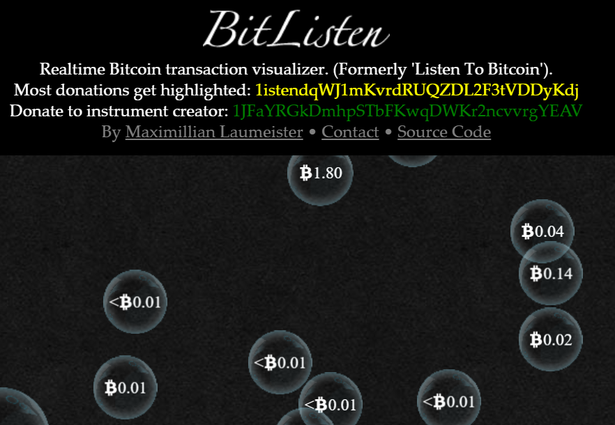

# Crypto Transaction Analyser

Dies sind Tools die das aktuelle **Geschehen am Markt in Echtzeit** darstellen. 

## BitListen

Mit diesem lustigen Tool wird jede BitCoin-Transaktion als gem. Transaktionswert grössere oder kleinere Bubble dargestellt die von unten nach oben steigen. Zudem erzeugt jede Creation einen Ton der je nach Transaktionswert höher (=niedriger Wert) oder tiefer (=grosser Wert) anhört. 

So kann man sich diesen Sound im Hintergrund laufen lassen um bei entsprechender Uebung ausserordentliche Patterns oder höhere Tradevolumen zu HOEREN!!

