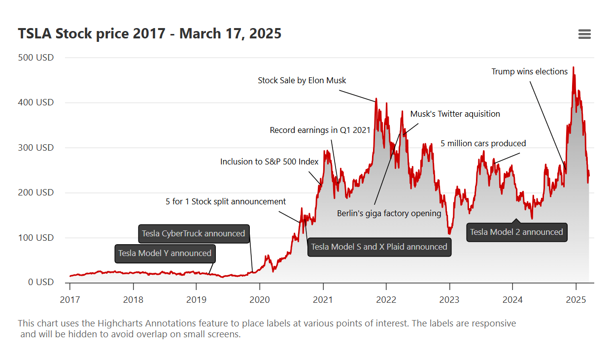

# EventDriven Timeline Analysis

## Suchbegriffe

* Price Chart annotations   

## Kontext
**Combining timeline maps with crypto charts** involves layering chronological events on a price chart to provide context for price movements. 

This approach helps traders understand the impact of news, technical analysis, and market psychology by visually connecting past events with chart patterns and price action, strengthening trading strategies. 

For example, you can see if a specific event, like a network upgrade, corresponded with a price increase, or if a certain chart pattern failed to play out because of an unexpected news event.

## Steps to combine timeline maps with crypto charts
* **Choose your chart and timeline**: Select a crypto chart (e.g., Bitcoin) and a corresponding timeline map to track events that occurred at the same time as the price movements.

* **Identify significant events**: Research and list key events, such as major news, network upgrades, hacks, or regulatory changes, that could influence the cryptocurrency's price.

* **Plot events on the timeline**: Place these events on your timeline map in chronological order, noting the date and time they occurred.

* **Layer the map onto the chart**: Overlay the timeline map onto your crypto price chart, using the timeline's date axis to align the events with specific points on the price chart.

* **Analyze the correlation**: Observe how price movements correlate with the events. Look for patterns like price increases after positive news, or price decreases after negative news.

* **Use multiple timeframes**: To get a more complete picture, use multiple timeframes (e.g., daily, weekly, monthly) on your chart to see how events affect the price on different scales.

* **Combine with technical indicators**: Use other indicators like moving averages, RSI, or Bollinger Bands to confirm or deny the signals from the timeline map. A price increase that also shows a bullish chart pattern and RSI crossing into an overbought zone may be a stronger signal than one without these confirmations.

* **Backtest your findings**: Test your strategy with historical data by backtesting it to see how it would have performed in the past. This will help you refine your approach before using it in live trading. 
## Tools

### Visualization
* "The Bitcoin Globe" by Wizb.it: ein Globus auf welchem man in Echtzeit sieht wo die nächsten Blocks erstellt werden