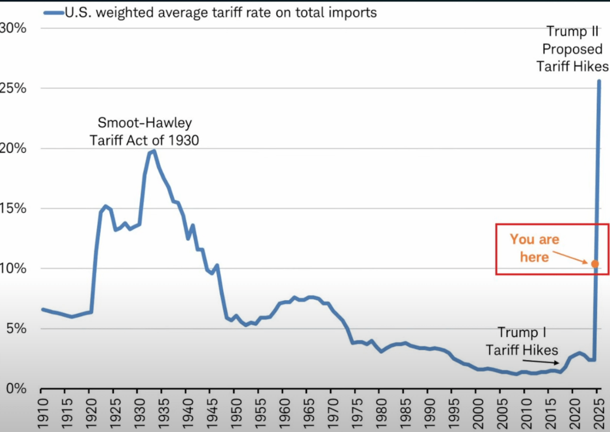

# Super Crypto Crash am 3. Januar 2025
Moch nie ist BTC innert 24 Stunden mit rund 16% von 105$ runter auf 92$ so massiv gecrashed wie dieses Wochenende. Damit sind allein für BTC 2.25 Milliarden verpufft, was sogar mehr ist als beim Zusammenbruch der FTX Börse. 
Dieser Crash am Montag morgen wurden von den über das Wochenende gehandelten  Futures angezeigt, welche extrem auf UNSICHERHEIT reagieren. 

## Facts
> Trump belegt Mexiko, Kanada und China ab sofort mit 25% Importzöllen mit Ausnahme von kanadischem Oel um einerseits die eigene Wirtschaft zu stärken und andererseits als Druckmittel gegen die illegale Migration aus Mexiko und Handelsdefizite gegenüber China und Kanada. 

> Der Dollar ist dadurch im Vergleich zum Euro und Yen kräftig gestiegen. 

> Der SMI hat über 1.2 Prozent verloren

> Crypto just went through one of its most brutal 24-hour periods, with over $2.2 billion in liquidations wiping out leveraged longs. 

Es scheint so, als würden Wale weiter kaufen, während der Durchschnittsretailer keinen Bock mehr drauf hat. 

Die Altcoins (ETH 37% in 58 Stunden) haben natürlich deutlich stärker an Boden verloren und damit der stabilere BTC mit 60%+ deutlich an Marktanteil gewonnen. 

## Analysis
Althouhg with Trumps announcement of 25% tariffs on Mexico, Canada and China and more to come, we have some rational explanations (dollar getting stronger, people liquidating their crypto-reserves because in need for cash, U.S. hater selling whatever is U.S. related, ..) there is no justification for this dip's shocking SIZE. 

Off course it is a good idea to eliminate market risks by changing everything into US$ based stablecoins which are on significatn rise due to stronger US$ upon the "America first"- initiatives. 

Therefore I personally take this dip pirmarely as an irrationally overpsyched TrumpHate-Mass-Revenche, whose size is not justified by any rationals or facts but where media and fear driven psychos are real and have always been the biggest threats for every market. And off course AI driven Bots and trade automatiomn tools, are adding to mechanics effects that will increasingly auto-reinforce market pendulums with hihger spikes and sharper edges even more. In addition we all know that weekends with many not working and exchanges closed, we have low liquidity that will add to the spread, that again triggers fears and (contract) obligations and therefore to overreaction coming at a speed where only autotrading is able to reasonable react. 

However, according to my personal opinion, all this is "just" psychologically exagerated. But when looking at the facts and obvious mechanics this is not a real shake-out capitualtion, but, technically a quite "normal" fluctuation upon news that non-professinals cannot overlooked in their full dimensions, consequence and complexity and therefore cannot be predicted by the masses for its mid- and longterm outcome. So people have started running in panic, just by seeing others running without questioning the reason. 

So as the psychos and AI have driven this plunge on the weekend, professionals will do their work this monday morning and will buy the dip for cheap (given they have funds on the side - exactly for THIS).

## What to do?
So you might take such waves either as a dayrading surfer, or you are just continuing your bread-and-butter, money earning day-job without giving a damm s.., because, in the long run, BTC is the only real alternative to inflaction driven devaluaition of any alternative asset besides real estate and metals. 

Unfortunately I do not have casino-money left to buy the deip, but I will change some BTC into ETH and SOL and some other oversold  Alt-Coins. 

## Speculations
U.S.A is no longer supported by Asia, Africa, Mid- and South-Americas. They are selling U.S.-realted an increasingly U.S.-regulated tokens for a) political, moral and increasingly tactial reasons to prevent further U.S. dependency. It has become just uncool to support the U.S. and Trump. These countries will have their own valuechains and e-currencies, their own DeFi and further innovation loops. 