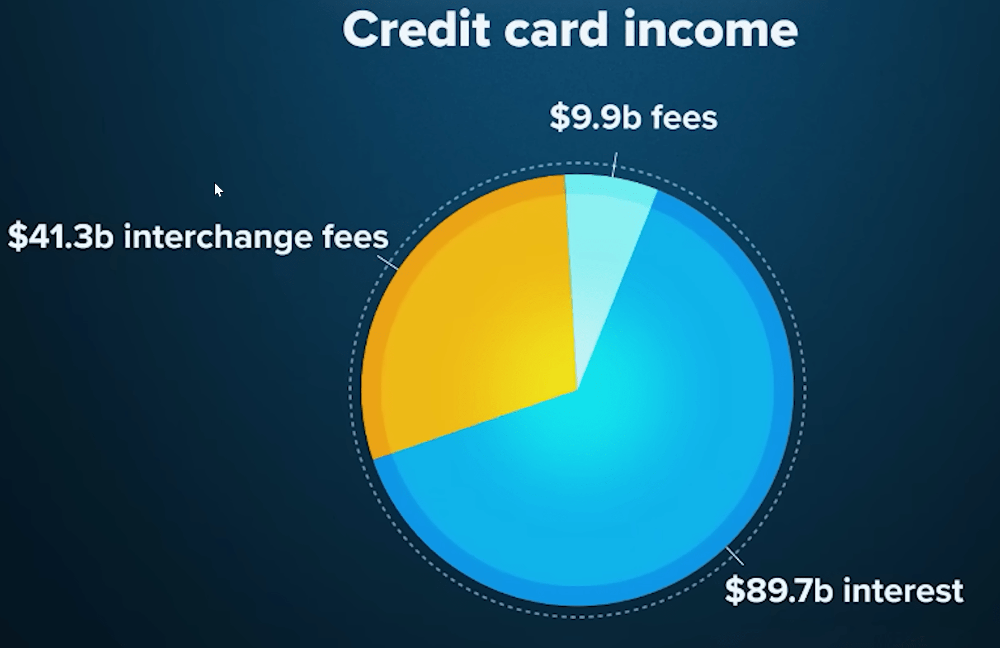
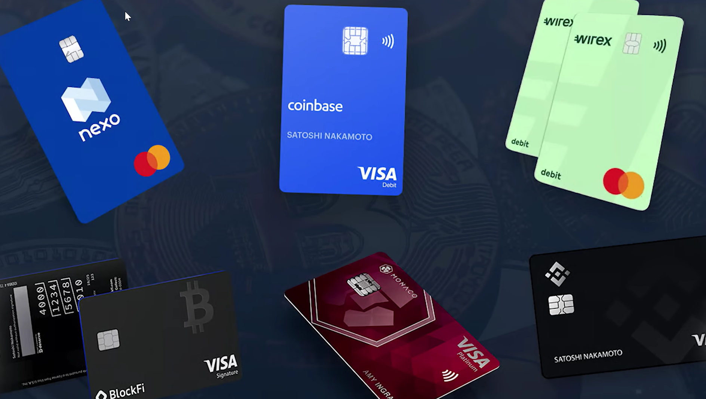

# CryptoCards

* [Video: Trump just killed the Creditcards](https://www.youtube.com/watch?v=sUc6N0sWZNc) vom CoinBureau vom 26. Januar 2026. 

* [CBDC](../../../GLOSSAR/C/CBCD.md)

CryptoKarten sind Karten mit denenen man in ausgewählten US-Shops wie mit normalen Karten zahlen kann. 

A crypto card is a type of payment card (physical or virtual) that acts as a bridge between digital asset portfolios and traditional, everyday spending. These cards, often issued in partnership with Visa or Mastercard, allow users to spend cryptocurrency holdings or earn rewards in cryptocurrency for their purchases. 
They are generally categorized into two main types based on their functionality: 

**1. Crypto Debit/Prepaid Cards**: These cards require you to pre-load or hold cryptocurrency in an associated exchange account. When you make a purchase, the platform instantly converts your cryptocurrency into local fiat currency (e.g., USD, EUR) to pay the merchant.

2. **Crypto Credit Cards**: These function like traditional credit cards, offering a line of credit and allowing you to pay your bill later in fiat. The primary difference is that they offer rewards, such as cashback, in the form of cryptocurrency. 

## Warum
Aktuell kann man im Januar 2026 mit der "Coinbase One" Cryptocard immer noch 4% der Ausgaben in BTC erhalten. 

## Warum das aktuell ist

### Deckelung der Kreditkartenzinse auf max. 10% 
Donald Trump plant für **US-Kreditkarten den Jahreszins auf 10 Prozent zu deckeln**, um so die Verschuldung der Haushalte zu senken. 

Banken warnen vor drastischen Folgen 

* verweigerte Kreditvergaben für Resolver -> Privatkonkurse. 
* verweigerte Kreditvergaben für Firmen -> Firmenkonkurse. 
* Reduzierung von Prämienprogrammen -> Kreditkarten verlieren an Attraktivität, Rückgang des nicht merh länger "insentivierten" Konsums, insbesondere im Bereich teurer Güter wie Reisen, Autos, Schmuch, Uhren,  etc..
* Schließung risikoreicherer Konten - -> Privatkonkurse. 
* Sinken der Aktienkurse von Finanzinstituten wie Visa, Mastercard und American Express welche den ganzen Aktienmarkt betrifft.

### Facts & Zahlen
* 2025 lag der   Jahreszins für Kreditkartenüberzüge im Schnitt bei 21.5 Prozent.

* Jeder USA-Amerikaner hat im SCHNITT 4 Kreditkarten. 

* 90% aller Kreditkarten belohnen ihren Gebrauch, resp. mit Kreditkarten gemachte Umsätze durch Gratisflüge, Cashbacks, Vergünstigungen, Gratiseintritte, etc. do dass die besten Kunden unter dem Strick mit Kreditkarten bezahlte Güter 30%-40% günstiger kriegen als Leute die mit Cash bezahlen oder in den Augen der Kreditkartenaussteller "schlechte" weil umsatzschwache Kunden sind.

* in der USA wird jeder 3. ausgegebene Dollar mit Kreditkarte bezahlt, was Kreditkarten zum mit Abstand umsatzstärksten Zahlungstool macht.

* In den USA sind 40% aller Kreditkartenbesitzer sogenannte "Revolver" die auf den Karten permanent im Minus sind und neue Kredite brauchen um die alten zu bezahlen. 

### Das Geschäftsmodell: Interchangefees und Verzugszinsen
Kreditkarten verlangen von Retail-Shops 3-4% "**InterchangeFees**". Diese bringen Kreditkartenfirmen rund einen Drittel der Einnahmen. 

Shops schlagen aber nun diese 4% nach und nach einfach auf den Retail-Preis - und zwar für Alle - egal ob sie nun mit Karte oder Cash bezahlen.

Nun erhalten aber (gute/vermögende) Kreditkartenbesitzer einen Teil dieser InterchangeFees wieder in Form von Rewards (Cash, Gutscheine, Vergünstigungen, Einladungen, ...) zurück, währenddem Bargeldbezahler leer ausgehen. 

Barbezahler unterstützen mit ihrem Cash zwar die Ladenbesitzer (welche die oben erwähnten 4% Interchangefees einbehalten), steigern damit aber auch die Akzeptanz von Kreditkarten durch Shopbesitzer, die unter dem Strich statistisch nachgewiesen HEUTE mehr Umsatz UND Gewinn machen als Shops früher OHNE Kreditkarten. 

Und natürlich müssen sich Bargeldbezahler angesichts der ihnnen so vorbehaltenen Cashbacks fragen, ob sie nicht eigentlich blöd sind, wenn sie freiwillig auf diese Cashbacks verzichten!

Der zweite IncomeStream für Kreditkartenfirmen sind die rund 40% permanenten Revolver die jährlich ebendiese 20+% Zinsen (Interests) auf ihre ausstehenden Schulden bezahlen und sich damit meistens neu verschulden müssen. Profite durch diese Zinsen machen rund  zwei Drittel des Profits der Kreditkarteninstitute. 

In der Praxis zahlen die vermögensten 15% der KreditkartenBesitzer wegen der Cashback rund 30% weniger für Güter, die durch die Zinsen der eh schon armen "Revolver" finanziert werden, resp. findet über die Kreditkarten so eine permanenten Umverteilung von unteren Einkommen nach oben statt während die Attraktivität der Barzahlung (weil Cash einerseits nicht mehr für Shopowner attraktiv ist und zweitens weil Cash keine Cashbacks generiert) schwindet. 

Auch wenn die ideellen Vorteile des Bargelds (Anonymität, Verfügbarkeit, Kontrolle, Inakazeptanz des Bankensystems, etc.) immer noch Bestand haben, scheint dieser angesichts der akutellen Finanz-Mechanismen immer mehr unter Druck zu geraten. 

.

Aber nicht nur VISA und Mastercard profitieren von diesem Modell sondern auch jede Bank und Organisation welche diese Karten ausstellt. Denn jede Ausstellerbank erhält ihren Anteil an diesen Interchangefees (wieviel genau ist geheim), 

### Rechtliche Lage
Rechtliche Lage: Es ist unklar, wie ein solcher Deckel umgesetzt werden könnte, da der Präsident dafür normalerweise keine direkten Befugnisse hat und der Kongress zustimmen müsste. Bisher existiert kein derartiges Bundesgesetz

### Ausblick
Es ist anzunehmen dass entweder Trump in der jetzigen Legislatur oder der nächste Präsident entweder die Zinsen für den Verzug oder die Interchangefees bei den Händlern per Gesetz deckeln wird. 

Bis dahin wächst die Kreditkartenverschulding weiter genauso wie die Akkzeptanz von Kreditkarten sowohl bei Händlern als auch beim Konsumenten.

### Impact auf Cryptokarten

Dies betrifft Crypokarten insofern, als dass sie Umsatz mit von den ZinsDeckelungen nicht betroffene Belohnungstokens rewarden können, welche über die Zeit massiv an Wert gewinnen könnten. Dies könnte einerseits eine **massive Zunahe von Cryptokartenbesitzern verursachen** und - wegen der Nachfragen und Handelbarkeit durch Masse- - andererseits auch den Wert dieser Vergütungs/CryptoTokens steigern. Beides zusammen, könnte ein rege sich gegenseitig beeinflussende Nachfragespirale in Gang setzen - vor allem dann wenn konventionelle Karten sanktioniert werden und User auf Alternativen umsteigen. 

Leider besteht für AltcoinTokens momentan kein Aufwärtstrend. Deshalb sind Cryptokarten interessant welche Stablecoins cashbacken oder DeFi-(Lending)Services anbieten.  

Leider sind die meisten Cryptokarten Debitkarten (und keine Kreditkarten)

## History
Die ersten (VISA-)Cryptokarten (aus Metall) wurden 2020 von der Firma crypto.com in Zsammenarbeit mit VISA ausgestellt welche Cashbacks in Form von CRO-Tokens vergütet welche massiv im Preis stiegen bis sie 2022 im Rahmen es grossen BitCoin-Crashes - zusammen mit allen anderen Crypto-Assets - untergingen. 

Unabhängig vom Crash verbreiteten sich diese Cryptokarten esponentiell weiter: 

Von aktuell 1 Million Crypokartenbesitzer im Jahr 2020 sind es 2025 bereits 5 und im Jahr 2026 werden 20 Millionen prognosziert. Dies ist natürlich immer noch Peanuts im Vergleich zu den weltweit ausgestellten 30 Milliarden Kreditkarten. 

60-80% dieser Cryptokarten wurden primär aus Sicherheitsüberlegungen als Backup in ökonomisch relativ schwachen Ländern mit inflationärer Währung und fragilen Finanzsystemen wie z.B. der Türkei ausgestellt. resp. wurden nur 20% aller Cryptokarten in UK und den USA ausgestellt. 

