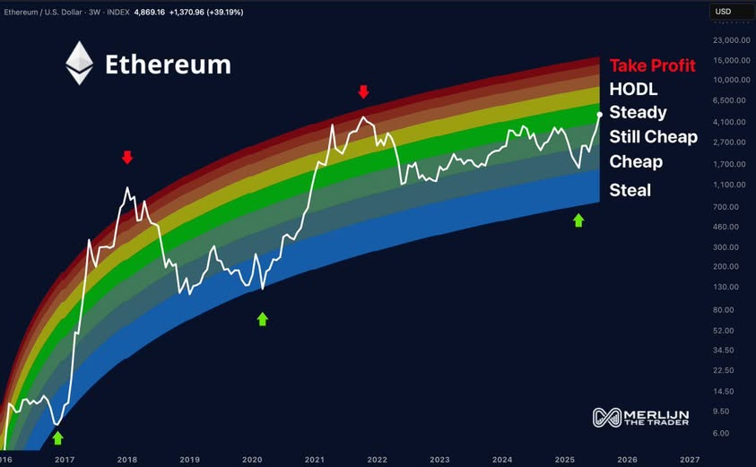

# Marktanalyse
Dieser Ordner enthält eine Sammlung von Notizen zu aktuellen Trends, Analysen, Dynamiken und Markttreiber, News, Hypes etc. 

* 

## Prognosen 

### Zyklische Betrachtung: Im Oktober verkaufen
BTC erreicht vermutlich Mitte Oktober einen Höschstand von 150k Weil BTC i.d.R einen Zyklus von 1050 Tagen zwischen Tiefststand und Höchstand des BTC folgt (resp. Oktober 2025 1050 nach dem letzten Tiefstand liegt). 

Ausserdem  beträgt der Höchststand zwischen dem letzten BTC Höchststand und dem Zyklushöchststand ca. 510 Tage. 

Natürlich wiederholt sich die Geschichte nie perfekt: aber sie reimt sich. 

Deshalb ist gut sich den **Höchststand nicht als Marker sondern als Feld vorzustellen**: 

Eine schöne Visualisierung ist auch dieser RegenbogenChart: 

Innerhalb dieses Feldes wird der Höchststand und damit der Verkaufspunkt oft durch eine wichtige Ankündigung ausgelöst bei der nun Alle glauben werden, dass es nur noch aufwärts gehen könnte: z.B. wenn eine Nation den massiven Kauf von Cryptos angekündigt, oder eine Neue Währung als ETF aufgelegt wird. (Weil diese Information aber immer SOFORT eingepreist wird, gibt es absolut keinen Grund daraus einen Aufwärtstrend abzuleiten, sondern eher einen Höchststand zu vermuten, resp. zu vermuten, dass es nun eine Weile seitwärts, wenn nicht sogar abwärts gehen könnte: der einzige Grund warum es immer noch aufwärts gehen könnte ist die Gier der Zocker die Trens aus Kurven lesen und sich einen Deut um Informationen scheren). 

## Merkpunkte
* Alt-Coins wie ETH haben ihr High i.d.R. 2 Wochen nach dem BTC High.

* 

