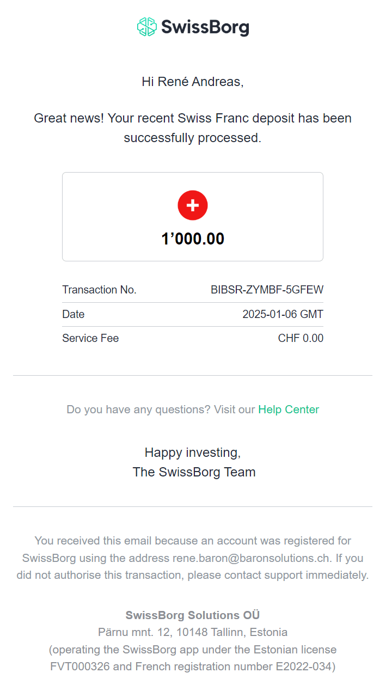

# 5. Jan 2025: CHF 1000 UBS 440J -> SwissBorg CHF Konto

Complete

-> [Transaktionsliste](../../_Transaktionen.md)

## TransaktionsDetails
Habe am 5.1.2025 CHF 1000.-- von meinem Privaten UBS Konto 440Y auf das Swissborg CHF Konto überwiesen. **Auführungsdatum** ist der 6.1. Diese Transaktion war **kostenlos** (checked) und wurde bereits um 07:12 (also 8 Stunden nach Aufgabe) **mit einem eMail an rene.baron@bs bestätigt** und war dann auch gleich in der BorgApp **im CHF-Konto sichtbar**.  

## Risiken
Die Transaktion erfolgt an eine neue IBAN Nummer der INCORE Bank in Schlieren welche das Geld an einen Empfänger in Tallin überweist???

## Motivation
Möchte am akutellen Bullrun partizipieren: 

* Grosse Banken (u.a. die Deutsche Bank) sind autorisiert ETFs auszugeben und werden da im im 2025 im grossen Stil tun. Damit öffnen sie den Weg für institutionelle Anleger wie z.B. Pensionskassen oder Familybusiness legal in Crypto zu investieren. 

* Trump und Musk wollen die US-Cryptoindustrie vorantreiben: mit Steuererleichterungen für Cryptounternehmen

* Sogar die USA wollen nationale Cryptoreserven anlegen. In der CH läuft eine Parlamentsinitiative welche die Nationalbank zum Anlegen einer Cryptoreserve motivieren will. 

* Nach Neujahr werden die Professionelle Investoren wieder aus den Ferien zurückkommen und wieder aktiver Traden. 

* MicroStrategy MUSS beinahe zwingend weiter BTC kaufen (und haben das auch so angekündigt). 

* BTC scheint mir insbesondere mit dem Engagement der USA immer mehr **too big to fail** zu werden, resp. werden insbesondere die USA regulativ wohl nichts mehr tun um den BTC zu gefährden. Und wenn andere Länder wie angekündigt (e.g. Polen nachziehen, immer weniger). 

* Grundsätzlich hat mich nun der Sinn und Zweck von BTC und ETH überzeugt. Mein Engagement ist weniger eine Wertanlage als ein politisches Statement. 
