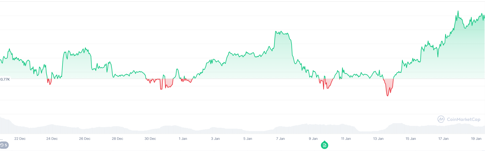

# TransaktionsLog und Erläuterungen
In diesem Verzeichnis sammeln wir sämtliche Informationen zu allen jemals getätigten Transaktionen von

1. Fiat in Crypto und zurück

2. Wechseln von Crypto in andere Cryptos, NFTs und andere Assets

## Transaktionsliste

* [Altes **Excel-Sheet zum Tracken** der Transaktionen](https://docs.google.com/spreadsheets/d/1OvUF7QjG97jGTxVf8kqsA-rKDNbFlHnCsGksAiqyaJI/edit?pli=1&gid=0#gid=0)

## Transaktions-Beschreibungen & Handbücher
Die Anleitungen und Handbücher WIE die einzelnen Transaktionen für die verschiedenen Anbieter wie z.B. [Swissborg](../../SERVICES/S/Swissborg/Swissborg.md) auszuführen sind, sind unter den entsprechenden Anbietern im [CryptoServices-Verzeichnis](../../SERVICES/_CryptoServices.md) aufgeführt. 

**Beispiel**: Die Anleitung wie ich bei **SwissBorg** einzahle findet sich in der Datei [BORG Einzahlen](../../SERVICES/S/Swissborg/BORG_Einzahlen.md) im [/SERVICES/S/Swissborg](../../SERVICES/S/Swissborg/Swissborg.md)-Verzeichnis. 

Und hier das [Manual für BINANCE Ein- und Auszahlungen](../../SERVICES/B/Binance/Binance.md)

## 2025

### Februar

* 3. Feb. **ETH <- BTC im Wert von 200.--** nach dem [massiven US-Strafzoll-Einbruch](../../MARKET/NEWS/2025/Q1/25.02.02%20Market%20Correction%20on%20TrumpTaxactions.md)

* 3. Feb. **SOL <- BTC im Wert von 200.--** nach dem [massiven US-Strafzoll-Einbruch](../../MARKET/NEWS/2025/Q1/25.02.02%20Market%20Correction%20on%20TrumpTaxactions.md)

*  10. Feb: [**CHF 1500** an BORG überwiesen]

* 10. Feb 07:46: [**BTC für 1500.--** gekauft]() (22.34 TFee) nachdem BTC eine Woche stabil vor sich hindümpelte und ich meinen Coople lohn erhalten hatte :-)

---

### Januar

*  5. Jan: [**CHF 1000** an BORG überwiesen](2025/01%20Januar/250105_CHF_Swissborg_1000.00.md)</spa>
---

* 6. Jan:  [**TRX für 100.--** gekauft](2025/01%20Januar/250106_CHF%20100_TRX%20410_Fee%202.md)

* 6. Jan:  [**BTC für 500.--** gekauft](2025/01%20Januar/2501016_CHF%20500_BTC%200.00532_Fee%207.md)

* 6. Jan:  [**TON für 100.--** gekauft](2025/01%20Januar/250106_CHF%20100_TON%2019.03_Fee%201.49.md)

* 6. Jan:  [**DRIFT für 100.--** gekauft](2025/01%20Januar/250106_CHF%20100_DRIFT%2078.53_Fee%201.49.md)

* 7. Jan 01:42 [**SOL für 100.--**](2025/01%20Januar/250107_CHF%20100_SOL_0.50_Fee%201.48.md) gekauft (1.48)

* 7. Jan 01:46 [**MANA für 100.--** ](2025/01%20Januar/250107_CHF%20100_MANA_190_Fee%201.49%20-%20Copy.md) gekauft (1.49 / 2661.37)

---

*  10. Jan: [**CHF 1000** an BORG überwiesen] nachdem ich meinen Coople Lohn erhalten hatte

---

Nachdem BTC innert einer Woche **ohne spezielle Gründe massiv gefallen** ist, halte ich das für einen guten Moment, um nochmals nachzukaufen. 
Sämtliche Prognosen sind weiterhin Bullishfür 2025 da sich insbesondere MicroStrategy und verschiedene ETFs auf dem Spotmarkt mit BTC eindecken werden (müssen) und Nachahmer finden werden. Zudem will Trump/Musk eine BTC Reserve anlegen und die Crypto-Industrie in Amerika fördern.
Es scheint mir so, als würden **Institutionelle momentan den Kurs künstlich drücken** um anschliessen wieder günstiger dazukaufen zu können. 

* 10. Jan:  [**BTC für 500.--** gekauft](2025/01%20Januar/250110_CHF%20500_BTC%200.00532_Fee%207.45.md)

* 10. Jan 07:36 [**DOT für 100.--** ](2025/01%20Januar/250110_CHF%20100_DOT_16.20_Fee%201.49.md) gekauft (1.49 / 2661.37)

* 10. Jan 07:36 [**ENS für 100.--**](2025/01%20Januar/250110_CHF%20100_ENS_3.42_Fee%201.49.md)

* 10. Jan 07:36 [**TRX für 100.--**](2025/01%20Januar/250110_CHF%20100_TRX%20446_Fee%201.48.md)

* 10. Jan 07:37 [**BNB für 200.--**](2025/01%20Januar/250110_CHF%20200_BNB_0.31_Fee%202.97.md)

---

*  21. Jan: [**CHF 1000** an BORG überwiesen](2025/01%20Januar/250105_CHF_Swissborg_1000.00.md)</spa>
---

* 20. Jan 07:31:  [**BTC für 500.--** gekauft](2025/01%20Januar/250120_CHF%20500_BTC%200.00526_Fee%207.45.md)

* 20. Jan 07:34 [**XRP für 200.--**](2025/01%20Januar/250121_CHF%20200_XPR_69.61_Fee%203.md) gekauft

* 20. Jan 07:35 [**DODGE für 100.--**](2025/01%20Januar/250120_CHF%20100_DODGE%20296_Fee%201.49.md)

* 20. Jan 18:00 [**MELANIA für 10.--**](2025/01%20Januar/250120_CHF%2010_MELANIA_Fee%200.14.md)

* 20. Jan 18:00 [**TRUMP für 10.--**](2025/01%20Januar/250120_CHF%2010_TRUMP_Fee%200.14.md)

* 21. Jan 08:20 [**MEME Coins für 80.--**](2025/01%20Januar/250120_CHF%2080_MEME_Fee%201.18.md)

* 21. Jan 10:22 [**USDT für 100.--**](2025/01%20Januar/250121_CHF%20100_Binance_101%20USDT%20via%20STC.md) von UBS nach **Binance** via P2P mit der ([STC](../../SERVICES/S/STC.md))

* 22. Jan. [**CREATE für 50.--**](2025/01%20Januar/250122_CHF%2050_CREATE_Fee%200.75.md)

* 26. Jan. [**SEI für 50.--**](2025/01%20Januar/250126_CHF%2050_SEI%20153.70_Fee%200.74.md)

*  27. Jan, **Tausche 19.03 [TON] in 65.55 OP** Fee=CHF 1.23

*  29. Jan, **Tausche 39.14 [DRIFT] in 9.41 SUI** Fee=CHF 0.48

---

## Januar Fazit: 
Auf Grund des grundsätzlich positiven Crypto-Klimas mit vielen rationalen Faktoren die auf einen weiteren Inflow von Geld in den Cryptomarkt sprachen habe ich im Januar ingesamt CHF 3000.-- investiert die sich bis Ende Januar in etwa mit Schwankungen auf diesem Niveau halten konnten. 

Insbesondere das Timing am 10. Januar war optimal. 

Der Einstieg am 6. Januar war etwas aus der Angst heraus den nächsten Schub bei Trumps Antritt zu verpassen. 

Der Einstieg am 21 Januar auf Grund konkrter Aussagen von Trump was für die Kryptoindustrie zu tun (was etwas optimistisch war, resp. Trump bis zum 23. zögerte überhaupt was zu Crypto zu sagen).  

Lustig war der Fun-Einstieg mit dem TRUMP und dem MELANIA Token. 

Trotz Schwankungen konnte ich mich mit Daytraden und On/Off-Hopping zurückhalten. Gut für die Nerven, aber nicht optimal fürs Portfolio. 

