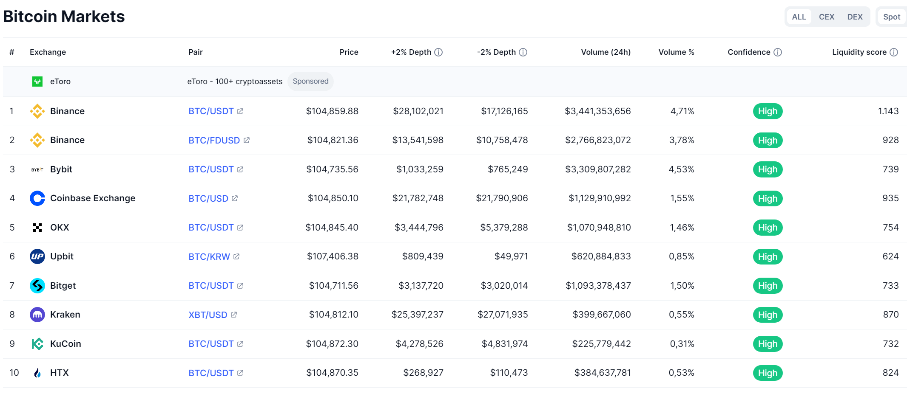

# Beste Cryptobörsen 2025

## Begriffe
Grundsätzlich unterscheidet man zwischen dezentralen ([DEX](../GLOSSAR/D/DEX.md) = Decentralized Exchange) und zentralen Kryptobörsen ([CEX](../GLOSSAR/C/CEX.md) = Centralized Exchange).

## Kriterien
* Tiefe **Transaktionsgebühren**
* Nachvollziehbare **Börsenkurse**  in Echtzeit
* **Reputation** in der Schweiz und international (Gründungsjahr, Handelsvolumen, Pressespiegel). 
* Glaubwürdiges **Management** 
* **Mobile Apps** verfügbar (on the road trading)
* Transparenz und Informationstiefe (Webseite, Blog, Newsletter)
* **Tools** für die Analyse und das Controlling
* **Benutzerfreundlichkeit** und Uebersicht 
* [Liquidität der Krypto-Vermögenswerte](#liquidität-der-krypto-vermögenswerte)
* 24/7 anywhere [Zugänglichkeit](#zugänglichkeit)
* **CHF Abrechung** 
* Einfacher Einstieg für **Anfänger**
* Advanced Features für **Profis**
* **CopyTrading**
* einfaches **Onboarding**

### Handelsgebühren
Gebühren können **Transaktionskosten**, **Maker**- und **Taker-Gebühren** sowie **Abhebungsgebühren** umfassen. 

Einige Plattformen bieten **gestaffelte Gebührenstrukturen oder Rabatte** für höhere Handelsvolumen, was für Vieltrader vorteilhaft sein kann. 

### Zahlungsmethoden
Vielfältige Zahlungsmethoden sind für Schweizer Händler unerlässlich, um nahtlose Transaktionen in CHF zu ermöglichen. Suchen Sie nach Börsen, die eine Vielzahl von Optionen unterstützen, einschließlich **Banküberweisungen, Kreditkarten und beliebte Schweizer Zahlungssysteme wie Twint**. 

### Technischer Support
Reaktionsschneller und zugänglicher Kundensupport ist für Schweizer Händler unerlässlich, insbesondere bei komplexen Transaktionen oder technischen Problemen. Suchen Sie nach Börsen, die 24/7-Support über mehrere Kanäle, einschließlich Live-Chat, E-Mail und Telefon, bieten. Die Verfügbarkeit von Support in den Amtssprachen der Schweiz (Deutsch, Französisch, Italienisch und Rätoromanisch) kann Ihr Erlebnis erheblich verbessern und es Ihnen erleichtern, Probleme schnell und effektiv zu lösen.

### Sicherheit
* Zwei-Faktor-Authentifizierung (2FA)
* Cold Storage für Vermögenswerte und 
* starke Verschlüsselungsprotokolle 

Überprüfen Sie, ob die Plattform den Schweizer Finanzvorschriften entspricht und eine solide Erfolgsbilanz beim Schutz von Benutzerfonds vor Betrug und Hacking-Versuchen hat.

### Liquidität der Krypto-Vermögenswerte
Liquidität ist entscheidend für die effiziente Durchführung von Trades zu günstigen Preisen. Für Schweizer Händler garantiert die Auswahl einer Börse mit hoher Liquidität in wichtigen Kryptowährungen wie Bitcoin (BTC), Ethereum (ETH) und anderen Altcoins reibungslosere Handelserfahrungen mit minimalem Slippage. Hohe Liquidität spiegelt auch ein lebhaftes Handelsumfeld wider, das es Ihnen ermöglicht, Vermögenswerte schnell und zu wettbewerbsfähigen Preisen zu kaufen und zu verkaufen.
### Zugänglichkeit
Zugänglichkeit
Zugänglichkeit ist entscheidend für Schweizer Händler, um sicherzustellen, dass die Börse in der Region verfügbar und benutzerfreundlich ist. Eine gute Plattform sollte mehrsprachigen Support bieten, insbesondere in Französisch, Deutsch und Italienisch, sowie mobile Apps, die den Handel unterwegs ermöglichen. Dies stellt sicher, dass Sie auf Ihr Konto zugreifen und Ihre Investitionen effizient verwalten können, unabhängig von Ihrem Standort

### Sitz im Ausland?
Ein Sitz im Ausland spricht übrigens nicht gegen die Seriosität einer Kryptobörse. Manche haben ihren Sitz aus steuerlichen Gründen so gewählt. Nicht jede Börse, die im Ausland sitzt, ist automatisch kriminell und nicht jede Börse in Deutschland automatisch ein Unternehmen, dem man vertrauen kann. Dank Internet und den sozialen Medien spricht es sich übrigens relativ schnell herum, wenn ein Unternehmen unehrlich handelt.

## Was wird gehandelt?
Intern verwenden wir https://coinmarketcap.com/ um zu sehen, welche Coins gegen welche Währung gekauft und verkauft werden können. 

## Crypto-Börsen und mein Verwendungs Status
Börsen die die Vorteile der Schweiz wei Stabilität, Innovation und regulatorischen Standards nutzen erlauben Schweizern ihr Handelspotential zu  maximieren und die Komplexitäten der Krypto-Welt mit Vertrauen zu meistern: 

### Aktive Börsen

* [Swissborg](S/Swissborg/Swissborg.md): aktives Handeln

* [Binance](B/Binance/Binance.md): Konto **muss mit neuem Pass erneut verifiziert werden**. 

### Mögliche Alternative Börsen 
Börsen die ich mir ev. genauer anschauen werde

* [Swiss Quote](S/SwissQuote.md)