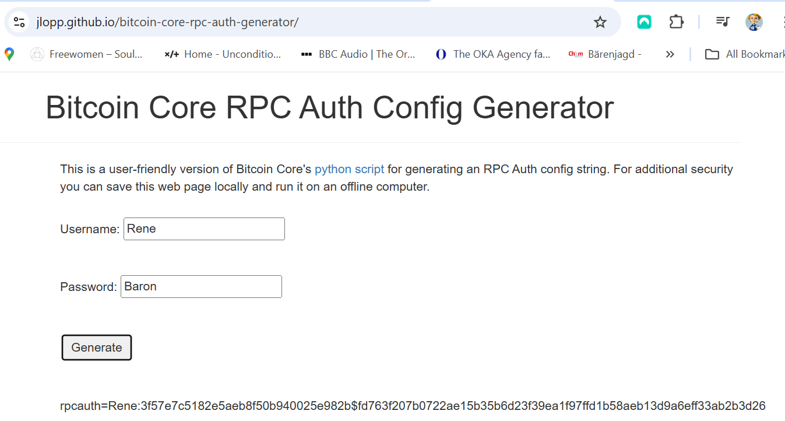

# BitCoinCore RPC Authentication

* [Credential Management](../../../../PRIV/_KEY/Admin/PW/_Credential-Management.md)

* [Auth Generator](https://jlopp.github.io/bitcoin-core-rpc-auth-generator): a python script for generating an RPC Auth config string. 

---
Anderst als auf der Kommandozeilte mittels [bitcoin cli](../bitcoin-cli.md) oder in der GUI-Konsole [bitcoin qt](../bitcoin-qt.md) müssen JSCON-RPC Calls zum mit [bitcoind](../../TOOLs/BitcoinCore/bitcoind.md) gestarteten BCoreServer mittels UserID und Passwort authentifiziert werden (da diese Calls, obwohl nicht empfohlen, auch von ausserhalb der lokalen Maschine erfolgen könnten).

Hierzu kann man sich im [Auth Generator](https://jlopp.github.io/bitcoin-core-rpc-auth-generator) auf der Basis einer adhoc gewählten UserID und eines Passworts (-> [_Credential Management](../../../../PRIV/_KEY/Admin/PW/_Credential-Management.md)) einen hexadezimal verschlüsselten Hash erstellen lassen den man ins wie folgt in die [bitcoin.config](../../TOOLs/BitcoinCore/bitcoin.config.md)-Datei einsetzt: 

Zum Beispiel generiert die UserID = Rene und das Passwort = Baron den folgenden Hash: 

> **rpcauth=Rene:3f57e7c5182e5aeb8f50b940025e982b$fd763f207b0722ae15b35b6d23f39ea1f97ffd1b58aeb13d9a6eff33ab2b3d26**

nach folgendem Muster

[*UserID:*Hash*$*Salt*]

wobei

* **UserID**: ist die bei der Eingabe im PassGenerator eingesetzte UserID (hier "Rene") gefolgt von einem abschliessenden **Doppelpunkt ":"**  

* **Hash**: die vom Generator aus UserID, Passwort und dem zufällig generierten "Salt" generierte hexidezimaler Hash mit abschliessendem **Dollarzeichen "$"**
* **Salt**: eine vom Generator generierte Zufallszahl in Hexdarstellung (damit ist jeder Hash auch bei gleichen UserName/PW-Kombi wieder anders). 

Nun kann diese ganze generierte Zeile, wie oben gezeigt, inklusive dem führenden "*rpcauth=*" an einer beliebigen Position (aber auf/in einer eigenen Zeile) in die [bitcoin.config](../../TOOLs/BitcoinCore/bitcoin.config.md) Datei kopiert werden:

> **rpcauth=Rene:3f57e7c5182e5aeb8f50b940025e982b$fd763f207b0722ae15b35b6d23f39ea1f97ffd1b58aeb13d9a6eff33ab2b3d26**

Damit diese Authentication Settings aktiv werden, muss man den **BCore Service neu starten**!
    

  
  
  
  
  
      
