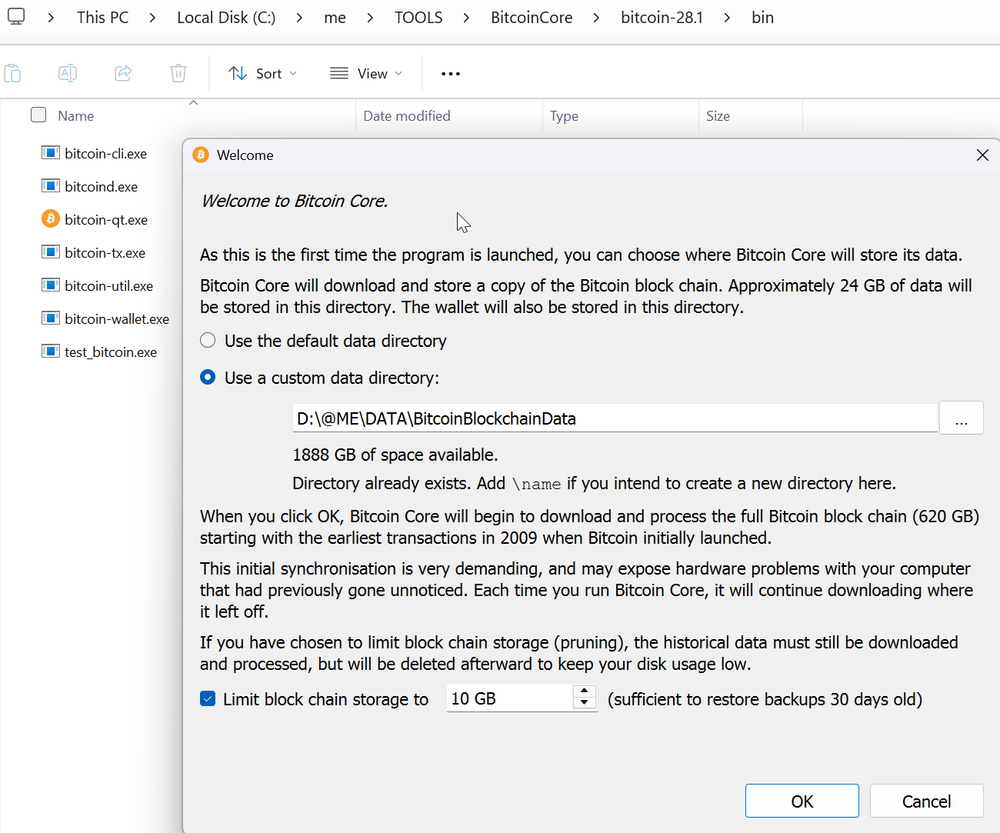
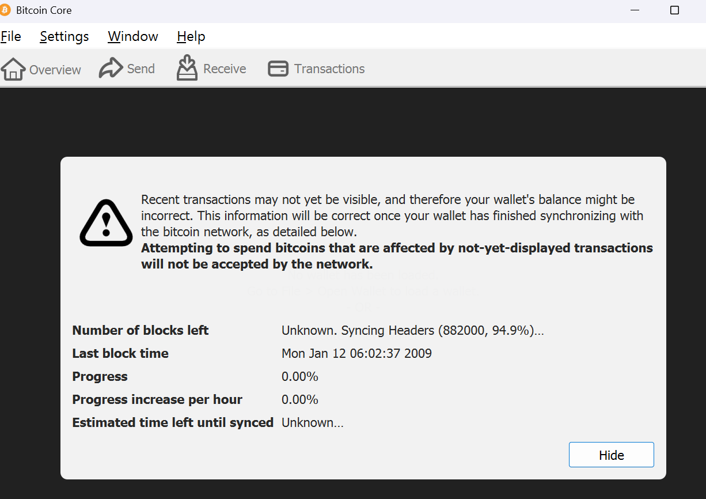

# Aufbau der Crypto Entwicklungsumgebung

* [BitCoin Buch Kapitel 3 zum Thema Entwicklungsumgebung](https://cypherpunks-core.github.io/bitcoinbook/ch03.html)

If you’re a developer, you will want to set up a development environment with all the tools, libraries, and support software for writing bitcoin applications. In this document we’ll walk through that process step-by-step. 

## Part 1: Setting Up Your Bitcoin Laboratory

### 1. Installing Bitcoin Core

Bitcoin Core provides two essential tools:

* **bitcoind**: The full node daemon (herefore the "d") that validates and relays transactions  

* **bitcoin-cli**: Your command-line interface (cli) to the daemon

1. **Download the latest version from https://bitcoin.org/en/download**

> Intern verwende ich das "C:\me\TOOLS\BitcoinCore"-Verzeichnis

2. **Unzip** the such downloaded files and **delete the *.zip-file** afterwards. 

3. Remove the **bitcoin-28.1-win64-folder** by moving its containing "**/bitcoin-28.1**"-folder into the BitcoinCore-Root folder and finally deleting the now emptied bitcoin-28.1-win64-folder (to reduce click- and typing-overhead) . 

4. **Antivirus anhalten**: Der Download würde mit eingeschaltetem Antivirus (nicht Firewall!) Jahre dauern. Deshalb habe ich den automatischen/realtime-scanning Antivirus ausgeschaltet. Ich denke das ist safe wenn ich während dieser Zeit darauf achte nichts runterzuladen und nur Vertrauenswürdiges zu klicken. ACHTUNG: bei einem nächtlichen ComputerUpdate wird der Antivirus neu gestartet!! -> Jeden Morgen checken ob er wieder ausgeschaltet ist. 

4. Run ***bitcoin-qt.exe*** in the above created ..\TOOLS\BitcoinCore\bitcoin-28.1 folder with the following options:  

    * As the installation requires 620GB!! of free storage, I have put this on **a fresh external 2TeraByte Drive in the *D:\@ME\DATA\BitcoinBlockchainData*-folder**  

    * I have **limited the final blockchain storage to 10 GB** (for 30 Days backup)  

    * When you **click "ok"** you will be asked to **open your firewall for external apps** to connect your computer: **say NO!** (You can open it later when you know what you are doing).  

    * **This downloads the entire history of Bitcoin transactions**: depending on the speed of your computer and network connection, the synchronization process can take hours to days.  
  
    * the following window tells you about progress and remaining download time: 

9. Antivirus wieder aktivieren!

**Tip**: die laufende **Synchronisierung kann jederzeit beendet werden** und mit einem **Neustart der bitcoin-qt.exe** Applikation wieder angestossen werden. Die Synchronisation läuft dann automatisch dort weiter, wo sie aufgehört hat. 

For this tutorial, **we'll use regtest mode—Bitcoin's built-in testing environment** where you're the only miner, blocks generate instantly, and you can experiment safely.

## Starting Your Private Bitcoin Network

# Start bitcoind in regtest mode
bitcoind -regtest -daemon

# Verify it's running
bitcoin-cli -regtest getnetworkinfo
Pro tip: Create an alias to save typing:

alias bcli="bitcoin-cli -regtest"
Now you can use bcli instead of typing the full command each time.