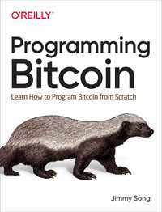

# Programming Bitcoin von Jimmy Song

Ich habe das Buch am 15. Januar 2026 begonnen auf der [OReilly Platform mit einem 10 Tage ProbeAbo zu lesen](../../../../../PRIV/_KEY/Assets/Services/O/OReilly.md). 

## Worum gehts?

## Scope
Knowing how Bitcoin works under the hood gives greater insight into what’s possible. Therfore **this books shows how to code our own BTC-library from scratch**. 

However, the library is not exhaustive nor efficient as its primary purpose is to educate some core principles so that you can make facts based decisions coming from the source and therefore can be trusted. 

The library itself is written in **Python 3**, and a lot of the exercises can be done in a controlled environment like a **Jupyter notebook**. 

### Out of Scope
However, this is **not a reference book** where you can look up the specification for a particular feature and it **doesn’t cover the monetary, economic, or social dynamics** of Bitcoin

## Extrakte
-> ["Warum Blockchain Programmierung wichtig ist"](../../Warum%20Blockchain%20Programmierung%20wichtig%20ist.md)

