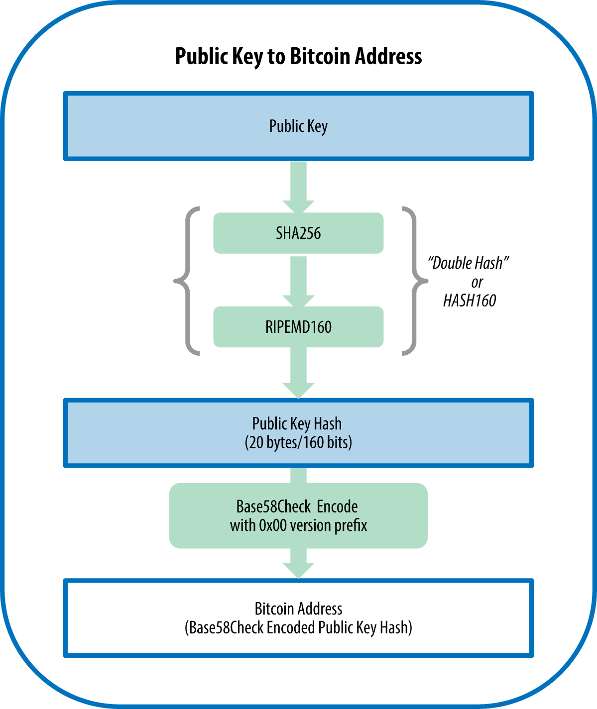

# Bitcoin Adressen (Address)

* [Blockchain Explorer](../B/Blockchain%20Explorer.md)

## Definition
**`1DSrfJdB2AnWaFNgSbv3MZC2m74996JafV`** ist eine BitCoin-Adress. Technisch handelt es isch um eine encodierte base58check Version eines 160-bit hashes eines [Public Keys](../P/Public%20Key.md). 

Analog zu einer eMail Adresse dient sie dazu Bitcoins an die Adrdesse von anderen zu senden. 

## Im Detail
Im Kontext von BitCoin Transaktionen verweist die "Adresse" - analog zu einer eMail-Adresse - auf die in der Blockchain vermerkten, aktuellen "BitContKonto"-Daten eines Nutzers. 

Technisch handelt es isch um eine encodierte base58check Version eines 160-bit hashes eines [Public Keys](../P/Public%20Key.md) und ist damit nicht mit dem [Public Keys](../P/Public%20Key.md) identisch!

Adressen sind kürzer als Public Keys und beginnen mit **1**, **3**, oder **bc1**, währenddem Public Keys mit **02**, **03** oder **04** beginnen.

## Verwendungszweck
Like email addresses, adresses can be shared with other bitcoin users who can use them to send bitcoin directly to your wallet. It can be posted anywhere without risking the security of the account. Unlike email addresses, you can create new addresses as often as you like, all of which will direct funds to your wallet. Modern wallets automatically create a new address for every transaction to maximize privacy. 

On the other hand, a wallet is simply a collection of addresses and the keys that unlock the funds within (resp. to decode the content at this addess).

## Blockchain Explorer
Die Adresse kann in einem [Blockchain Explorer](../B/Blockchain%20Explorer.md) eingegeben werden, um damit die auf der Blockchain gespeicherten und öffentlich zugänglichen (sofern man den richtigen Schlüssel hat) Daten auszulesen. 

## Wallets und das Generieren von neuen Adressen
Wallet applications randomly generated a private key at setup time plus a corresponding [Public Key](../P/Public%20Key.md) and at least one [Bitcoin Address](Address.md) derived from it. Neither Private nur Public key are visible to the user nor required for manual input. All what is required are addresses. 
However, as lont as the address is not used it is not known to the bitcoin network or "registered" with any part of the bitcoin system. 

A bitcoin address at this stage is simply a number that corresponds via [Public Key](../P/Public%20Key.md) to a [Private Key](../P/Private%20Key.md) that one can use to invite people to send money to this address and to control access to this funds when done so.

Wallets will normally generate addresses without reference or registration with any service and in most wallets, there is no association between the bitcoin address and any externally identifiable information including the user’s identity. 

Until the moment this address is referenced as the recipient of value in a transaction posted on the bitcoin ledger, the bitcoin address is simply part of the vast number of possible addresses that are valid in bitcoin. 

Only once it has been associated with a transaction does it become part of the publicly known addresses on the blockchain.

## Addresses vs. Public Keys
Adressen werden zwar immer mit Hilfe einer HashFunktion von Public Keys abgeleitet, sind aber NICHT mit diesen identisch!

Wallets und Transaktionen zeigen i.d.R immer die Adresse, nicht den Public Key! 

Adressen sind kürzer als Public Keys und beginnen mit **1**, **3**, oder **bc1**, währenddem Public Keys mit **02**, **03** oder **04** beginnen.

## Addresse und QR Code in der Wallet
The most important part of a wallet is its bitcoin address such as:  `1Cdid9KFAaatwczBwBttQcwXYCpvK8h7FK`. 

Next to the address we have it as **QR code** as well, that can be scanned by a smartphone camera. **Tip**: Tapping the QR code often magnifys it for easier scanning.

## Adress Generation Maths

The bitcoin address is derived from the public key through the use of one-way cryptographic hashing. 

A "hashing algorithm" or simply "hash algorithm" is a one-way function that produces a fingerprint or "hash" of an arbitrary-sized input. 

The algorithms used to make a bitcoin address from a public key are the Secure Hash Algorithm (SHA) and the RACE Integrity Primitives Evaluation Message Digest (RIPEMD), specifically **SHA256 and RIPEMD160**.

Starting with the public key K, we compute the SHA256 hash and then compute the RIPEMD160 hash of the result, producing a 160-bit (20-byte) number:

A = RIPEMD160(SHA256(K))

where K is the public key and A is the resulting bitcoin address.

Bitcoin addresses are almost always encoded as "Base58Check" (see Base58 and Base58Check Encoding), which uses 58 characters (a Base58 number system) and a checksum to help human readability, avoid ambiguity, and protect against errors in address transcription and entry. Base58Check is also used in many other ways in bitcoin, whenever there is a need for a user to read and correctly transcribe a number, such as a bitcoin address, a private key, an encrypted key, or a script hash.