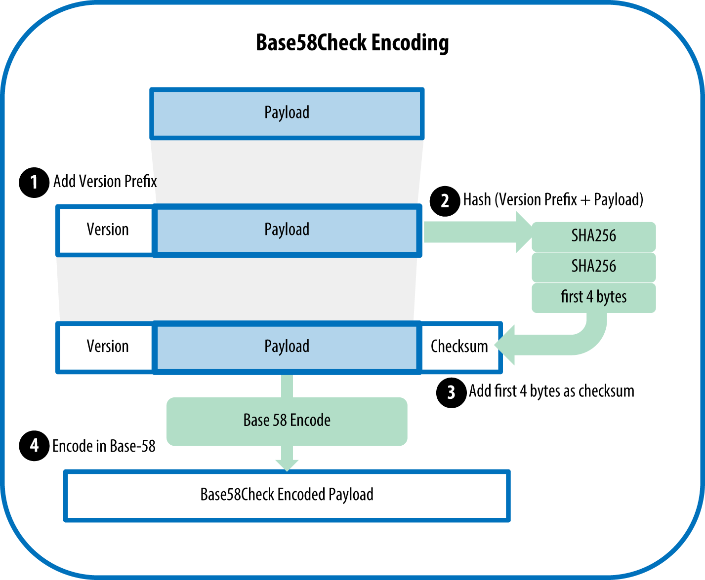

# Base58 Verschlüsselung
Bitcoin addresses are almost always encoded as "Base58Check" (see Base58 and Base58Check Encoding), which uses 58 characters (a Base58 number system) and a checksum to help human readability, avoid ambiguity, and protect against errors in address transcription and entry. Base58Check is also used in many other ways in bitcoin, whenever there is a need for a user to read and correctly transcribe a number, such as a bitcoin address, a private key, an encrypted key, or a script hash.
