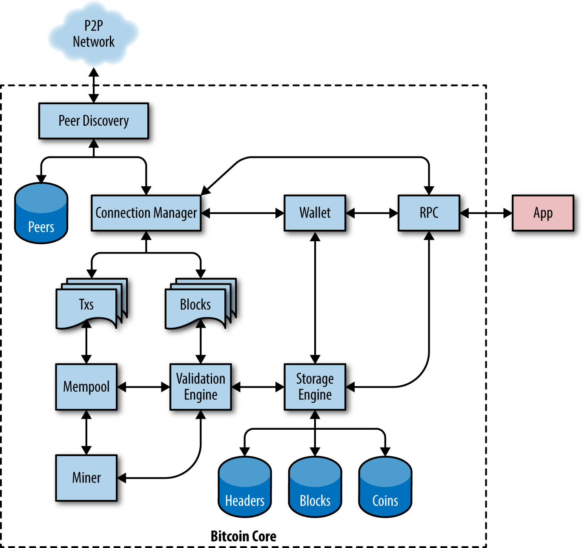

# Bitcoin Core
Also referred to as the "Satoshi Client", "BitCoin Core" is the **reference [BitCoin Wallet](../W/Wallet.md) that originally came with the original Bitcoin system** and which is derived from the original implementation written by Satoshi Nakamoto.

Bitcoin Core implements all aspects of bitcoin, including wallets, a transaction and block validation engine, and a full network node in the peer-to-peer bitcoin network.

ACHTUNG: 
The **Bitcoin Core wallet implementation is not intended to be used as a production wallet**!

## Architektur

## Open Source Setup
Bitcoin is an open source project and the source code is available under an open (MIT) license, free to download and use for any purpose. Open source means more than simply free to use. It also means that bitcoin is developed by an open community of volunteers. At first, that community consisted of only Satoshi Nakamoto. By 2016, bitcoin’s source code had more than 400 contributors with about a dozen developers working on the code almost full-time and several dozen more on a part-time basis. Anyone can contribute to the code—including you!

## Entwicklungsumgebung
Der Setup der Entwicklungsumgebung beschreiben wir in einem separaten Dokument

## History
When bitcoin was created by Satoshi Nakamoto, the software was actually completed before the whitepaper reproduced in [satoshi_whitepaper] was written. Satoshi wanted to make sure it worked before writing about it. That first implementation, then simply known as "Bitcoin" or "Satoshi client," has been heavily modified and improved. It has evolved into what is known as Bitcoin Core, to differentiate it from other compatible implementations. 

ACHTUNG:
Even though Bitcoin Core includes a reference implementation of a wallet, this is not intended to be used as a production wallet for users or for applications. Application developers are advised to build wallets using modern standards such as BIP-39 and BIP-32 (see [mnemonic_code_words] and [hd_wallets]). BIP stands for Bitcoin Improvement Proposal.

