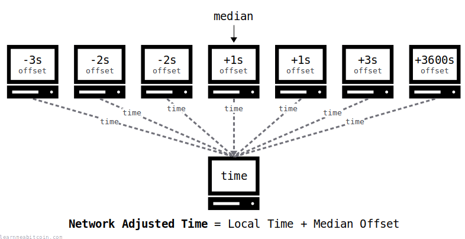

# Block Time 
"Ungefähre Zeit wann der Block erstellt wurde"

* [Details](https://learnmeabitcoin.com/technical/block/time/)

Das TIME-Feld im [Block Header](Block%20Header.md) ist der ungefähre Zeitpunk für das Erstellen des Candiate Blocks (-> [Mining](../../M/Mining.md)) im Unix Timestamp Format (Anzahl Sekunden seit dem 1. Januar 1970). 

Der [GenesisBlock]() hat den Timestamp `1231006505`, was dem 3. Januar 2009 um  18:15:05 entspricht.

ACHTUNG: Da der Timestamp nur UNGEFAEHR der Zeit des Einfügens in die Blockchain entspricht, kann es durchaus sein, dass später eingefügte Blocks eine frühere Zeit haben als ihre Vorgänger, resp. ist die Block Time kein Massstab für die Reihenfolge der Blocks in der Blockchain!

Bei der Validierung des Blocks muss die Block Time sich aber in den folgendne Grenzen halten: 
1. Grösser als der Durchschnitt der BlockTime der letzten 11 Blocks
2. Nicht grösser als die aktuelle Zeit + 2 Stunden! 

## Network Adjusted Time
Da es in einem dezentralen Netzwerk schwierig ist sich auf EINE Zeit zu einigen berechnet sich die Zeit eines aktiven Knotens als Mittelwert aller Zeiten der Rechner mit denen der Knoten in Verbindung steht. 

## Verwendung des Time-Feldes
### Pacemaker
Die Block Time wird vom Netzwerk verwendet um zu sehen ob Blocks in der vorgegebenen Zeit erstellt werden oder ob das Netzwerk durch die Anpassung des [Targets](../../T/Target.md) beschleunigt oder verlangsamt werden muss. 

### Locktime
Zum Berechnen von Sperrfristen wie z.B. für das Ausgeben von ([Block Rewards](BlockReward.md))