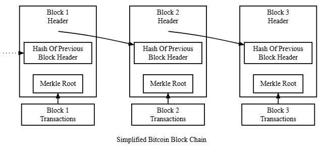
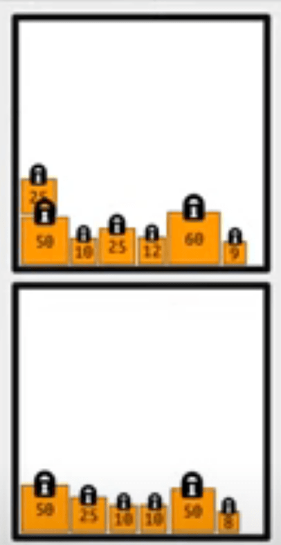

# Bitcoin Blockchain

* [BitCoin Developer Manual](https://developer.bitcoin.org/devguide/block_chain.html): Technical Explanations

* [Block](Block.md)

* [Transaction](../T/Transaction.md)

* [Script](../S/Script.md)

* [Verteilung der rund 22000 FullNodes](https://bitnodes.io/) 

> Die BitCoin Blockchain ist eine dezentral "verwaltete", einzige, öffentlich zugängliche Liste (denke an ein Excelsheet) in der sämtliche jemals getätigten BitCoin-Transaktionen und die Schaffung neuer Bitcoins-Werte mit ihrem Timestamp unabänderbar für ewig festgehalten werden. 

## Die Blockchain is a Chain of Blocks
Die Bitcoin Blockchain besteht aus verschlüsselten, maximal 1 MegaByte grossen [Blocks](Block/Block.md), die - indem sie den Hash der vorangegangenen Blocks in den eigenen HeaderDaten haben - logisch und unveränderbar so aneinander gekoppelt sind, dass es sofort auffallen würde, wenn man nachträglich Blöcke mutieren oder darin irgendwelche (Transaktions- oder Header)Daten ändern würde. Weil der nächste Block immer auf den Hash des vorangehendne Blocks verweist, ensteht - rein gedanklich - eine kettenähnliche Sturktur, was der Blockchain ihren Namen gibt, derweil die Blocks sich physich als voneinander völlig unabhängige Datenelemente repräsentieren.

## Blocks, Transaktionen und UTXOs
In den Blocks befinden sich - bildlich gesprochen - verschiedene, mit unterschiedlichen Beträgen gefüllte Geldsäcke ([UTXO](../U/UTXO.md)) mit einem Schloss (public key), welches nur von demjenigen geöffnet werden kann, der den dazu passenden Schlüssel (private Key) in seiner [Wallet](../W/Wallet.md) hat:  

Dieses Schloss besteht aus einem [Script](../S/Script.md) und dem Public Key des Besitzers, so dass jedermann, der dieses Script ausführt sich vergewissern kann, dass der Geldsack demjenigen gehört, der den dazu passende Public Key besitzt. 

Wenn ein UTXO vom Besitzer an einen Empfänger übergeben wird, wird er nicht physich bewegt, sondern eine Kopie davon wird mit dem Public Key des neuen Empfängers (resp. einem entsprchenden neuen Script) in einen neuen Block geschrieben.

## Wallet
Dafür wird in einer sogenannten Wallet-App eine [Transaction](../T/Transaction.md) erstellt, der man in einem ersten Schritt zuerst einen oder mehrere UTXOs zusammen mit dem Privat Key des Absenders zum Oeffnen der jeweiligen UTXO zuweist (Input UTXOs), um damit in einem zweiten Schritt einen weiteren, ebenfalls mit einem Schloss, resp. dem Public Key des Empfängers gesicherten Geldsack zu erstellen, den damit natürlich nur noch der Empfänger öffnen kann (Output UTXO). Dabei können UTXOs nur immer als GANZES überwiesen werden, wobei die Transaktion dann automatisch ein UTXO für das RetourGeld (Change) erstellen wird.

## BlockChain Implementierung
Stand 2025, ist die auf [22k+ unterschiedlichen FullNodes (davon nur rund 200 in der CH)](https://bitnodes.io/) dezentral laufende Blockchain auf **650 MegaBytes** angewachsen, und dürfe auch die nächsten Jahre noch auf eine TeraByte-Festplatte passen. 

