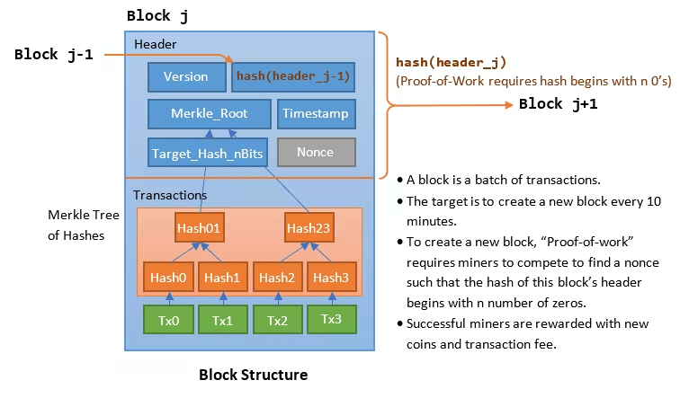

# Block Templates
Ein Block Template ist eine Vorlage für einen neuen Block in der Blockchain. Es enthält alle notwendigen Daten, die ein Miner benötigt, um einen gültigen Block zu erstellen und an das Netzwerk zu senden. Block Templates werden in der Regel von einer Bitcoin-Node generiert und sind ein zentraler Bestandteil des Mining-Prozesses.



## Bestandteile eines Block Templates
### Header-Daten:
* **Version: Gibt die Softwareversion des Bitcoin-Protokolls an.
* **Previous Block Hash: Verweis auf den Hash des vorherigen Blocks in der Blockchain.
* **Merkle Root: Der Wurzelhash des Merkle-Baums, der alle Transaktionen im Block repräsentiert.
* **Timestamp: Aktuelle Zeit des Nodes.
* **Difficulty Target: Die Schwierigkeitsgrenze, die der Block erfüllen muss.
* **Nonce: Ein Wert, der während des Minings variiert, um einen gültigen Blockhash zu finden.

### Liste von Transaktionen:
Enthält alle Transaktionen, die in den neuen Block aufgenommen werden sollen. Diese Transaktionen stammen aus dem Mempool (Memory Pool), in dem alle unbestätigten Transaktionen gespeichert werden.

### Coinbase-Transaktion:
Die erste Transaktion im Block, die die Mining-Belohnung an die Adresse des Miners auszahlt. Dies ist der einzige Weg, neue Coins in Umlauf zu bringen.

### Zusätzliche Felder:
Informationen über Gebühren, Höhe des Blocks, und manchmal sogar zusätzliche Metadaten.

## Wie werden Block Templates generiert
Block Templates werden normalerweise von einem Bitcoin-Node mit Hilfe der JSON-RPC-Schnittstelle bereitgestellt. Ein Miner bzw. der Stratum Server kann die Methode *getblocktemplate* verwenden, um eine aktuelle Vorlage zu erhalten.

Beispiel für einen RPC-Aufruf:

> *bitcoin-cli getblocktemplate '{"capabilities":["coinbasetxn", "workid"]}'*

Die Node gibt daraufhin ein JSON-Objekt zurück, das alle oben genannten Daten enthält.

Eine Antwort könnte in etwas so aussehen:

```json
{
  "version": 536870912,
  "previousblockhash": "0000000000000000000bae6ebf7a123456789abcdef0000000000000abcde123",
  "transactions": [
    {
      "data": "0100000001abcdef...", 
      "txid": "123456789abcdefabcdef123456789abcdef123456789abcdef123456789abcde",
      "hash": "abcdefabcdef123456789abcdefabcdef123456789abcdefabcdef123456789abc",
      "depends": [],
      "fee": 50000,
      "sigops": 2
    }
  ],
  "coinbaseaux": {
    "flags": "062f503253482f"
  },
  "coinbasevalue": 312500000, 
  "target": "0000000000000000000f00000000000000000000000000000000000000000000",
  "mintime": 1697097600,
  "mutable": ["time", "transactions", "prevblock"],
  "noncerange": "00000000ffffffff",
  "sigoplimit": 80000,
  "sizelimit": 4000000,
  "curtime": 1697098502,
  "bits": "170c47d7",
  "height": 809349
}
```

In diesem Beispiel ist nur eine einzige Transaktion enthalten. Ein Template wäre natürlich viel viel grösser.

### Erklärung der Felder
1. **version:
Gibt die Blockversion an, die verwendet wird. Die Miner müssen diese in den Blockheader einfügen.
2. **previousblockhash:
Der Hash des vorherigen Blocks, der in den neuen Block referenziert wird, um die Blockchain zu verketteten.
2. **transactions:
Eine Liste der Transaktionen, die im Block enthalten sein sollen.
data: Die vollständige, serialisierte Transaktion.
2. **txid: Die ID der Transaktion.
2. **hash: Hash der Transaktion.
2. **fee: Die Transaktionsgebühr (in Satoshis).
sigops: Anzahl der Signaturoperationen der Transaktion.
2. **coinbaseaux:
Zusätzliche Daten, die in der Coinbase-Transaktion enthalten sein sollen, wie Mining-Pool-Flags.
2. **coinbasevalue:
Die Gesamtbelohnung (Blockreward + Transaktionsgebühren), die an den Miner ausgezahlt wird (in Satoshis).
2. **target:
Der Zielwert, unter den der Hash fallen muss, damit der Block gültig ist (abhängig von der Difficulty).
2. **mintime:
Die frühestmögliche Zeit (UNIX-Timestamp), zu der der Block erstellt werden kann.
2. **mutable:
Eine Liste von Feldern, die der Miner anpassen darf, z. B. time, transactions oder prevblock.
2. **noncerange:
Der Wertebereich der Nonce, die der Miner verändern darf, um neue Hashes zu erzeugen.
2. **sigoplimit:
Die maximale Anzahl an Signaturoperationen, die im Block erlaubt sind.
2. **sizelimit:
Die maximale Blockgröße in Bytes (bei Bitcoin 4 MB, einschließlich SegWit-Daten).
2. **curtime:
Die aktuelle Zeit, zu der der Blocktemplate erstellt wurde (UNIX-Timestamp).
2. **bits:
Der kompakte Zielwert (Difficulty) für den Block in komprimierter Form.
2. **height:
Die Höhe des Blocks in der Blockchain (1-basierte Nummerierung).


Block Templates also sind ein zentraler Bestandteil des Mining-Prozesses. Sie enthalten die Daten, die ein Miner benötigt, um einen Block zu erstellen und zu validieren. Für Solominer die ihren eigenen Mining Pool beitreiben, bieten sie maximale Kontrolle über den Inhalt des Blocks und die Auszahlung der Belohnung. Ein Blocktemplate, der eure BTC-Adresse enthält, kann nicht mehr nachträglich von Bitcoincore verändert werden, ansonsten würde der Hash des Blocks nicht mehr stimmen.

## Was ist, wenn ich mehrere Miner habe, arbeiten die dann alle am selben Template?

Nein, dafür gibt es eben zum Beispiel die ExtraNonce. Die ExtraNonce ist Teil des Stratum mining protocol und befindet sich im Header der Coinbase Transaktion. Die ExtraNonce besteht aus 2 Teilen:
ExtraNonce1 und ExtraNonce2:

👉 Die ExtraNonce1 wird dem Miner vom Pool zur Verfügung gestellt und dient als Identifikator
mining.subscribe("user agent/version", "extranonce1")

👉 Die ExtraNonce2 wird vom Miner während seiner Arbeit ständig geändert und mit jedem Share an den Pool übermittelt
mining.submit("username", "job id", "ExtraNonce2", "nTime", "nOnce")

Mit diesem 'unique string' oder 'Identifikator' ist sichergestellt, dass 2 Worker selbst bei identischem Block Template / Nonce / Time Stamp etc. nie den gleichen Hash produzieren.

Damit wird sichergestellt, dass sich die Hashleistung auch bei mehreren Workern addiert, und niemals 2 Miner an der selben Aufgabe rechnen.