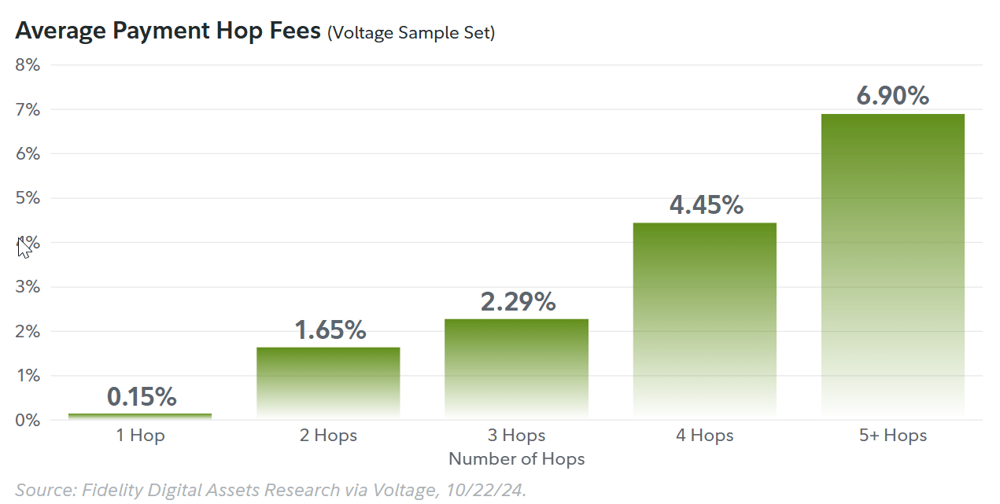
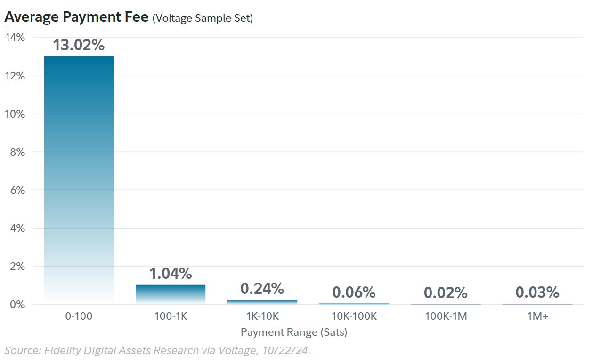

# Lightning Network

## Lektionen und Links
* [Originales LN White Paper 2016](https://lightning.network/lightning-network-paper.pdf)

* [Wikipedia](https://en.wikipedia.org/wiki/Lightning_Network)

* [**UebersichtsVid** vom CoinBureau](https://www.youtube.com/watch?v=J3cQNpOR_a0)
* [A **Technical Introduction** to The Lightning Network von Andreas M. Antonopoulos ](https://www.youtube.com/watch?v=E1n3sKKPD_k)
* [2025 Lightning Report by Voltage](https://fwc.widen.net/s/hph5vgcj2h/fda_us_uk_thelightningnetwork_expandingbitcoinusecases_1187503.2.0_v1)

* https://www.theblock.co/post/291662/coinbase-lightning-network-lightspark
* https://lightning.network/lightning-network-paper.pdf
* https://nostr.how/en/zaps
* https://stats.nostr.band/
* https://github.com/ark-network/ark
* https://ark-protocol.org/
* https://docs.lightning.engineering/the-lightning-network/taproot-assets/faq

## Uebersicht
Das Lightning Netzwerk, abgekürzt LN, ist ein auf der BTC-Blockchain basierendes Layer2  Routing-Neztwerk (also KEINE Blockchain) zur Skalierung des auf 7 Transaktionen pro Sekunden limitierten BTC-Layers und zur **Reduktion der Transaktionskosten** auf Cents-Bruchteile statt bis zu 50$ für jede einzelen BTC-Transaktion. Fehlverhalten der Teilnehmer wird durch automatisch ausgelöste "Zahlungen" an Betroffene geahndet. 

Hauptsächlich als Peer to Peer Micropayment-system konzipiert, kann das LN zukünftig auch für andere Dienste verwendet werden. Zudem ist das LN nicht auf BTC beschränkt solange alle Implementierungen den sogenannt COLT-Standard implementieren. 

Nach einem initialen "Hochladen" (eine sogenannten time-locked, dualsig "funding transaction" auf dem BitcoinNetzwerk) eines damit geblockten BTC-Betrags kann man diesen BTC-Betrag (Satoshis) anonym über sogenannte "Channels" - direkte oder indirekt über "Hopps" geroutete LN Verbindungen - an andere Teilnehmer versenden. Dieses LN-Konto kann dabei jederzeit wieder "gelöscht" und damit das dann aktuelle BTC-Guthaben wieder über eine zweite (sogenannte BTC "Settlement Transaction") in die BTC-Blockchain zurückgeführt werden. Funding- und Settlement-Transaktion verlangen natürlich die betragsunaghängigen üblichen BTC-TransactionFeed zwischen 5-50$. 

Da jeder an einer LN-Transaktion beteiltigte Knoten selbst mindestens über den zu transferierenden Betrag auf seinem Konto haben muss, ist LN für grössere adhoc Beträge an beliebige Personen noch nicht geeignet. Dedizierte LN-Anbieter die ihre "Kunden" direkt verbinden, springen hier einerseits in die Bresche aber führen auch zu einer gewissen Zentralisierung und mittels entsprechender KYC-Verfahren auch zur Auflösung der Anonymität. 

Started 2016 it fully launched in 2018 but did not got adoption before 2024. 2025 Lightning payments are now integrated into large exchanges such as Kraken and Coinbase.

To preserve privacy and security, the network employs an onion routing protocol, wherein each node in the path decrypts only enough information to determine the next hop, without knowledge of the payment's origin or final destination

Several cryptocurrency wallets offer support for the Lightning Network.

## Key Lessons
1. Um am LN teilzunehmen, muss man immer zuersts mal eigene **BTCs ins LN "hochladen"** und damit parkieren, wo es dann bis um finalen "Settlement" bleibt (**locked BTC**), resp. kann man über diese BTCs bis zum Settlement (was dauern kann) nicht verfügen.   
Alternativ kann man auch über einen entsprechenden **LN-OnRamper** wie z.B. Cryptobörsen gehen,  an dessen LN-Pool man partizipiert aber damit natürlich a) die Anonymität aufgibt und b) man dem Anbieter vertrauen muss dass er sich nicht einfach verabschiedet. 

2. Um zum Beispiel 1 BTC an einen Empfänger zu senden muss jeder Knoten dazwischen mindestens 1 BTC auf seinem Konto haben. Damit nimmt die Anzahl Knoten mit der Höhe des Transaktionswerts ab. 

3. Lightning Network is a peer-to-peer payment network and not a blockchain,

4. **Fees**: in the Lightning Network, each user can decide the fees they are willing to pay and deploy channels to achieve it. 2025 fees did vary drastically between nodes or even between
payments. This means it is possible to pay no fee whatsoever or under 0.5% fees on payments on the Lightning Network. Alternatively, if users do not have a proper channel management strategy, they could pay a high amount of fees.

2. Jeder Knoten der eine Transaktion weiterleiter erhält einen Bruchteil von einem Rappen **Transactionfees**. Im LN kann man also als blosser "Router" Geld verdienen!

3. Die LN App muss für die Dauer von Transaktionen offen resp. permanent am Laufen gehalten werden. (to be checked)

4. Lightning funzt nicht nur für BTC sondern akzeptiert auch ETC und andere Cryptowährungen. 

5. Granularity – According to Andreas Antonopoulos, some implementations of the Lightning Network allow for payments that are smaller than a satoshi, the smallest unit on the base layer of bitcoin.

Privacy – Lightning network payments may be routed through many sequential channels where each node operator will be able to see payments across their channels, but they will not be able to see the source nor destination of those funds if they are non-adjacent.

5. Alternativ zu Lightning gibt es das sogenannte MONERO Netzwerk

6. Centralization doesn't really have any effect on the lightning network. The big hubs would have no advantage over smaller hubs, since they can't see the transaction info routing through. Also people can choose nodes to connect to, and thus it is much more likely that many medium sized hubs will be created because people will connect to multiple different hubs in case one is down for some reason.

7. Strike ist eine Schlüsselapplikation für Lightning

8. LN interne "Watchtowers" kontrollieren die Channels für Missbrauch

9. Grosse Firmen würden es lieben herauszufinden wer wem Geld sendet. 

10. **Mangelnde Messbarkeit und Transparenz**: Scheinbar ist es schwierig die Anzahl der Knoten, Channels und Transaktionen zu messen da jeder "Messer" einzig und allein Zugriff auf seine eigenen Kanäle hat und nicht sieht was er selber routet oder was ausserhalb seiner eigenen Kanäle passiert resp. gibt es für Lightning keine Chain oder MemPool oder anderes Objekt wo alles zusammenläuft sondern alles läuft hier ohne Lod oder Ledger strikt Peer2peer.

11. The Lightning Network permits permissionless unilateral exits as a part of the protocol.n other words, any participant in a Lightning channel may close the channel and reclaim
their capital as on-chain bitcoin at any time without third-party permission. Bei noch offen contracten fallen dabei eventuell Gebühren oder Strafen an (Collaterals). 

## LN Use Cases
* Anonyme Finanztransaktionen über Ländergrenzen hinweg
* InGame Payments
* Als "Router" Transactionfees kassieren (zur Zeit sehr wenig)

## Transaction Fees
Given that the Lightning Network is a peer-to-peer payment network and not a blockchain,
the fee rates experienced in the network can vary drastically between nodes or even between
payments. Across most of the digital asset ecosystem, participants are accustomed to having a
global fee rate that all users must conform to. However, in the Lightning Network, each user can decide the fees they are willing to pay and deploy channels to achieve it.

This means it is possible to pay no fee whatsoever or under 0.5% fees on payments on the
Lightning Network. Alternatively, if users do not have a proper channel management strategy,
they could pay a high amount of fees.

An aspect of Lightning transactions that can be attributed to fees is the number of “hops” a
transaction requires to find the end address. If one was to consider the Lightning Network as a subway system, each “hop” can be compared to a rider having to get off and on to another train, paying a separate fee for each.

The payment rails in the Lightning Network are channels created between nodes. Each node
sets their individual fee rate and charges the user for forwarding the transaction to the next node. The forwarding of a payment is known as a “hop.”

The more hops a payment uses, the higher the fee will likely be. However, it is possible to pay no fees for a payment if you are paying directly to your channel counterparty. This is why having an effective channel strategy is key to achieving low fees.

Users must be mindful of the channels they open to ensure the fewest number of hops.
Channels are becoming fewer but more substantial, indicating channel consolidation.

Using the dataset from Voltage, we can see that larger Lightning transactions experienced lower fee rates. While this may seem counterintuitive, it is likely due to nodes in the network using a fixed cost or flat rate for their base fee.

In other words, nodes are size agnostic. They are assigning the same base fee for sending
$5 and $1,000, then additionally a percent of payment size. At the time of writing, Lightning
appears to be one of the most cost-effective protocols for sending substantial amounts of value.

However, this does not imply that transactions such as micropayments are impossible to
conduct on the Lightning Network. Instead, it simply suggests that users and entities supporting this ecosystem need to be intentional when opening channels to perform that use case. 

It is possible the Lightning Network could further entrench itself as one of the most cost-
effective methods of transacting within the entire digital asset ecosystem when properly
configured. This would fulfill its original intent of processing payments at a significantly
lower cost compared to on-chain transactions. Users paying high fees in the Lightning
Network could easily avoid doing so with proper analysis and configuration.
It is also important to consider that payments to in-demand destinations often incur higher
fees. This is due to routing and fee market dynamics inherent to the network.
Through a well-connected self-hosted node, transactions that required an average of one
to three hops paid a fee of 0.04%. In other words, transactions over 1,000,000 satoshis
(~$1,000) have cost between $0.39 and $1.27. This fee-to-transaction settlement ratio is rare
within the traditional payment processing sector and across other digital asset networks.

## Warum Lightning ev. nicht funktioniert
* **OnRamp zu teuer**: Da L1 BTC-Transaktionen immer teurer werden (bis zu 50$ pro Transaktion) ist es nicht wahrscheinlich, dass Individuen einfach schnell mal einen Channel mit 100$ eröffnen werden. Und wenn sie es tun, dann werden sie diese 100$ bei fallenden BTC-Kurs abschreiben müssen und erst wieder über dieses BTC verfügen können, resp. den Channel schliessen wenn der BTC Kurs so hoch gestiegen ist, dass sich der Cashout minus Fees für die zwei UpRamp und Closing-Transaktion lohnt. 

* **Kein Incentive**: Da man zuerst initial echte BTCs ins LN pumpen muss die dort solange parkiert bleiben bis man den Channel wieder auflöst, führt das natürlich zu massivem de-channeling wenn der BTC-Kurs fällt und BTC-Owners ihre BTCs auf der Level1 Blockchain verkaufen wollen. Wenn das passiert und damit massiv Routing-Knoten fehlen sind schnell mal gewisse Zahlungen nicht mehr möglich weil einfach kein Route mehr gefunden werden kann, zu langsam und zu teuer (weil bei jedem Hopp eine Fees gezahlt werden muss (Burchteile von Rappen aber immerhin). So muss man sich schon fragen ob man seine BTC wirklich im LN parkieren will nur um Dienstleistungen zu bezahlen die man auch einfacher, schneller und transparenter auch mit FIAT bezahlen könnte. 

* **Drohende Regulierung**: Staaten könnten versuchen wichtige auf Lightning basierende Infrastrukturanbieter (Onramper) und Geschäftsmodelle (IOY-Provider) zur Aufgabe oder zur Offenlegung der Transaktionsteilnehmer zwingen. 

* **Mangelnde Skalierbarkeit**: Wenn auch nur 10% der Weltbevölkerung initial auf LN onrampen wollen (OnRampTransactions) bringt das das Level1 BTC-Netzwerk an den Anschlag. 

## Metrics
Publicly available metrics include the number of public nodes, public channels, and public
channel capacity. However, these figures only represent a partial view of the network because
nodes and channels can be kept private. Key metrics for measuring the Lightning Network’s
success—such as transaction counts, transaction volumes, and fee rates—are only visible
to the node operator. By collaborating with Voltage, we can provide readers with a glimpse
into some of these private metrics to better analyze the overall growth of the network.
---

### Stand von LN 2025
• More businesses integrated the Lightning Network in 2024 than years past—a trend we expect to continue throughout 2025.
• The Lightning Network is showing signs of maturity. Smaller, less efficient channels deployed between 2018–2020 are closing in favor of larger, more streamlined channels.
• Total average capacity of public Lightning Network channels has grown, increasing the probability of payment success as payment sizes increase.
• A well-optimized participant in the Lightning Network can see transaction fees as low as 0% and payment completion times of less than half a second.
• A shift is occurring in favor of fewer, larger well-connected nodes as opposed to many smaller nodes.
• The Lightning Network is delivering on the promise of being the most efficient way to transact in the digital asset ecosystem.
• Lightning can be viewed as a yield-bearing network that does not require users to give up control of their bitcoin.

## Providers
### Voltage
[Voltage](https://www.voltage.cloud/) is a leading Lightning Network payment provider

## What's on the Horizon?
Another interesting aspect of the Lightning Network is the application of fungible and non-
fungible tokens. The Taproot Assets protocol enables the issuance of digital assets outside
the scope of the underlying blockchain (Bitcoin).⁸
Assets are created and embedded into bitcoin’s existing dataset of UTXOs. Taproot Assets have
the potential to expand Bitcoin’s functionality beyond seemingly simple value transfer by enabling
the transfer of all assets inscribed to the network.
However, the most notable breakthrough here lies in the combination of Taproot Assets and the
Lightning Network. At its most basic level, Bitcoin is simply a decentralized ledger of “who owns
what.” This means bitcoin is never sent between addresses like some explanations may imply.
Rather, a change in the ledger means adding a credit to one side and a debit to the other.
This distinction is important because these two protocols enable ownership of inscribed assets to
be traded at “lightning” speed with a negligible cost. Stablecoins, NFTs, and real-world assets such
as gold and corporate bonds could trade seamlessly between users, companies, or even countries.
As a payment rail, Lightning is one of the fastest in the world. Now, users can load it with virtually
any asset. Users may even choose to use the Lightning Network over other comparatively fast
alternatives because it is backed and secured by Bitcoin.
An alternative view offers the Lightning Network not as a peer-to-peer scaling technology, but
instead as one for immediate and final settlement between banks and institutions. Currently, most
banks are a part of an interbank settlement network such as Fedwire or SWIFT. These networks
enable one- to two-day payments. However, these transactions include multiple third parties.
In some cases, additional parties are needed such as a clearing house or correspondent banks.
Using the Lightning Network, banks and institutions could settle debts instantaneously and in
real time, either for themselves or on behalf of clients and users. However, the “HODL” mentality,
driven by expectations of increasing purchasing power, makes investors reluctant to spend
bitcoin. This could impact the speed at which Lightning is adopted.
Consequently, the Lightning Network and similar technologies that promote bitcoin spending
remain relatively new concepts for most users. Looking ahead, we anticipate continued growth
for the Lightning Network, despite bitcoin’s perception as a maturing store of value that
discourages spending.
Stablecoins on Lightning are expected to address this issue. Users will benefit from the speed
and low fees that the Lightning Network offers while holding a stable asset.
13The Lightning Network: Expanding Bitcoin Use Cases

## Can Lightning Strengthen Bitcoin’s Overall Investment Thesis? 
Where Layer 1 bitcoin transactions take an average of 10 minutes to settle, Lightning
transactions occur at the speed of light. Lightning transactions have a negligible cost,
enabling the streaming of funds. This combination enables bitcoin payments to be used
for day-to-day purchases such as a cup of coffee and for a new type of digital commerce
enabled by micropayments.

For Lightning to be truly effective, users need Lightning payments to work 100% of the time.

Both publicly available data and my proprietary data support the thesis that Lightning
is steadily improving in efficiency and growth while also expanding its use cases beyond
simple one-to-one payments. Its network capacity and transaction volume have continued
to increase as Lightning continues to scale.

Additionally, there is the advantage of not needing to rely on a different blockchain or token.

The ability to use the native bitcoin token for transactions is highly attractive in today’s digital asset ecosystem, as new protocols with obfuscated tokenomics are constantly emerging.

Lastly, I believe the Lightning Network presents a transformative opportunity for both new
and existing financial institutions as well as payment service providers to gain a significant competitive advantage in the global remittance and transaction processing landscape.

This second-layer solution, built on the current most secure digital asset network, offers several key benefits that may warrant consideration from institutional entities. By adopting this technology, banks, exchanges, and payment processors may be able to position themselves at the forefront of financial innovation. Further institutional adoption could solidify Bitcoin’s role in the global financial system, enhancing its long-term value proposition and investment potential. 

## Diskussionen

I am convinced that Bitcoin will die, when we do not succeed in making it the backbone/foundation of an openly and publicly accessible payment system that provides the same level of anonymity as BTC but not necessarily the same security standards. Having said this, I am wondering why developers are not making more efforts to control and standardize the (Layer 1 detached) IOY-business (Level 3) on top of the Lightning Network. Rather than criticizing Lightning, we should put efforts into Layer3 protocol standards that ensure fully transparent BTC-coverage for IOY-Lightning-providers. 

### [Lightning Network has Failed](https://www.youtube.com/watch?v=5Cq0C0SpbkY)

There are a lot of assumption in this vid that might be true or not: 

1. **Transaction Fees**: considering new types of hardware using less energy and new energy sources that can provide excess energy at low cost might still lead to acceptable transaction fees. Additinally not every (state) miner has to earn money and is following its own purpose (control, domination, security, etc. )

2. **Opening and Closing Channels**: maybe layer 1 interaction was never ment to be for end-users but for intermediary only who will run their IOY-business. 

3. **The 3rd picture is wrong** in a sense that we will not only have a few banks and whales on the first ring but millions keeping anonymity, choice, etc. alive due to global competition. Everybody who wants to run a IOY-biz is entitled to open an channel: either as a startup, as a NGO, as a state authority or just some friends putting some money together to run their own "pool". So, when you are not happy with any IOY (which I do not believe will ever happen) you can still run your own - the same way everybody may run his or her own BTC-node. 

4. The whole point stands and falls with the **standards, regulations, open code, and other trust mechanism etc. for running such IOY business** where the sume of IOY-coins can  be transparently mapped to the BTC-Channel. As soon such mapping mechanism are in place most of the the fears this guy has mentioned might vanish, right?
I am not saying that his assumptions are wrong. I am just saying that his assumptions have no prove as it all depends on implementations that are not yet analysed or not yet existing. 
So, my  conclusion here is that most probably we are having the wrong discussions because it is just assumption based. A better discussion would be about how th IOY-processings can be standardized and audited, right?

## LN Provider (LSP)
Lightning Service Providers (LSPs) are companies or entities that act like ISPs for the Bitcoin Lightning Network, providing essential liquidity and connectivity for users, especially newcomers, by opening channels, managing inbound/outbound funds, routing payments, and handling complex tasks so users get instant, reliable transactions without managing nodes themselves, with key examples including providers like Voltage, Lightspark, Breez, and Bitrefill. 

### Voltage
richtet sich for allem an Geschäftskunden die eine einfache ReadyMade-Lösung suchen

### Lightsparks
[Lightsparks](https://docs.lightspark.com/) bietet ein **API für Programmierer** für dein vereinfachten Zugriff auf die Lightning-Architektur für den Bau eigener Lösungen. Anbieter von [UMA as a Service](https://lightsparkdev.github.io/umaaas-api/) für das einfache verschieben beliebiger Crypto und FIAT Währungen über das Lightning Netzwerk. 
Tolle Doks.

## Breez
SDK Provider
Offers the "Misty Breez" App for sending and receiving bitcoin payments powered by the Breez SDK that offers a ready-made white-label solution for partners building new apps. Bietet ein paar [gehaltvolle BlogArtikel](https://blog.breez.technology/)

## Bitrefill. 
[Bitrefill](https://help.bitrefill.com/hc/en-us) 

## Alternativen

## Geschichte
* **2015** publizierten Joseph Poon und Thaddeus Dryja ihr Lightning Network Whihte Paper. 

* **2018** startete Lightning Labs das Lightning Network. Zu diesem Zeitpunkg hatte die Bitcoin Blockchain gerade mal einen Troughput von 7 Transaktionen pro Sekunde (verglichen mit Kreditkarteninstituten die 30000+ Transaktionen pro Sekunde handeln und auch weiter skalieren können). Leider haben Berichte über nicht ausgeführte Transaktionen und Sicherheitslücken die anfängliche Akzeptanz geschmälert.

* **2019** a pseudonymous Twitter user hodlonaut began a game-like promotional test of the Lightning Network by sending 100,000 satoshis (0.001 bitcoin) to a trusted recipient where each recipient added 10,000 satoshis ($0.34 at the time) to send to the next trusted recipient. The "lightning torch" payment reached notable personalities including former Twitter A.K.A X CEO Jack Dorsey, Litecoin Creator Charlie Lee, Lightning Labs CEO Elizabeth Stark, and Binance CEO "CZ" Changpeng Zhao, among others.