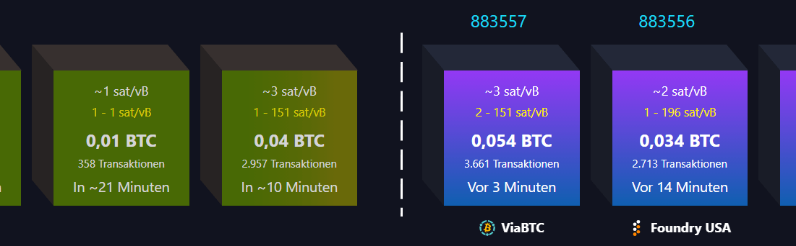

# Mempool (Blockchain)
Bildlich gesprochen ist der Mempool eine dezentral verwaltete **Warteschlange für noch unbestätigte Transaktionen**, die alle darauf warten, von einem Miner gewählt (je höher die Transaction-Fee, umso grösser die Wahrscheinlichkeit), überprüft, verschlüsselt und in einem neuen Block der Blockchain angefügt und damit bestätigt (confirmed) zu werden. 

Physikalisch ist der Mempool eine sich permanent um weitere Transaktionen  ergänzende Datei mit **Daten von neuen aber noch nicht bestätigten (pending) Transaktionen**, die von mindestens einem Knoten verifiziert worden sind. 

Defaultmässig allziert BitcoinCore für den MemPool 300MB. Ist der MemPool voll, verweigert er die Annahme von Transaktionen deren Fee unter einem bestimmten Wert (Feerate threshold) liegt.  

Die akutellen Werte für die MemPool Auslastung (Speicherplatzverbrauch) und die minimum Threshold FeeRate (Mindestgebühr) werden auf der Mempool.space Frontpage rechts unterhalb der Blocks angegeben. 

Merkpunkt: **Jeder NetzKnoten verwaltet seinen eigenen Mempool mit unterschiedlichen Speichergrössen und Defaultwerten** und beinhaltet dabei unterschiedlichen Transaktionen, resp. gibt es **keinen einheitlichen, global gültigen, zentral verwalteten Mempool**! sondern immer so viele wie es aktive Knoten im Netzwerk gibt. 

Diese Knoten erhalten zwar irgenwann mal all Transaktionen, aber erhalten sie - je nach Netzwerk-Pfad - nicht alle gleichzeitig. Damit fehlen neue Transaktionen in gewissen MemPools während sie in anderen bereits vorhanden sind. Oder sie fehlen in kleinen, vollen Pools währenddem sie in grösser konfigurierten Pools immer noch zu finden sind. 

> Anmerkung: Früher wurde der `Mempool` auch `Memory Pool` oder `Transaction Pool` genannt.

## mempool.space
Auf der Webseite https://mempool.space/de/ erhält man einen Ueberblick über die **aktuell anstehenden Transaktionen mit zugehörigen US$-Beträgen und TransactionFees** und wie deren Daten in einen neuen Block eingepasst werden. 
> 
^-- 
In je nach Auslastung Grün (wenig), Gelb (mittel), Organage (starkt) Rot (überlastet) sieht man links die ausstehenden Blöcke (projected) und rechts der weiss gestrichelten Linie die blauen bestätigten mit der BlockID (der wievielte Block seit dem GenesisBlock under der 0-ID) darüber, der mittleren, höchsten und tiefsten TransactionFee, Anzahl der darin enthaltenen Transaktionen und MiningTime (in der Box) und dem Namen ihrer Miner (darunter).

Den **Status eigener Transaktionen** kann man durch das Einfügen der Absender-Adresse oder der TransaktionsID oben rechts in die Suchbox abfragen. 

Ausserdem kann man hier auch noch nachträglich und wiederholt die Transactionfee erhöhen, um so die Bestätigung zu beschleunigen und endlos zurückgestellte Transaktionen zu verhindern. 

Mempool.space betreibt viele eigen, aber unterschiedliche Knoten um einerseits das Echtzeitverhalten kleiner Mempools abzubilden welche, sobald sie voll sind Transaktionen ohne Minimalfee zurückweisen, aber auch von der Grösse her unbeschränkte Mempools, die sicherstellen, dass ALLE pendenten Transaktionen auffindbar bleiben. 

### Mempool Goggles

Mit dieser Visualisierung versucht man effektiv erstellte Blocks auf der Basis von mehrern von Mempool.space betriebenen, unterschiedlich konfigurierten Knoten vorauszusagen. Indem man diese "projected" blocks mit den effekt erstellten vergleicht, werden die Vorcast laufend verbesssert und oder an veränderte Umwelt/Marktparameter angepasst. 

## Wie lange bleiben Transaktionen im Mempool?
Da es nicht "den einen Mempool" gibt, sondern sich dieser individuell von Node zu Node unterscheiden kann, gibt es auf diese Frage keine konkrete Antwort. Eine veröffentlichte Bitcoin Transaktion kann grundsätzlich auch erst in 10 Jahren bestätigt werden, sofern sie ihre Gültigkeit nicht verliert.

**Die Standardeinstellung der Bitcoin Nodes entfernt Transaktionen allerdings nach 14 Tagen aus ihrem Mempool**, sollte sie in dieser Zeit nicht bestätigt werden. Diese Einstellung ist jedoch nicht in Stein gemeißelt, weshalb Transaktionen auch nach 14 Tagen noch durchaus im ein oder anderen Mempool auftauchen können. Solange eine Transaktion gültig ist, kann sie außerdem jederzeit wieder neu veröffentlicht werden.

