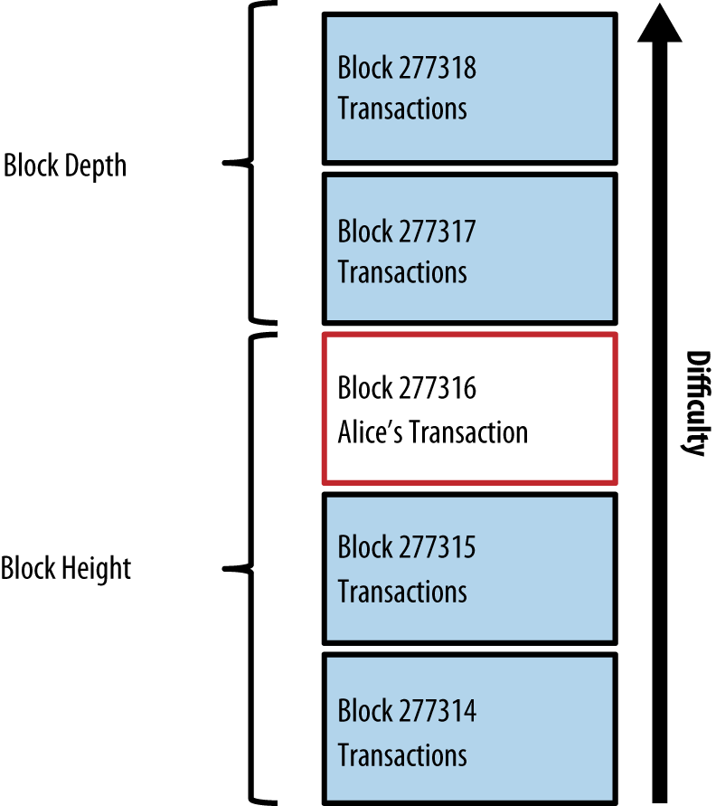
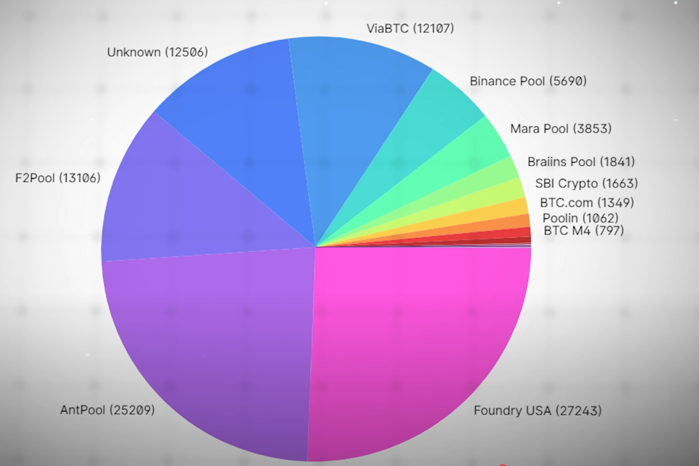

# Bitcoin Mining - eine Uebersicht

* [Transactions](../T/Transaction.md)
* [Transaction Fees](../T/TransactionFee.md)
* [Mempool](Mempool.md)
* [U T X O](../U/UTXO.md)
* [Transaction Size](../../../TransactionSize.md)
* [Block](../B/Block/Block.md)

[Transactions](../T/Transaction.md) propagated on the bitcoin network do not become part of the blockchain until verified and included in a [Block](../B/Block.md) by a process called mining. 

Around 2000 transactions are bundled into a block, which requires an enormous amount of computation to prove, but only a small amount of computation to verify as proven. 

The mining process serves two purposes:

1. Mining nodes **validate all transactions by reference to bitcoin’s consensus rules**. Therefore, mining provides security for bitcoin transactions by rejecting invalid or malformed transactions.

2. Mining **creates new bitcoin** in each block, almost like a central bank printing new money. The amount of bitcoin created per block is limited and diminishes with time, following a fixed issuance schedule.

Mining achieves a fine balance between cost and reward. Mining uses electricity to solve a mathematical problem. **A successful miner will collect a reward in the form of new bitcoin and transaction fees.** However, the reward will only be collected if the miner has correctly validated all the transactions, to the satisfaction of the rules of consensus. This delicate balance provides security for bitcoin without a central authority.

A good way to describe mining is like a giant competitive game of sudoku that resets every time someone finds a solution and whose difficulty automatically adjusts so that it takes approximately 10 minutes to find a solution. Imagine a giant sudoku puzzle, several thousand rows and columns in size. If I show you a completed puzzle you can verify it quite quickly. However, if the puzzle has a few squares filled and the rest are empty, it takes a lot of work to solve! The difficulty of the sudoku can be adjusted by changing its size (more or fewer rows and columns), but it can still be verified quite easily even if it is very large. **The "puzzle" used in bitcoin is based on a cryptographic hash and exhibits similar characteristics: it is asymmetrically hard to solve but easy to verify, and its difficulty can be adjusted**.

A miner runs a mining farm that runs thousands of specialized mining computers, competing for the reward. Every 10 minutes or so, Jing’s mining computers compete against thousands of similar systems in a global race to find a solution to a block of transactions. Finding such a solution, the so-called [Proof-of-Work (PoW)](../P/PoW.md), requires quadrillions of hashing operations per second across the entire bitcoin network. The algorithm for Proof-of-Work involves repeatedly hashing the header of the block and a random number with the SHA256 cryptographic algorithm until a solution matching a predetermined pattern emerges. The first miner to find such a solution wins the round of competition and publishes that block into the blockchain.

Jing started mining in 2010 using a very fast desktop computer to find a suitable Proof-of-Work for new blocks. As more miners started joining the bitcoin network, the difficulty of the problem increased rapidly. Soon, Jing and other miners upgraded to more specialized hardware, such as high-end dedicated graphical processing units (GPUs) cards such as those used in gaming desktops or consoles. At the time of this writing, the difficulty is so high that it is profitable only to mine with application-specific integrated circuits (ASIC), essentially hundreds of mining algorithms printed in hardware, running in parallel on a single silicon chip. Jing’s company also participates in a mining pool, which much like a lottery pool allows several participants to share their efforts and rewards. Jing’s company now runs a warehouse containing thousands of ASIC miners to mine for bitcoin 24 hours a day. The company pays its electricity costs by selling the bitcoin it is able to generate from mining, creating some income from the profits.

## Mining Transactions in Blocks
New transactions are constantly flowing into the network from user wallets and other applications. As these are seen by the bitcoin network nodes, they get added to a temporary pool of unverified transactions maintained by each node. As miners construct a new block, they add unverified transactions from this pool to the new block and then attempt to prove the validity of that new block, with the mining algorithm (Proof-of-Work). 

**Transactions are added to the new block, prioritized by the highest-fee transactions first and a few other criteria**. Each miner starts the process of mining a new block of transactions as soon as he receives the previous block from the network, knowing he has lost that previous round of competition. He immediately creates a new block, fills it with transactions and the fingerprint of the previous block, and starts calculating the Proof-of-Work for the new block. **Each miner includes a special transaction in his block, one that pays his own bitcoin address the block reward (currently 12.5 newly created bitcoin) plus the sum of transaction fees from all the transactions included in the block.** If he finds a solution that makes that block valid, he "wins" this reward because his successful block is added to the global blockchain and the reward transaction he included becomes spendable. Jing, who participates in a mining pool, has set up his software to create new blocks that assign the reward to a pool address. From there, a share of the reward is distributed to Jing and other miners in proportion to the amount of work they contributed in the last round.

Alice’s transaction was picked up by the network and included in the pool of unverified transactions. Once validated by the mining software it was included in a new block, called a **candidate block**, generated by Jing’s mining pool. All the miners participating in that mining pool immediately start computing Proof-of-Work for the candidate block. Approximately five minutes after the transaction was first transmitted by Alice’s wallet, one of Jing’s ASIC miners found a solution for the candidate block and announced it to the network. Once other miners validated the winning block they started the race to generate the next block.

Jing’s winning block became part of the blockchain as block #277316, containing 419 transactions, including Alice’s transaction. The block containing Alice’s transaction is counted as one "confirmation" of that transaction.

Approximately 19 minutes later, a new block, #277317, is mined by another miner. Because this new block is built on top of block #277316 that contained Alice’s transaction, it added even more computation to the blockchain, thereby strengthening the trust in those transactions. Each block mined on top of the one containing the transaction counts as an additional confirmation for Alice’s transaction. As the blocks pile on top of each other, it becomes exponentially harder to reverse the transaction, thereby making it more and more trusted by the network.

In the diagram in Alice’s transaction included in block #277316, we can see block #277316, which contains Alice’s transaction. Below it are 277,316 blocks (including block #0), linked to each other in a chain of blocks (blockchain) all the way back to block #0, known as the genesis block. Over time, as the "height" in blocks increases, so does the computation difficulty for each block and the chain as a whole. The blocks mined after the one that contains Alice’s transaction act as further assurance, as they pile on more computation in a longer and longer chain. By convention, any block with more than six confirmations is considered irrevocable, because it would require an immense amount of computation to invalidate and recalculate six blocks. 

## Die Ökonomie des Minings
Die Hashrate des Netzwerks steht nicht direkt mit dem Preis im Verhältnis, allerdings besteht eine indirekte Verbindung. Je wertvoller die Belohnung für das Finden eines Blockes ist, desto mehr kann ein Miner für die Suche investieren. Anders gesagt: je höher der Bitcoin-Kurs, desto höher die Netzwerk-Hashrate. Jedoch reagiert die Hashrate meist verzögert auf die Kursschwankungen.

Hier spielen auch die Energiekosten des Minings eine große Rolle. Denn die Energie ist die reale Ressource, die aufgewendet wird für den Mining-Prozess. Wenn ein Miner günstigen Strom bekommt, kann er für dasselbe Geld mehr Hashrate im Netzwerk kommandieren. So setzt sich das Mining zum einen aus der Effizienz der Hardware (der ASICs) zum anderen aus den Energiekosten zusammen.

Ein weiteres, fiktives Beispiel hilft der Illustration:

Ein Miner hat einen ASIC mit 10 TH/s, der 1000 Watt oder 1 kW in der Stunde verbraucht. Jetzt ist es für den Miner vonnöten, seinen Strom so günstig wie möglich einzukaufen. Wenn die Kilowattstunde 1 Cent kostet, dann bezahlt der Miner vereinfacht gesprochen 7,2 € pro Monat für seinen ASIC.

Wenn die Kilowattstunde hingegen 10 Cent kostet, bezahlt der Miner für die gleiche Leistung 72 € pro Monat.

Daran können wir erkennen, warum ein Miner auf günstigen Strom angewiesen ist. Mehr noch, je nach Land ist das Mining profitabel oder nicht. In Deutschland kostet die Kilowattstunde ungefähr 25 Cent. Daher hat ein Miner in China bspw. einen Vorteil, denn er kann für dasselbe Geld mehr ASIC-Miner betreiben.

Angenommen der Block Reward beträgt 100.000 €. Wenn ein Miner 25 Prozent der Hashrate im Netzwerk hat, findet er durchschnittlich jeden vierten Block. Das heißt, im Schnitt verdient der Miner 25.000 € pro Block und kann so im Monat ungefähr 108.000.000 € für Strom ausgeben (6 Blöcke pro Stunde x 24 Stunden am Tag x 30 Tage im Monat x 25.000 € = 108.000.000€ pro Monat). Hat der Miner nun einen Strompreis von einem 1 Cent, kann er 15 Millionen ASICs betreiben und erzielt damit eine insgesamte Hashrate von 150 Millionen TH/s (oder 15 Exa-Hashes pro Sekunde). Bei einem Strompreis von 10 Cent kann er nur 1,5 Millionen ASICs betreiben und hat folglich auch nur eine Hash Rate von 15 Millionen TH/s (oder 1,5 Exa-Hashes pro Sekunde) für das gleiche Geld.

Natürlich ist die obige Rechnung stark vereinfacht und geht von einer statischen Mining-Landschaft aus. In der Realität schwankt jedoch die Hashrate im Netzwerk (wie sich auch aus der Figur oben entnehmen lässt). Allerdings stellt sie dennoch die grundlegende Überlegung eines Miners dar. Es zeigt auf, dass das Mining von der Effizienz der ASICs abhängt (wie hoch wären die Energiekosten, wenn der ASIC nur 100 Watt für 10 TH/s braucht) und von den Strompreisen (wie im Beispiel oben). Je besser diese beiden Faktoren sind, desto wettbewerbsfähiger ist ein Miner.

## Big Miners

Leider sind nur noch die grössten Miners in der Lage profitabel zu minen und deshalb wird der Miningprozess von immer weniger Grossen dominiert. Dies wird durch den Fakt entschärft, dass sich die grossen MiningPools wieder aus tausenden von KleinMiners zusammensetzt.

