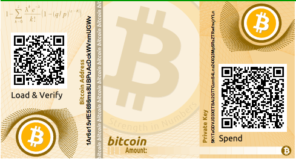
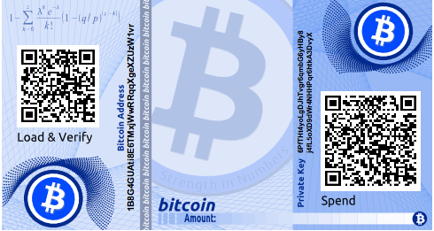

# Paper (Cold Storage) Wallet

* [Private Key](Private%20Key.md) // [Public Key](Public%20Key.md)
* [Wallet](../W/Wallet.md)
* [Seed Verwaltung](../../../../PRIV/_KEY/Admin/PW/SeedVerwaltung.md)
* [bitaddress.org](https://www.bitaddress.org/)
* [Relai](../../../../PRIV/_KEY/Assets/Services/R/Relai/_Relai.md): eine Relai spezifische Wallet erstellen.

**PaperWallets enthalten den Privaten Schlüsel zu einem Bitcoin-"Konto" oder ermöglichen die Generierung eines solchen mittels "[SeedPhrase](../S/Seed.md)"**. 

In ihrer einfachsten Form enthält eine Paper Wallet lediglich einen Private Key und die dazu gehörige Addresse resp. Public-Key (welcher auch aus dem Private Key generiert/abgeleitet werden könnte). 

Mit der Eingabe dieses Keys allein kann über eine beliebige Wallet App, jederzeit auf einem beliebigen Gerät wieder auf das dazugehörige BitCoin-Konto zugegriffen werden. 

Alternativ wird der Privat Key als SeedPhrase gespeichert: eine Folge von 12, 18 oder 18 Wörtern die man in einer Wallet eingibt die daraus dann wiederum den PrivateKey generiert (diesen dann aber lediglich verwendet ohne ihn jemals anzuzeigen oder zu speichern). 

Damit ist eine Paper-Wallet die einfachste Form einer Offline (Backup) Wallet, die deshalb auch "Cold Storage" genannt wird.

Falls dieser Privat-Key offline generiert und nie auf einem elektronischen System gespeichert wurde, gibt es nichts auf der Welt, was sich auf diesen PrivatKey bezieht, genauso wie die Wahrscheinlichkeit praktisch gleich Null ist, dass derselbe Schlüssel jemals ein zweites Mal generiert werden wird. Natürlich sind damit auch Hacker chancenlos. 

Auch auf der BitCoin Blockchain erscheint dieser Schlüssel erst dann, wenn von irgendwo her Satoschis auf diese Adresse überwiesen werden. Bis dann, gibt es diesen Schlüssel einzig und allein auf dem damit betrauten (Spezial-)Papier. 

## Eine Paper Wallet generieren
Paper Wallets lassen sich einfach mit der lokal und detached laufenden JavaScript Generator auf [bitaddress.org](https://www.bitaddress.org/) erstellen (das funktioniert auch - solange man die Browserapp nicht schliesst, wenn man sich im Moment der Erstellung vom Internet entkoppelt). 

1. Speicher dir die GANZE [bitaddress.org](https://www.bitaddress.org/) Seite auf deinem Lokalen Disk oder einem externen USB-Strick. 

2. Unterbreche die Internetverbindung und öffne die zuvor gespeicherte SeitenDatei im Browser und das Scrsipt für die Schlüsselgenerierung auszuführen (Die ganz Vorsichtigen, booten ihren PC mit einem vertrauenswürdigen (Linux) Betriebssystem von einem USB-Stick oder CD-ROM. 

3. Immer noch Offline drucke die generierten Schlüssel auf einem lokal (nicht wireless!!) angeschlossenen Drucker um so eine Paper Wallet zu erstellen die einzig und allein auf genau diesem Gedruckten Papier existiert ohne jemals elektronsich gespeichert zu werden.

4. Hinterlege dieses Papier an einem sicheren, wasser-, feuer und Zugriffssicheren, trockenen, nicht offensichtlichen Ort.  

Done!

Nun kannst du Bitcoins an diese Adresse senden. 

**Beispiel:** 

Das oben stehende Bild zeigt eine mit bitaddress.org erstellte Paper Wallet. 

## Nachteile einer Paper Wallet
The disadvantage of a simple paper wallet system is that the printed keys are vulnerable to theft. A thief who is able to gain access to the paper can either steal it or photograph the keys and take control of the bitcoin locked with those keys. A more sophisticated paper wallet storage system uses BIP-38 encrypted private keys. The keys printed on the paper wallet are protected by a passphrase that the owner has memorized. Without the passphrase, the encrypted keys are useless. Yet, they still are superior to a passphrase-protected wallet because the keys have never been online and must be physically retrieved from a safe or other physically secured storage. An example of an encrypted paper wallet from bitaddress.org. The passphrase is "test." shows a paper wallet with an encrypted private key (BIP-38) created on the bitaddress.org site.

An example of an encrypted paper wallet from bitaddress.org. The passphrase is "test."

ACHTUNG: 
Although you can deposit funds into a paper wallet several times, you should withdraw all funds only once, spending everything. This is because in the process of unlocking and spending funds some wallets might generate a change address if you spend less than the whole amount. Additionally, if the computer you use to sign the transaction is compromised, you risk exposing the private key. By spending the entire balance of a paper wallet only once, you reduce the risk of key compromise. If you need only a small amount, send any remaining funds to a new paper wallet in the same transaction.

**Paper wallets come in many designs and sizes, with many different features**. Some are intended to be given as gifts and have seasonal themes, such as Christmas and New Year’s themes. Others are designed for storage in a bank vault or safe with the private key hidden in some way, either with opaque scratch-off stickers, or folded and sealed with tamper-proof adhesive foil. 