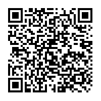

# Payment request QR code

Ein sogenannter "Payment request QR code" wird dir in der Regel an einer Kasse angezeigt wenn Du dort Dinge kaufst. 

Diesen QR Code kannst i.d.R. mit deiner [WALLET App](../W/Wallet.md) einlesen (die normale Handycam bringt die Meldung "keine Daten gefunden"), um so die Transaktionsdaten wie die [Addresse](../A/Address.md) des Empfängers, den Betrag und Informationen zum Empfänger automatisch in die App zu übernehmen wo man sie, vor dem Auslösen der Transaktion nochmals kontrollieren kann.

## Datensatz des QR Codes
Der folgende Payment Request QR Code enthält die folgende - mittels BIP-21-Codierung - in der URL verschlüsselten Daten:

<pre>
bitcoin:1GdK9UzpHBzqzX2A9JFP3Di4weBwqgmoQA?
amount=0.015&
label=Bob%27s%20Cafe&
message=Purchase%20at%20Bob%27s%20Cafe
</pre>

Dabei sind: 

1. **bitcoin**: `"1GdK9UzpHBzqzX2A9JFP3Di4weBwqgmoQA"` die [Bitcoin Addresse]([Address](../A/Address.md)) des Empfängers. 

2. **amount**: `"0.015"` der zu überweisende **Betrag in Millibitcoins** (Nicht US$!!!). 

3. **label**: `"Bob's Cafe"`  der Name des Empfängers

4. **message**: `"Purchase at Bob's Cafe"` eine Beschreibung des Zahlungsgrundes

