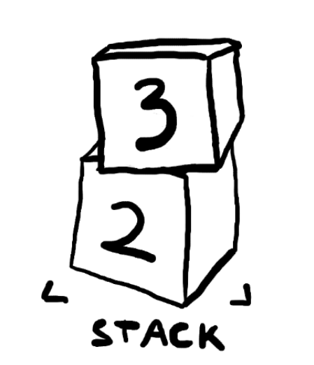

# Transaction Scripts and Script Language

* [Bitcont Script 101](https://kingslanduniversity.com/bitcoin-script-101/)

Script ist ist die "Mini"-Programmiersprache der Bitcoin Technologie, um den Zugriff auf die darin gespeicherten "Bitcoins" zu verwalten.

Scriptcode ist i.d.R. nicht Teil des Sourcecodes, sondern Teil der in der Blockchain gespeicherten Daten, und wird nur ausgeführt, um letztere zu verschlüsseln, zu entschlüsseln und/oder zu transferieren. 

## Abstract: 
Bitcoin transaction validation is not based on a static pattern, but instead is achieved through the execution of a scripting language running that scripts which are embedded in the transaction. This allows for a nearly infinite variety of conditions to be expressed that can be defined "on the fly" when a transaction is submittes and therefore are not required to be "baked" into the otherweise static Bitcoin Core code. This is how bitcoin gets the power of "programmable money."

## Intro 

### Generic Smart Contract programming in BitCoin 
Hereby term “smart contract” was coined by Nick Szabo in 1994, and they were made popular with the introduction of Ethereum in 2015, but many people don’t realize that Bitcoin also has them – in fact, the only type of transaction that Bitcoin supports is a scripted transaction!

Multi-signature wallets, Lightning Network, escrow, all rely on this feature, and so does every Bitcoin transaction ever made – it’s just that this is hidden “under the hood” of wallet software.

The bitcoin transaction script language, called "Script", is a stack-based execution language similar to the Forth language (created in the 60s). 

### Stack Based programming principles
“Stack-based” means instead of defining variables that act like named memory locations, and passing them around like that to functions, we use a stack data structure: functions take their parameters from the top of the stack, and return their results at the top of the stack.

This is similar to calculators that use “RPN” (Reverse Polish Notation):

---
**Example**: 

To calculate the expression `(2 + 3) * (6 + 1)`: 

1. press 2 and [ENTER] to push  “2” onto the stack.

2. press 3 and [ENTER], to push “3” onto the stack. 

3. press `[+]`, which takes the two top-most values from the stack (e.g. deletes them from the stack), adds them, and pushes the result = "5" back on top of the stack so that at the end the stack has "5" at the top as the only value stored.
---
Script is deliberately limited  and has no loops and no complex flow control other than conditional flow control. 

This ensures that scripts have limited complexity and predictable execution times and ensures that it cannot be used to create an infinite loop or other forms of denial-of-service attack against the bitcoin network when every transaction is validated by every full node on the bitcoin network. 

When a transaction is validated, the unlocking script in each input is executed alongside the corresponding locking script to see if it satisfies the spending condition.

Today, most transactions processed through the bitcoin network have the form "Payment to Bob’s bitcoin address" and are based on a script called a `Pay-to-Public-Key-Hash` script. 

However, bitcoin transactions are not limited to this. In fact, **locking scripts can be written to express a vast variety of complex conditions**. 

## Bitcoin Transaction Scripts

### How a Bitcoin Transaction works (abstract)
In Bitcoin, every transaction has a number of associated inputs and outputs. The inputs “fund” the transaction, while the outputs specify the destinations and the respective amounts. When your wallet shows you how much money you have, it’s showing you the sum of the unspent transaction outputs (UTXOs) that you have the keys for to use as inputs – the Bitcoin that you can spend.

A UTXO can be spent only once, and is always spent completely – if you want to spend less Bitcoin than the UTXO is for, just create additional transaction outputs that “return” some BTC back to you (in other words, create new UTXOs that you control, for the amount that you want to receive as “change”).

### Input Validation
To verify whether a transaction is valid, **for all a transaction's inputs, Bitcoin will run the input’s attached script, and, immediately after that, it will run the script of the referenced transaction’s output**. Those two halves of the script are traditionally called `scriptSig` (the one that supplies the values) and `scriptPubKey` (the one that does the check).

