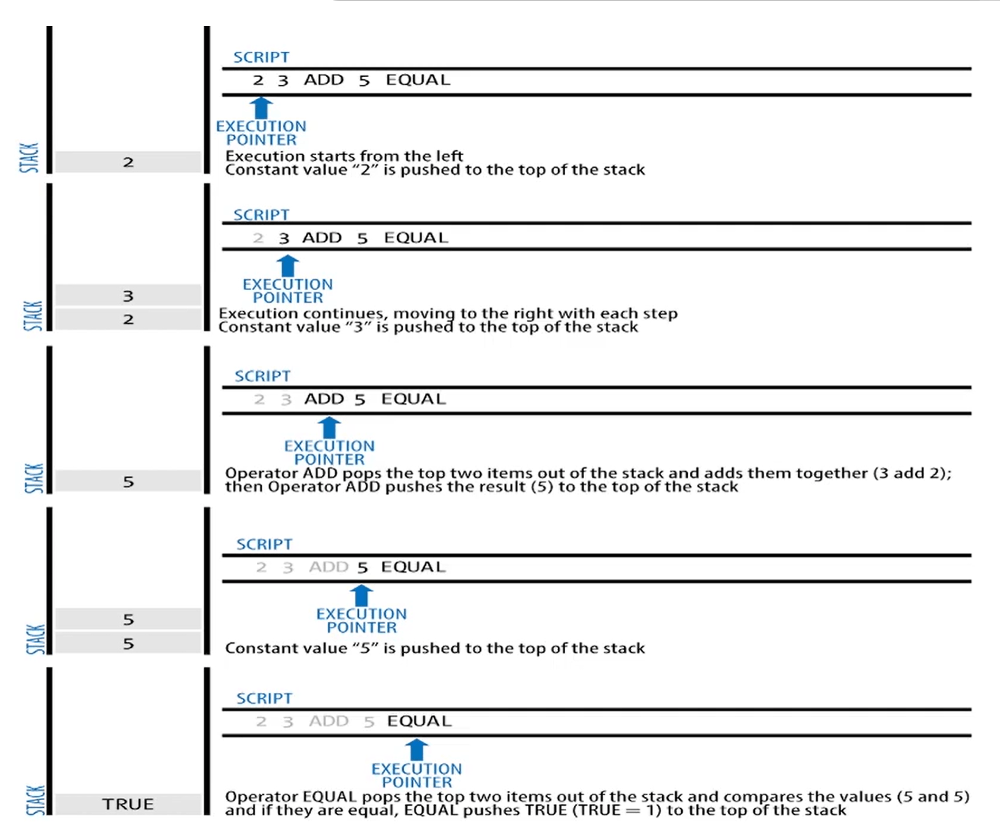
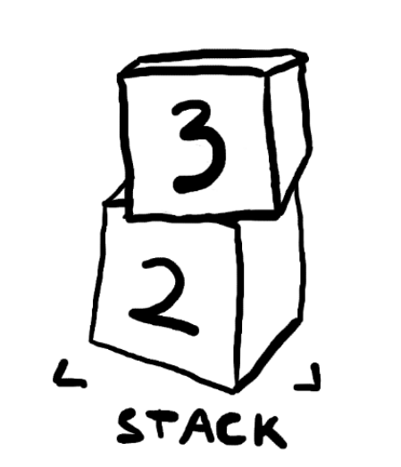

# SCRIPT die Programmiersprache der Blockchain-Technologie (GLOSSAR)

* [Script, die BTC Programmiersprache im Detail](../../b$TECH/SCRIPT/_Script%20BTC%20Programmiersprache.md)  

* [Bitcoin-Script 101](https://kingslanduniversity.com/bitcoin-script-101/)

Script ist die "Mini"-Programmiersprache der Bitcoin Technologie, um den Zugriff auf die in der Blockchain gespeicherten "Bitcoins" zu verwalten.

Scriptcode ist i.d.R. nicht Teil des Sourcecodes, sondern Teil der in der Blockchain gespeicherten Daten, und wird nur ausgeführt, um letztere zu verschlüsseln, zu entschlüsseln und/oder Werte zu transferieren. 

## Intro: 

> Da der Ausdruck “smart contract” erst 2015 mit Etherum bekannt geworden ist, vergessen wir oft, dass auch Bitcoin auf scripted transactions implementiert welches Features wie z.B.  Multi-Signature Wallets, das Lightning Network, Escrow, etc. ermöglichen

Die Logik mit der Bitcoin-Transaktionen ausgeführt werden, ist nicht statisch im Code von Bitcoin-Core gespeichert, sondern in Form eines Scripts Bestandteil von [BitCoin-Transaktionen](../T/Transaction/Transaction.md). 

Die "Ausführung" resp. die "Verifikation" einer Transaktion besteht  darin, das Script dieser Transaktion auszuführen und das Endresultat zu testen: Kommt dabei "TRUE" heraus, ist die Transaktion gültig, sonst nicht. 

Dies erlaubt die Definition einer schier unendliche Anzahl verschiedener Scripts "on the fly" im Sinne von "programmierbarem Geld" ohne die ansonsten statische Transaction-Engine von BitCoin-Core anpassen zu müssen.

Diese sogenannte [stack-based](#stack-based-programmierprinzipien) Scriptsprache erinnert an die Programmiersprache Forth, welche Zwischenwerte auf dem Stack speichert, kombiniert und wieder löscht.

Bei Transaktionen werden Scripts primär für 
1. das **Versiegeln (lock) von UTXOs** verwendet, so dass  sie nur noch vom Empfänger entsperrt werden können und 
2. für die **Freigabe (unlock) von UTXOs** die Du erhalten hast und die dann nur Du entsperren kannst. 
Durch diese lock/unlock-Mechanik (einem sogenannten "**smart contract**") werden UTXOs auf anderen Konto gutgeschrieben (und damit "transferiert"). Script (die Programmiersprache) verwendet hierzu mathematische Funktionen der "elliptische KurvenKryptografie". 

## Funktionsweise
Elements are data. Technically, processing an element pushes that element onto the stack. Elements are byte strings of length 1 to 520. A typical element might be a 
DER-signature or a SEC-pubkey

## Script Mechaniken
“Smart contract” bedeuted “programmierbar”. Script, die für “smart contracts” verwendete Script/ProgrammierSprache, kennt keine Schleifen (und ist damit nicht "Turing complete") und arbeitet Kommandos von ob nach unten zeilenweise ab.

Kommandos betreffen einen Stapel von entweder a) Elemente (Daten) oder b) Operationen.

**Elemente** sind 1 - bis maximal 520 Bytes lange ByteStrings die auf den Stack gepushed werden. Beispiels sind z.B. die DER-signature oder der SEC-pubkey 

**Operationen** nehmen Null, ein oder mehrere dieser Elemente vom Stack, berechnen daraus Null, ein oder mehrere neue Elemente und pushen diese wieder auf den Stack. 

Zum Beispiel verdoppelt der "OP_DUP" Operator das oberste Stackelement wie folgt: 

Am Schluss sollte ein einziges Element mit einem von Null verschiedenen Wert überig bleigen. Ist der Stack am Ende leer oder ist das Element 0, dann wurde das Script nicht erfolgreich ausgeführt und damit wird die Transaktion nicht in den Block und damit nicht in die Blockchain aufgenommen.  

Funktional beschränkt sich diese Kommandos mehr oder weniger darauf, auszudrücken unter welchen Bedingungen UTXOs ausgegeben (unlocked) werden können. Die Summe aller im Script codierten Regeln bilden den "Smart Contract". 

Insbesondere kennt Script keine Schleifen (for, while, etc.) und ist damit nicht "Turing complete".

Scripts sind Teil der TransactionsDaten, resp. umfasst jede Transaktion i.d.R zwei Scripts: ein Locking Script und ein Unlocking Script

### 1. Locking Script
Das "locking script" ist im ScriptPubKey benannten Datenfeld codiert. Es funktioniert wie ein Schliessfach für die dort deponierten UTXOs auf die, nachdem die Transaktion in die Blockchain geschrieben wurde, nur noch der Empfänger über seinen Privaten Schlüssel Zugriff hat. 

### 2. Unlocking Script
Das Script für das Unlocking befindet sich im ScriptSig  benannten DatenFeld der Transaktion. Mit der Ausführung dieses Scripts bezeugt der Absender, dass er im Besitz der UTXOS ist. 

### Stack Based Programmierprinzipien
“Stack-based” means instead of defining variables that act like named memory locations, and passing them around like that to functions, we use a stack data structure: functions take their parameters from the top of the stack, and return their results at the top of the stack.

---
**Example 1 **: 

---

**Example 2 **: 

To calculate the expression `(2 + 3) * (6 + 1)`: 

1. press 2 and [ENTER] to push  “2” onto the stack.

2. press 3 and [ENTER], to push “3” onto the stack. 

3. press `[+]`, which takes the two top-most values from the stack (e.g. deletes them from the stack), adds them, and pushes the result = "5" back on top of the stack so that at the end the stack has "5" at the top as the only value stored.
---
Script is deliberately limited  and has no loops and no complex flow control other than conditional flow control. 

This ensures that scripts have limited complexity and predictable execution times and ensures that it cannot be used to create an infinite loop or other forms of denial-of-service attack against the bitcoin network when every transaction is validated by every full node on the bitcoin network. 

When a transaction is validated, the unlocking script in each input is executed alongside the corresponding locking script to see if it satisfies the spending condition.

Today, most transactions processed through the bitcoin network have the form "Payment to Bob’s bitcoin address" and are based on a script called a `Pay-to-Public-Key-Hash` script. 

However, bitcoin transactions are not limited to this. In fact, **locking scripts can be written to express a vast variety of complex conditions**. 

---

## Bitcoin Transaction Scripts

### How a Bitcoin Transaction works (abstract)
In Bitcoin, every [Transaction](../T/Transaction/Transaction.md) has a number of associated inputs and outputs. The inputs “fund” the transaction, while the outputs specify the destinations and the respective amounts. When your wallet shows you how much money you have, it’s showing you the sum of the unspent transaction outputs (UTXOs) that you have the keys for to use as inputs – the Bitcoin that you can spend.

A UTXO can be spent only once, and is always spent completely – if you want to spend less Bitcoin than the UTXO is for, just create additional transaction outputs that “return” some BTC back to you (in other words, create new UTXOs that you control, for the amount that you want to receive as “change”).

### Input Validation
To verify whether a [Transaction](../T/Transaction/Transaction.md) is valid **for all a transaction's inputs Bitcoin will run the input’s attached script, and, immediately after that, it will run the script of the referenced transaction’s output**. Those two halves of the script are traditionally called `scriptSig` (the one that supplies the values) and `scriptPubKey` (the one that does the check).

---

## Appendix

### Why Bitcoin Isn’t Turing Complete
Turing completeness in a programming language essentially means that the program has the ability to loop. Loops are a useful construct in programming, so you may be wondering at this point why Script doesn’t have the ability to loop.

There are a lot of reasons for this, but let’s start with program execution. Anyone can create a Script program that every full node on the network executes. If Script were Turing complete, it would be possible for the loop to go on executing forever. This would cause validating nodes to enter and never leave that loop. This would be an easy way to attack the network through what would be called a denial-of-service (DoS) attack. A single Script program with an infinite loop could take down Bitcoin! This would be a large systematic vulnerability, and protecting against this vulnerability is one of the major reasons why Turing completeness is avoided. Ethereum, which has Turing completeness in its smart contract language, Solidity, handles this problem by forcing contracts to pay for program execution with something called “gas.” An infinite loop will exhaust whatever gas is in the contract because, by definition, it will run an infinite number of times.

Another reason to avoid Turing completeness is because smart contracts with Turing completeness are very difficult to analyze. A Turing-complete smart contract’s execution conditions are very difficult to enumerate, and thus it’s easy to create unintended behavior, causing bugs. Bugs in a smart contract mean that the coins are vulnerable to being unintentionally spent, which means the contract participants could lose money. Such bugs are not just theoretical: this was the major problem in the DAO (Decentralized Autonomous Organization), a Turing-complete smart contract that ended with the Ethereum Classic hard fork.

