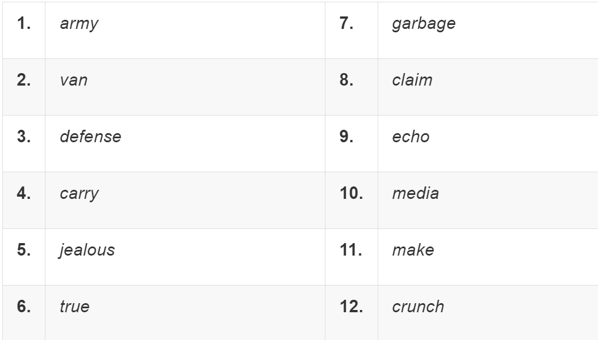
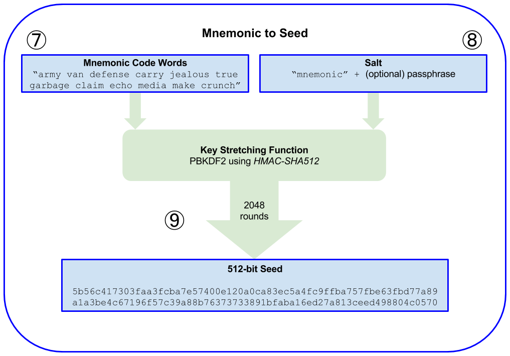
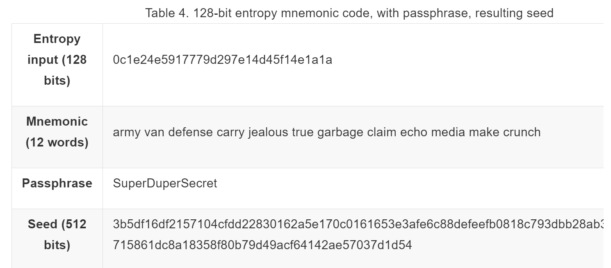

# Seed-Phrase im DETAIL mit Focus auf BITCOIN

* [**CRYPTO-Verwaltung**](../../../../PRIV/_KEY/Assets/Crypto/_CryptoVerwaltung.md): SPE Doc zu meinen Crypto-Assets. 

* [**Seed-Verwaltung**](../../../../PRIV/_KEY/Admin/PW/SeedVerwaltung.md)  

* [Seedphrases im CRYPTO Glossar](Seed.md): mit einer abstrakten und kurzen Definition was Seedphrases sind und wofür sie eingesetzt werden ohne - wie hier - in die Details zu gehen.  

* [Private Key](../P/Private%20Key.md) // [Public Key](../P/Public%20Key.md)

* [Risiken von Cryptobörsen](../../PROC/TRAIN/1_INTRO/Risiken%20von%20Cryptobörsen.md)  

* [SelfCustody](../../PROC/myBTC/_BTC%20SelfCustody.md)  

* [**Wallets**](../W/Wallet.md): mit den Unterschieden von pragmatischen [**Mini Wallets**](../../../GLOSSAR/M/MiniWallet.md) für den täglichen Gebaruch und [**Life Wallets**](../../../GLOSSAR/L/LifeWallet.md) für die langfristige Vermögensbildung. 

> 
not your keys not your coins

## Intro
Bei der SeedPhrase (kurz Seed) in Kontext von Cryptowährungen geht es um die 12, 18 oder 24 englischen Wörter zur Wiederherstellung des [Privaten Schlüssels](../P/Private%20Key.md), resp. einer für dessen Vewaltung benötigten [Wallet](../../../GLOSSAR/W/Wallet.md) für den Zugriff auf ein [bestimmtes](../../PROC/myBTC/_BTC%20SelfCustody.md) Crypto-"Konto".

Zum besseren Verständnis sei nochmals erwähnt, dass das "BitCoin-Konto", technisch gesehen, eine Menge von [UTXOs](../U/UTXO.md)) ist, welche transparent und auf ewig Teil DER dezentral selbstverwalteten, überaus sicheren BitCoin-Blockchain ist, um deren Erhalt, Wartung und Sicherheit man sich grundsätzlich bis anhin NIE zu sorgen brauchte, und zwar genau so wenig, wie man sich jemals Sorgen machte, dass die Hausbank abbrennen oder ausgeraubt werden könnte.

Denn, worum es bei der Wiederherstellung geht, ist nicht das Konto und das "Geld" darauf, sondern um die Wiederherstellung der Zugangs-Schlüssel zu diesen CryptoKonten!

Auch ist die **SeedPhrase per se NICHT der Schlüssel zu diesem Konto**, sondern dient lediglich zur Wiederherstellung der für den Zugang zu diesem Schlüssel und dem damit verbundenen CryptoKonto erforderlichen [Wallet-App](../../../GLOSSAR/W/Wallet.md) und den darin implizit verwalteten CrypoSchlüssel. 

Die Seephrase **umfasst i.d.R 12, 18 oder 24 englische Wörter**, die man **bei der Neuinstallation einer HD-Wallet** (ACHTUNG: Nur sogenannten HD-Wallets können über Seedphrasen wiederherstellt werden) auf einem neuen Gerät **in der richtigen Reihenfolge** eingeben muss, um so bei Verlust der WalletApp (z.B. durch Diebstahl des Handys) wieder auf das BitCoin-"Konto" zugreifen zu können. 

Der mit der Seed wieder hergestellte Private Schlüssel wird lokal in der WalletApp gespeichert und ist in der Regel aus Sicherheitsgründen nicht sichtbar. Er dient lediglich der lokal in der Wallet-App ablaufenden Verschlüsselungen und Entschlüsselungen von Blockchaindaten und verlässt niemals die lokaleApp, genauso wie es praktisch unmöglich ist, von aussen auf diesen lokal verschlüsselt gespeicherten Schlüssel zuzugreifen. Dieser Private Schlüssel ist damit physich mit der auf diesem Gerät installierten WalletAppInstanz verbunden. 

ACHTUNG: Wird diese WalletApp vom Handy entfernt, ist auch der darin gespeichert Schlüssel weg. Und natürlich ist der dort gespeichert Schlüssel auch dann weg, wenn das ganze Handy gestohlen wird, resp. hat dann, sollte das Handy nicht entsprechend gesichert sein, ev. über dieses Handy jemand anders Zugriff.  

Aus diesen Gründen ist es logisch, dass SeedPhrases IMMER OFFLINE und möglichst redundant an verschiedenen geografischen Orten physisch hinterlegt werden müssen: auf SpezialPapier oder Cold-/HardwareWallets. 

---

ACHTUNG: Bei SeedPhrasen geht es explizit **NICHT um die Passwörter für den Zugriff auf Online-Bitcoin-Börsen** (bei denen es auch nicht um die Verwaltung eigener Bitcoins geht, sondern lediglich um das Verwalten eines virtuellen BitCoin-Kontos bei dem sich die Bank mittels Quittung (IOU = I Owe You) verpflichtet, dir jederzeit den aktuellen Gegenwert der Cryptowährung wieder in FIAT auszuzahlen. Wieviel von deinem Geld die Börse tatächlich in Bitcoin anlegt und ob überhaupt, bleibt allein ihr Geheimnis -> Sieh hierzug mein Artikel [Risiken von Cryptobörsen](../../PROC/TRAIN/1_INTRO/Risiken%20von%20Cryptobörsen.md)

---
## Sichere Aufbewahrung
Die grösstes Herausforderung im Umgang mit Seephrases ist deren SICHERE Aufbewahrung, welchem wir ein [eigenes Dokument zur **Seed Verwaltung**](../../../../PRIV/_KEY/Admin/PW/SeedVerwaltung.md) widmen, in dem die sichere Verschlüsselung und Verwahrung von Seedphrases im Kontext der allgemeinen Verwaltung von Passwörtern steht. 

## Wallets
In a deterministic [wallet](../W/Wallet.md), **all its private/public key/pairs and adresses are derived from a single master key**, the so called [seed pharase](../S/Seed.md) or "seed" in short. 

All the keys in this type of wallet then are related to each other and can be generated again if one knows the original [seed](../S/Seed.md).

There are a number of different key derivation methods used in deterministic wallets. The most commonly used derivation method uses a tree-like structure and is known as a `hierarchical deterministic` or `HD wallet`.

Seeds are encoded in 24 English words known as a [seed phrase](../S/Seed.md) that can be used to restore the wallet whenever and on whatever device they want. 

---
WARNING:
Keeping private keys and seed phrases secure is essential!
---

## Seeds and Mnemonic Codes (BIP-39)
HD wallets are a very powerful mechanism for managing many keys and addresses. They are even more useful if they are combined with a standardized way of creating seeds from a sequence of English words that are easy to transcribe, export, and import across wallets. This is known as a mnemonic and the standard is defined by BIP-39. Today, most bitcoin wallets (as well as wallets for other cryptocurrencies) use this standard and can import and export seeds for backup and recovery using interoperable mnemonics.

Let’s look at this from a practical perspective. Which of the following seeds is easier to transcribe, record on paper, read without error, export, and import into another wallet?

A seed for a deterministic wallet, in hex: 

> `0C1E24E5917779D297E14D45F14E1A1A`

A seed for a deterministic wallet, from a 12-word mnemonic

> `army van defense carry jealous true`  
`garbage claim echo media make crunch`

ACHTUNG: 
**The sequence of words is important**, so mnemonic paper backups normally have numbered spaces for each word.

This is a 12-word mnemonic for simplicity. However, most hardware wallets generate a more secure 24-word mnemonic that is used in exactly the same way.

## Mnemonic Code Words (BIP-39)
A wallet application that implements deterministic wallets with mnemonic words will show the user a sequence of 12 to 24 mnemonic words when first creating a wallet - the so called "seed phrase" (which is NOT the seed, but used to create it by hasing it together with some "salt" and/or password. 

This Seed Pharse is the wallet's backup as it can be used to recover and re-create all keys in the same or any compatible wallet application with or without an additional password that is kept separate from the Seed Phrase. 

Mnemonic codes are defined in BIP-39 that was proposed by the company behind the Trezor hardware wallet and has now achieved de facto industry standard.

### Generating the "24 mnemonic words" (not the seed)
The wallet starts from a source of entropy, adds a checksum, and then maps the entropy to a word list as follows:

1. Create a random sequence (entropy) number of 128 to 256 bits.

2. Create a checksum of the random sequence by taking the first (entropy-length/32) bits of its SHA256 hash.

3. Add the checksum to the end of the random sequence.

4. Split the result into 11-bit length segments.

5. Map each 11-bit value to a word from the predefined dictionary of 2048 words.

6. The mnemonic code is the sequence of words.

Generating entropy and encoding as mnemonic words shows how entropy is used to generate mnemonic words.

### From mnemonic words to the Seed
The mnemonic words represent entropy with a length of 128 to 256 bits. The entropy is then used to derive a longer (512-bit) seed through the use of the key-stretching function PBKDF2. The seed produced is then used to build a deterministic wallet and derive its keys.

The key-stretching function takes two parameters: the mnemonic and a salt. The purpose of a salt in a key-stretching function is to make it difficult to build a lookup table enabling a brute-force attack. In the BIP-39 standard, the salt has another purpose—it allows the introduction of a passphrase that serves as an additional security factor protecting the seed, as we will describe in more detail in Optional passphrase in BIP-39.

The process described in steps 7 through 9 continues from the process described previously in Generating mnemonic words:

The first parameter to the PBKDF2 key-stretching function is the mnemonic produced from step 6.

The second parameter to the PBKDF2 key-stretching function is a salt. 

The salt is composed of the string constant "`mnemonic`" concatenated with an optional user-supplied passphrase string.

PBKDF2 stretches the mnemonic and salt parameters using 2048 rounds of hashing with the HMAC-SHA512 algorithm, producing a 512-bit value as its final output. That 512-bit value is the seed.

### Passwort um den Seed zu schützen
The BIP-39 standard allows the use of an optional passphrase in the derivation of the seed. 

If no passphrase is used, the mnemonic is stretched with a salt consisting of the constant string "`mnemonic`", producing a specific 512-bit seed from any given mnemonic. 

If a passphrase is used, the stretching function produces a different seed from that same mnemonic. In fact, given a single mnemonic, every possible passphrase leads to a different seed so that there is no practical possibility of brute-forcing or accidentally guessing one that is in use.

ACHTUNG: 
There are no "wrong" passphrases in BIP-39. Every passphrase leads to some wallet, which unless previously used will be empty.

The optional passphrase creates two important features:

A second factor (something memorized) that makes a mnemonic useless on its own, protecting mnemonic backups from compromise by a thief.

A form of plausible deniability or "duress wallet," where a chosen passphrase leads to a wallet with a small amount of funds used to distract an attacker from the "real" wallet that contains the majority of funds.

However, it is important to note that the use of a passphrase also introduces the risk of loss:

If the wallet owner is incapacitated or dead and no one else knows the passphrase, the seed is useless and all the funds stored in the wallet are lost forever.

Conversely, if the owner backs up the passphrase in the same place as the seed, it defeats the purpose of a second factor.

ACHTUNG: 
While passphrases are very useful, they should only be used in combination with a carefully planned process for backup and recovery, considering the possibility of surviving the owner and allowing his or her family to recover the cryptocurrency estate.

## Wiederherstellungsprozess mittels Seed

