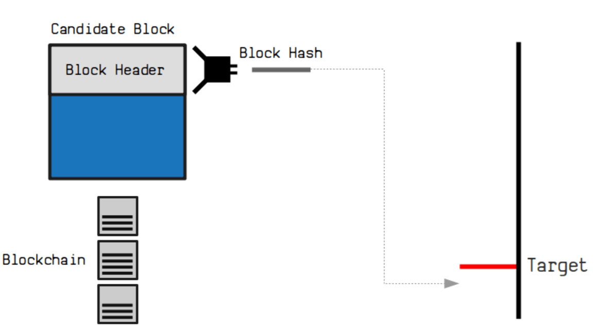

# Target

* [Nonce](../N/Nonce.md)
* [Mining](../M/Mining.md)
* [Difficulty Adjustment](../D/Difficulty-Adjustment.md)

Um das Rennen um den nächsten Block zu gewinnen, mutieren Miner das "Nonce" benannte Feld im Blockheader des nächsten Blocks so lange, bis der HashWert des Headers (inklusive Nonce) kleiner als eine vom BitCoin Netzwerk intern gesetzte, als "Target" bezeichnete, 256-Bit-Variable ist. 

Damit versuchen Miner durch trillionenfaches Pröbeln einen [Nonce-Wert](../N/Nonce.md) zu finden, bei dem der Betrag des [SHA-256 BlockHashes](../B/Block%20Hash.md) kleiner als die der Target-Zahl wird - und damit führende Nullen aufweist, deren Anzahl durch die Grösse des Targets definiert wird. 

Je kleiner dieses Target ist, resp. je mehr führende Nullen diese TargetZahl hat, umso schwieriger wird die Suche nach einem Hashwert der kleiner als das Target ist, und je länger wird es im Schnitt dauern, bis ein solcher Hash gefunden werden kann. 

Durch Verändern des Target-Werts, resp. durch das Einschieben oder Weglassen führender Nullen in der 256-Bit Targetzahl kann das BitCoin System so einfach die Durchschnittszeit für das Minen eines Blocks bei zunehmender oder rückläufiger ComputerPower immer wieder auf 10 Minuten justieren. 

Aus technischer Sicht überprüft das Netzwerk laufend die durchschnittliche Erstellungszeiten der letzen 2016 Blocks. Falls die mittlere Erstellungszeit unter 10 Minutzen fällt, resp. das Sytstem zu schnell läuft, reduziert das System den Targetwert durch Hinzufügen von maximal 2 führenden Nullen um so das Blockrätsel schwieriger zu machen und damit die Erstellungszeit nach oben wieder auf die 10 Minuten zu schrauben.  

## Wie die Target-Zahl berechnet wird
The target is a 256-bit number (extremely large) that all Bitcoin clients share. The SHA-256 hash of a block's header must be lower than or equal to the current target for the block to be accepted by the network. The lower the target, the more difficult it is to generate a block.

It's important to realize that block generation is not a long, set problem (like doing a million hashes), but more like a lottery. Each hash basically gives you a random number between 0 and the maximum value of a 256-bit number (which is huge). If your hash is below the target, then you win. If not, you increment the nonce (completely changing the hash) and try again.

For reasons of stability and low latency in transactions, the network tries to produce one block every 10 minutes. Every 2016 blocks (which should take two weeks if this goal is kept perfectly), every Bitcoin client compares the actual time it took to generate these blocks with the two week goal and modifies the target by the percentage difference. This makes the proof-of-work problem more or less difficult. A single retarget never changes the target by more than a factor of 4 either way to prevent large changes in difficulty.

## What is the maximum target?
The maximum target used by SHA256 mining devices is:

    `0x00000000FFFFFFFFFFFFFFFFFFFFFFFFFFFFFFFFFFFFFFFFFFFFFFFFFFFFFFFF`

Because Bitcoin stores the target as a floating-point type, this is truncated:

    `0x00000000FFFF0000000000000000000000000000000000000000000000000000`

Since a lower target makes Bitcoin generation more difficult, **the maximum target is the lowest possible difficulty**.