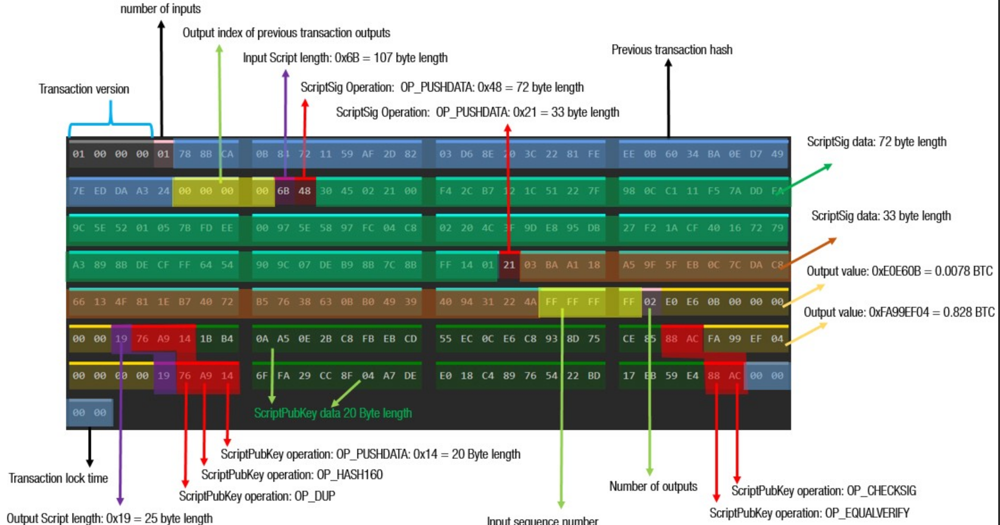

# Bitcoin Transaction

* [Bitcoinbook Kapitel 6 zum Thema Transactions](https://github.com/bitcoinbook/bitcoinbook/blob/develop/ch06_transactions.adoc)

* [UTXO](../U/UTXO.md)

* [CoinBase Transaction](../C/CoinBase-Transaction.md)

---


---

## BenutzerSicht
Rein bildlich gesprochen, teilt eine Transaktion dem Netzwerk mit, eine gewisse Menge Satoschis (Betrag) an die [Address](../A/Address.md) resp. in die [Wallet](../W/Wallet.md) eines anderen zu überweisen. 

Der neue Besitzer kann dann diesen Betrag wieder an einen anderen Owner senden, und so weiter, und ergänzt somit die Transaktionskette um einen weiteren Eintrag (resp. die Blockchain um ein weiteren Block den die Transaktion i.d.R. mit anderen teilt).  

<span style="color:red; font-weight:bold">ACHTUNG</span>: 
Das bildliche Erklärungsmodell einer Transaktion für Anwender (in Anlehnung an den Umgang mit FIAT Geld) weicht damit beträchtlich von der technischen Implementierung ab (z.B. enthalten Wallets keine Coins und es werden auch KEINE Satoshis verschoben sonder es lediglich ein paar an einer Transaktion beteiligten UTXOs wechseln ihren "Besitzer")!

Für normale Anwender ist eine Transaktion damit nichts weiter als die simple Eingabe einer [Empfänger-Adresse](../A/Address.md), eines Bitcoin-Betrages und ev. noch einer Transaktionsfee in einer [Wallet-App](../W/Wallet.md), die diese Transaktion dann in den MemPool schickt wo sie von einem Miner (sofern die Transaktionsfee genügt) in einen neuen Block gepackt und damit fälschungssicher an die Blockchain angehängt wird. Diese Daten könnten dann an einer Kasse mit Hilfe eines sogenannten [Payment request QR code](../P/Payment%20request%20QR%20code.md) eingescannet werden.

Mit den [Transaktionskosten][BTC TransactionFees](../../../b$TECH/Fees/BTC_TransactionFees.md) reift dann auch die Einsicht, dass sich BitCoin auf dem Layer One nicht für kleine Beträgen eignet, sondern besser auf dem Layer-Two z.B. mittels Lightning ausgeführt werden.  

--- 
## Technische Sicht

### Abstrakt
Es gibt KEINE einzelnen Bitcoins: weder physisch als Münze noch digital als Dateneintrag. Physisch auf der Blockchain gibt es lediglich sogenannte UTXOs die bestimmten Personen bestimmte BitCoin-BETRAEGE zuerkennen. Solche UTXOs erhält man  
1. entweder als Lohn fürs erfolgreiche Mining (CoinBase) 
2. oder bei jeder Transaktion wo eine Person A eine beliebige Menge seiner UTXOs an einen Empfänger sendet der daraus genau EINEN (quasi konsolidierten) "unspent" UTXO erhält währenddem die alten als "spent" gekennzeichnet werden. 

Es ist wie mit Land welches man "besitzt" weil irgendwo in einem Register festgehalten wird, wem welcher Anteil von Land gehört ohne dass das Land per se angeschrieben wäre wem es gehört oder sichtbar wäre welchen Quadratmeter man nun genau meint wenn man ihn "besitzt". Genau wie bei Land wird nicht physisches oder symbolisches Land übertragen, sondern lediglich die verbriefte Urkunde wo drin steht um welches Land es sich genau handelt und wem es nun gehört.   

There exists a database on every Bitcoin full node that says that Alice controls some number of the total amount (21M max) bitcoins. 

Technisch gesehen wird bei einer Transaktion immer ein in [Satoshi](../S/Satoshi.md) ausgedrückter Betrag von einer in der Wallet des Senders enthalten InputAddresse auf eine oder mehrere OutputAdressen der Empfänger verschoben, resp. wird das Netzwerk angewiesen, neue Einträge für die damit mutierten Konten in der Blockchain(Datenbank) einzutragen. 

Der [Input](../I/Input.md) besteht immer aus einem oder mehreren UTXOs (Output früheren Transaktionen oder Lohn fürs Mining), und bildet damit eine Transaktionskette, die so zeigt, woher das "Geld" ursprünglich kam. 

Weil [UTXO](../U/UTXO.md) nie geteilt werden und immer nur GANZ ausgegeben werden können, erhält der Absender der Transakton bei nicht passenden [UTXO](../U/UTXO.md)-Beträgen Wechselgeld (Change) auf eine neue Adresse. 

Die Differenz zwischen Input und ausbezahltem Output + Wechselgeld geht als [Transaction Fee](TransactionFee.md) an den Miner, der die Transaktion als Teil eines neuen Blocks an die Blockchain hängt und damit bestätigt. 

### Im Detail
Physisch werden auf der Blockchain keine Satoshis verschoben, sondern es werden ein oder mehrere (von der Summe ihrer Beträge her passende) [UTXO](../U/UTXO.md)-"Beutel als "ausgegeben" markiert, um daraus jeweils je einen neuen [UTXO](../U/UTXO.md) für 

a) den **Empfänger** (mit dem überwiesenen "**Betrag**"), 

b) den **Absender** (mit dem "**Retourgeld**")  

zu generieren, resp. auf der Blockchain zu vermerken. 

Die dafür erforderliche [Transaction Fee](TransactionFee.md) für den Miner wird dabei nicht als UTXO eingetragen, sondern berechnet sich implizit aus der Differenz von Input- und OutputSummen dieser Transaktion und wird dem Miner als Summe aller seiner im Block eingetragenen Transaktionen überwiesen. 


Indem bei einer Transaktion alle Input-[UTXO](../U/UTXO.md) als ausgegeben (spent) markiert) werden, ist sichergestellt, dass diese nicht mehr als Input für andere Transaktion zur Verfügung stehen (double spending). 

Da jedem [UTXO](../U/UTXO.md) nur immer genau eine Wallet-Addresse zugeordnet sein kann, existiert jeder UTXO auch nur immer genau in einer Wallet bis zu dem Moment, wo er wieder im Rahmen einer Transaktion "ausgegeben" wird (resp. ist er in seinem LifeCycle immer und ewig nur immer mit genau eine Wallet-Addresse assoziiert).  

## Beispiel
If Alice owns a UTXO worth 1 BTC and wishes to pay Bob 0.4 BTC, she must spend her entire 1 BTC for this transaction's input. 

In order to send Bob exactly 0.4 BTC, Alice creates two outputs: the first to Bob, in the amount of 0.4 BTC, and the second back to herself, in the amount 0.59 BTC, assuming that she pais a 0.01 BTC transaction fee. This transaction will consume one INPUT-UTXO and create 2 new OUTPUT-UXTOs. 

> Note that the fee paid is not itself an output. It is implied by the sum of the inputs (1 BTC) minus the sum of the outputs (0.4 + 0.59 = 0.99 BTC). The miner of this transaction would calculate this fee and claim it for themself in the transaction.

In order for Alice to send the .4 bitcoin to Bob, she signs a message with the transaction's input-, output-, and amount-details using her private key. This message is then broadcast to the rest of the Bitcoin network where nodes verify that Alice’s private key is able to access the inputs (by checking that Alice’s private-key-encoded message can be opened with the public key she is claiming to own).

Once a message is broadcasted to a node, this transaction will be added to the [mempool]() and considered 'pending'. This node then passes it along the network until it reaches a mining node where it will be added to a [block template]() depending of the transaction fee (the higher the fee the more priority this transaction gets to be written to the next block (which is limited to 1 MB of data)). 

Finally, when a miner finds the next block in the chain, then this block template is mined and becomes an immutable block on the blockchain. 

---


## UTXOs in Bitcoin Wallets
Eine Wallet speichert keine Bitcons, sondern managed die mit einer bestimmten Addresse assozierten UTXOs: 

1. **Konto**: Der in einer Wallet gespeicherte Wert (resp. der für eine Transaktion zur Verfügung stehende Betrag) ist die Summe aller darin enthaltenen UTXOs (resp. die Summe aller mit der Wallet-Addresse assoziierten UTXOs). 

2. **Transaction**: When you initiate a transaction, your wallet software selects appropriate UTXOs to use as inputs where their sum is equal or higher the amount of the "money" sent + transaction-fees.

3. **Retourgeld**: If the selected UTXOs exceed the amount you want to send, your wallet creates a change output back to one of your addresses.

4. **Konsolidierung**: Ab und zu werden die UTXOs mit kleinen Beträgen zu einem grösseren UTXO zusammengefasst um so Transaktionsgebühren zu sparen.

5. **Privacy**: Fortgeschrittene Wallets wit z.B. "CoinJoin" können UTXOs von mehreren Usern zusammenlegen, um so die Anonymität zu wahren, resp. Absender und Empfänger von Transaktionen zu verschleiern. 

## Wechselgeld (Change)
The change address does not have to be the input address and for privacy reasons, it is often a new address from the owner’s wallet.

Different wallets may use different strategies when aggregating inputs to make a payment requested by the user. They might aggregate many small inputs, or use one that is equal to or larger than the desired payment. Unless the wallet can aggregate inputs in such a way to exactly match the desired payment plus transaction fees, the wallet will need to generate some change. This is very similar to how people handle cash. If you always use the largest bill in your pocket, you will end up with a pocket full of loose change. If you only use the loose change, you’ll always have only big bills. People subconsciously find a balance between these two extremes, and bitcoin wallet developers strive to program this balance.

## Transaction Fees

--> [BTC TransactionFees](../../../b$TECH/Fees/BTC_TransactionFees.md)

Bitcoin users **have to choose their own tansaction fee rate**. The higher the fee, the higher the chance that the block-miner will include your transaction into the next block (to confirm your transaction for the eternity on the blockchain). 

Each [block](../B/Block.md) in the blockchain can only contain up to 1MB of information. Since space is limited, a limited number of transactions can be included in each block. 

Miners receive both a block subsidy (newly minted bitcoin) and the sume of all the block's transaction fees for ordering transactions into blocks.

This means they are incentivized to prioritize the transaction with the highest fees. During times of high network congestion, where a large number of users want to transact, the transactions with the highest fees are more likely to be included in the next block.

## Transaktionsketten
This chain of transactions, from Joe to Alice to Bob, is illustrated in a **chain of transactions, where the output of one transaction is the input of the next transaction**: 


## Wallets gestalten Transaktionen "behind the scene"
All the logic for selecting appropriate inputs and outputs to build a transaction is normally hidden by the [wallet](../W/Wallet.md). 

Users  only specify a destination and an amount, and the rest happens in the wallet application without seeing the details. 

Importantly, a wallet application can construct transactions even if it is completely offline. Like writing a check at home and later sending it to the bank in an envelope, the transaction does not need to be constructed and signed while connected to the bitcoin network.

## Inputs kontrollieren
Wallet application will first have to find inputs that can pay the amount she wants to send to Bob. 

Most wallets keep track of all the available outputs belonging to addresses in the wallet. 

### Full node versus lightweight Wallets
However, a bitcoin wallet application that runs as a full-node client actually contains a copy of every unspent output from every transaction in the blockchain. This allows a wallet to construct transaction inputs as well as quickly verify incoming transactions as having correct inputs.

However, because a full-node client takes up a lot of disk space, most user wallets run "lightweight" clients that track only the user’s own unspent outputs.

### Input Anfragen delegieren
If the wallet application does not maintain a copy of unspent transaction outputs, it can query the bitcoin network to retrieve this information using a variety of APIs available by different providers or by asking a full-node using an application programming interface (API) call. 

We can for instance look up all the unspent outputs for Alice’s bitcoin address as an API request, constructed as an HTTP GET command to a specific URL. This URL will return all the unspent transaction outputs for an address, giving any application the information it needs to construct transaction inputs for spending. We use the simple command-line HTTP client `cURL` to retrieve the response: 

    $ curl https://blockchain.info/unspent?active=1Cdid9KFAaatwczBwBttQcwXYCpvK8h7FK

giving the following response
  
```json
{

	"unspent_outputs":[

		{
			"tx_hash":"186f9f998a5...2836dd734d2804fe65fa35779",
			"tx_index":104810202,
			"tx_output_n": 0,
			"script":"76a9147f9b1a7fb68d60c536c2fd8aeaa53a8f3cc025a888ac",
			"value": 10000000,
			"value_hex": "00989680",
			"confirmations":0
		}

	]
}
```

The response shows one unspent output (one that has not been redeemed yet) under the ownership of Alice’s address 1Cdid9KFAaatwczBwBttQcwXYCpvK8h7FK. The response includes the reference to the transaction in which this unspent output is contained (the payment from Joe) and its value in satoshis, at 10 million, equivalent to 0.10 bitcoin. With this information, Alice’s wallet application can construct a transaction to transfer that value to new owner addresses.

As you can see, Alice’s wallet contains enough bitcoin in a single unspent output to pay for the cup of coffee. Had this not been the case, Alice’s wallet application might have to "rummage" through a pile of smaller unspent outputs, like picking coins from a purse until it could find enough to pay for the coffee. In both cases, there might be a need to get some change back, which we will see in the next section, as the wallet application creates the transaction outputs (payments).

## Outputs zusammenstellen
A transaction output is created in the form of a script that creates an encumbrance on the value and can only be redeemed by the introduction of a solution to the script. 

In simpler terms, Alice’s transaction output will contain a script that says something like, "This output is payable to whoever can present a signature from the key corresponding to Bob’s public address." Because only Bob has the wallet with the keys corresponding to that address, only Bob’s wallet can present such a signature to redeem this output. Alice will therefore "encumber" the output value with a demand for a signature from Bob.

This transaction will also include a second output, because Alice’s funds are in the form of a 0.10 BTC output, too much money for the 0.015 BTC cup of coffee. Alice will need 0.085 BTC in change. Alice’s change payment is created by Alice’s wallet as an output in the very same transaction as the payment to Bob. Essentially, Alice’s wallet breaks her funds into two payments: one to Bob and one back to herself. She can then use (spend) the change output in a subsequent transaction.

Finally, for the transaction to be processed by the network in a timely fashion, Alice’s wallet application will add a small fee. This is not explicit in the transaction; it is implied by the difference between inputs and outputs. If instead of taking 0.085 in change, Alice creates only 0.0845 as the second output, there will be 0.0005 BTC (half a millibitcoin) left over. The input’s 0.10 BTC is not fully spent with the two outputs, because they will add up to less than 0.10. The resulting difference is the transaction fee that is collected by the miner as a fee for validating and including the transaction in a block to be recorded on the blockchain.

The resulting transaction can be seen using a blockchain explorer web application. 

## Die Transaktion in der Blockchain
The transaction created by Alice’s wallet application is 258 bytes long and contains everything necessary to confirm ownership of the funds and assign new owners. Now, the transaction must be transmitted to the bitcoin network where it will become part of the blockchain: 

### 1. Transaktion übermitteln 
Because the transaction contains all the information necessary to process, it does not matter how or where it is transmitted to the bitcoin network. The bitcoin network is a peer-to-peer network, with each bitcoin client participating by connecting to several other bitcoin clients. The purpose of the bitcoin network is to propagate transactions and blocks to all participants.

### 2. Transaktion im P2P Netzwerk verteilen (Propagation)
Any system, such as a server, desktop application, or wallet, that participates in the bitcoin network by "speaking" the bitcoin protocol is called a bitcoin node. Alice’s wallet application can send the new transaction to any bitcoin node it is connected to over any type of connection: wired, WiFi, mobile, etc. Her bitcoin wallet does not have to be connected to Bob’s bitcoin wallet directly and she does not have to use the internet connection offered by the cafe, though both those options are possible, too. **Any bitcoin node that receives a valid transaction it has not seen before will immediately forward it to all other nodes to which it is connected, a propagation technique known as flooding**. Thus, the transaction rapidly propagates out across the peer-to-peer network, reaching a large percentage of the nodes within a few seconds.

### 3. Bestätigung durch den Empfänger
If Bob’s bitcoin wallet application is directly connected to Alice’s wallet application, Bob’s wallet application might be the first node to receive the transaction. However, even if Alice’s wallet sends the transaction through other nodes, it will reach Bob’s wallet within a few seconds. Bob’s wallet will immediately identify Alice’s transaction as an incoming payment because it contains outputs redeemable by Bob’s keys. **Bob’s wallet application can also independently verify that the transaction is well formed, uses previously unspent outputs, and contains sufficient transaction fees to be included in the next block. At this point Bob can assume, with little risk, that the transaction will shortly be included in a block and confirmed.**

<span style="color:red; font-weight:bold">Tip</span>: 
A common misconception about bitcoin transactions is that they must be "confirmed" by waiting 10 minutes for a new block, or up to 60 minutes for a full six confirmations. Although confirmations ensure the transaction has been accepted by the whole network, such a delay is unnecessary for small-value items such as a cup of coffee. **A merchant may accept a valid small-value transaction with no confirmations, with no more risk than a credit card payment made without an ID or a signature, as merchants routinely accept today.**

### 4. Mining
Das Mining wird in einem [separaten Mining Doc](../M/Mining.md) beschrieben.

### Checking for Completion
Now that Alice’s transaction has been embedded in the blockchain as part of a block, it is part of the distributed ledger of bitcoin and visible to all bitcoin applications. Each bitcoin client can independently verify the transaction as valid and spendable. Full-node clients can track the source of the funds from the moment the bitcoin were first generated in a block, incrementally from transaction to transaction, until they reach Bob’s address. Lightweight clients can do what is called a simplified payment verification (see [spv_nodes]) by confirming that the transaction is in the blockchain and has several blocks mined after it, thus providing assurance that the miners accepted it as valid.

### 6. Spending the Transaction's Output
Bob can now spend the output from this and other transactions. For example, Bob can pay a contractor or supplier by transferring value from Alice’s coffee cup payment to these new owners. Most likely, Bob’s bitcoin software will aggregate many small payments into a larger payment, perhaps concentrating all the day’s bitcoin revenue into a single transaction. This would aggregate the various payments into a single output (and a single address). 


## Transactions—Behind the Scenes
Behind the scenes, an actual transaction looks very different from a transaction information displayed on screen by a typical [block explorer app](), where most of the constructs we see in the app do not actually exist in the bitcoin system.

We can use Bitcoin Core’s command-line interface (`getrawtransaction` and `decoderawtransaction`) to retrieve a "raw" transaction, decode it, and see what it contains. The result looks like this:

```xml
{
  "version": 1,
  "locktime": 0,
  "vin": [
    {
      "txid": "7957a35fe64f80d234d76d83a2a8f1a0d8149a41d81de548f0a65a8a999f6f18",
      "vout": 0,
      "scriptSig" : "3045022100884d142d86652a3f47ba4746ec719bbfbd040a570b1deccbb6498c75c4ae24cb02204b9f039ff08df09cbe9f6addac960298cad530a863ea8f53982c09db8f6e3813[ALL] 0484ecc0d46f1918b30928fa0e4ed99f16a0fb4fde0735e7ade8416ab9fe423cc5412336376789d172787ec3457eee41c04f4938de5cc17b4a10fa336a8d752adf",
      "sequence": 4294967295
    }
  ],
  "vout": [
    {
      "value": 0.01500000,
      "scriptPubKey": "OP_DUP OP_HASH160 ab68025513c3dbd2f7b92a94e0581f5d50f654e7 OP_EQUALVERIFY OP_CHECKSIG"
    },
    {
      "value": 0.08450000,
      "scriptPubKey": "OP_DUP OP_HASH160 7f9b1a7fb68d60c536c2fd8aeaa53a8f3cc025a8 OP_EQUALVERIFY OP_CHECKSIG",
    }
  ]
}
```

You may notice the things that are missing such a the sender's and receiver's address and the amount of coins sent. 
However, in bitcoin, there are no coins, no senders, no recipients, no balances, no accounts, and no addresses. 

All those things are only constructed at a higher level for the benefit of the user, to make things easier to understand.

You may also notice a lot of strange and indecipherable fields and hexadecimal strings. 

Don’t worry, we will explain each field shown here in detail here below.

## Transaction Outputs and Inputs
The fundamental building block of a bitcoin transaction is a transaction output. Transaction outputs are indivisible chunks of bitcoin currency, recorded on the blockchain, and recognized as valid by the entire network. Bitcoin full nodes track all available and spendable outputs, known as unspent transaction outputs, or "UTXO". The collection of all UTXO is known as the "UTXO set" and currently numbers in the millions of UTXO. The UTXO set grows as new UTXO is created and shrinks when UTXO is consumed. **Every transaction represents a change (state transition) in the UTXO set.**

When we say that a user’s wallet has "received" bitcoin, what we mean is that the wallet has detected an UTXO that can be spent with one of the keys controlled by that wallet. Thus, a user’s bitcoin "balance" is the sum of all UTXO that user’s wallet can spend and which may be scattered among hundreds of transactions and hundreds of blocks. The concept of a balance is created by the wallet application. The wallet calculates the user’s balance by scanning the blockchain and aggregating the value of any UTXO the wallet can spend with the keys it controls. Most wallets maintain a database or use a database service to store a quick reference set of all the UTXO they can spend with the keys they control.

A transaction output can have an arbitrary (integer) value denominated as a multiple of satoshis. Although an output can have any arbitrary value, once created it is indivisible. This is an important characteristic of outputs that needs to be emphasized: **OUTPUTS are discrete and indivisible units of value, denominated in integer satoshis**. An unspent output can only be consumed in its entirety by a transaction.

If an UTXO is larger than the desired value of a transaction, it must still be consumed in its entirety and change must be generated in the transaction. In other words, if you have an UTXO worth 20 bitcoin and want to pay only 1 bitcoin, your transaction must consume the entire 20-bitcoin UTXO and produce two outputs: one paying 1 bitcoin to your desired recipient and another paying 19 bitcoin in change back to your wallet. As a result of the indivisible nature of transaction outputs, most bitcoin transactions will have to generate change.

The user’s wallet application will typically select from the user’s available UTXO to compose an amount greater than or equal to the desired transaction amount.

As with real life, the bitcoin application can use several strategies to satisfy the purchase amount: combining several smaller units, finding exact change, or using a single unit larger than the transaction value and making change. All of this complex assembly of spendable UTXO is done by the user’s wallet automatically and is invisible to users. It is only relevant if you are programmatically constructing raw transactions from UTXO.

A transaction consumes previously recorded unspent transaction outputs and creates new transaction outputs that can be consumed by a future transaction. This way, chunks of bitcoin value move forward from owner to owner in a chain of transactions consuming and creating UTXO.

The exception to the output and input chain is a special type of transaction called the `coinbase transaction`, which is the first transaction in each block. This transaction is placed there by the "winning" miner and creates brand-new bitcoin payable to that miner as a reward for mining. This special coinbase transaction does not consume UTXO; instead, it has a special type of input called the "coinbase." This is how bitcoin’s money supply is created during the mining process.

**Tip**: What comes first? Inputs or outputs? Strictly speaking, outputs come first because coinbase transactions, which generate new bitcoin, have no inputs and create outputs from nothing.


## Low Tech Description

### Transaktionsverschlüsselung mittels [Scripts](../S/Script.md)

Bei einer Transaktion werden - vereinfacht gesagt - immer eine bestimmte Anzahl [UTXO](../U/UTXO.md) mit dem eigenen Private Key entschlüsselt/geöffent, um deren Werte auf neu erstellte UTXO's zu verteilen und mit dem Public Key des Empfängers zu verschlüsseln.

Wichtig ist dabei dass die Inhalte und damit die Werte der [UTXO](../U/UTXO.md)-Päckli niemals mutiert werden, sondern (im Sinne von Pure Function ohne Seiteneffekte) fortschreitend lediglich neue Päckli erstellt und die alten als ungültig markiert werden.

Anschliessend erstellt der Empfänger mit seinem Private Key auf seinem [UTXO](../U/UTXO.md)-Päckli eine sogenannte "Signature", welche öffentlich belegt, dass der Owner des Public Keys auf diesem Päckli auch über den Private Key verfügt (mit dem er die "Signature" erstellt hat. 

Physisch werden diese Ver- und Entschlüsselungen mittels Locking- und UnLocking Scripts erstellt welche auf das [UTXO](../U/UTXO.md)-Päckli draufgepackt werden. Beim sogenannten 


. Für diese Lock/UnLock-Geschichten fügt Bitcoin mit in einer eigenen [MiniProgrammiersprache namens "Script"](../S/Script.md) programmiert Scrits zu den eigenltichen Daten hinzu. So kann dieser Lock/UnLock-Prozess dynamisch für jede Transaktion neu definiert werden anstatt sie im Core-Code fix zu verdrahten. 


### Bitcoin Core’s serialization format

Every transaction is serialised and can be looked up with the following `getrawtransaction` CLI-Command: 

`$ bitcoin-cli getrawtransaction 466200308696215bbc949d5141a49a41\
38ecdfdfaa2a8029c1f9bcecd1f96177`

which produces the following hexadecimal output:

<pre>

01000000000101eb3ae38f27191aa5f3850dc9cad00492b88b72404f9da13569
8679268041c54a0100000000ffffffff02204e0000000000002251203b41daba
4c9ace578369740f15e5ec880c28279ee7f51b07dca69c7061e07068f8240100
000000001600147752c165ea7be772b2c0acb7f4d6047ae6f4768e0141cf5efe
2d8ef13ed0af21d4f4cb82422d6252d70324f6f4576b727b7d918e521c00b51b
e739df2f899c49dc267c0ad280aca6dab0d2fa2b42a45182fc83e81713010000
0000
</pre>

At a high level, a transaction really only has four components. They are:

1. **Version**: what additional features the transaction uses

2. **Inputs**: what bitcoins are being spent

3. **Outputs**: where the bitcoins are going

4. **Locktime**:  when this transaction starts being valid

5. **Network**: network to be validated against (main- or testnet)

6. **ID**: The id is what block explorers use for looking up transactions. It’s the hash256 of the transaction in hexadecimal format.

7. 

> **Bitcoin Core’s serialization format** is special because it’s the format used to make commitments to transactions and to relay them across Bitcoin’s P2P network, but otherwise programs can use a different format as long as they transmit all of the same data. However, Bitcoin Core’s format is reasonably compact for the data it transmits and simple to parse, so many other Bitcoin programs use this format.

That are organized as follows: 


resp. in Byte-representation: 


### 1. Version 
The first 4 bytes of a serialized Bitcoin transaction are its version. Currently we only have version 1 and 2 with version 3 under discussion. 

Note that **the actual value in hexadecimal is 01 00 00 00**. Interpreted as a little-endian integer, this number is actually 1.

Specifying the version number defines supported features and the APIs we can program against.


#### Version 1
The original version of Bitcoin transactions was **version 1** (0x01000000). All transactions in Bitcoin must follow the rules of version 1 transactions.

#### Version 2
Bitcoin transactions were introduced in the BIP68 soft fork change to Bitcoin’s consensus rules. BIP68 places additional constraints on the sequence field, but those constraints only apply to transactions with version 2 or higher. Version 1 transactions are unaffected. BIP112, which was part of the same soft fork as BIP68, upgraded an opcode (OP_CHECKSEQUENCEVERIFY), which will now fail if it is evaluated as part of a transaction with a version less than 2. Beyond those two changes, version 2 transactions are identical to version 1 transactions.

#### Version 3
As of this writing, a proposal to begin using version 3 transactions is being widely considered. That proposal does not seek to change the consensus rules but only the policy that Bitcoin full nodes use to relay transactions. Under the proposal, version 3 transactions would be subject to additional constraints in order to prevent certain denial of service (DoS) attacks.

**Protecting Presigned Transactions**: 
The last step before broadcasting a transaction to the network for inclusion in the blockchain is to sign it. However, it’s possible to sign a transaction without broadcasting it immediately. You can save that presigned transaction for months or years in the belief that it can be added to the blockchain later when you do broadcast it. In the interim, you may even lose access to the private key (or keys) necessary to sign an alternative transaction spending the funds. This isn’t hypothetical: **several protocols built on Bitcoin, including Lightning Network, depend on presigned transactions.**

This creates a challenge for protocol developers when they assist users in upgrading the Bitcoin consensus protocol. Adding new constraints—such as BIP68 did to the sequence field—may invalidate some presigned transactions. If there’s no way to create a new signature for an equivalent transaction, then the money being spent in the presigned transaction is permanently lost.

This problem is solved by reserving some transaction features for upgrades, such as version numbers. Anyone creating presigned transactions prior to BIP68 should have been using version 1 transactions, so only applying BIP68’s additional constraints on sequence to transactions v2 or higher should not invalidate any presigned transactions.

If you implement a protocol that uses presigned transactions, ensure that it doesn’t use any features that are reserved for future upgrades. Bitcoin Core’s default transaction relay policy does not allow the use of reserved features. You can test whether a transaction complies with that policy by using Bitcoin Core’s `testmempoolaccept` RPC on Bitcoin mainnet.

### 2. Extended Marker and Flag
The next two fields of the example serialized transaction were added as part of the segregated witness (segwit) soft fork change to Bitcoin’s consensus rules. The rules were changed according to BIPs 141 and 143, but the extended serialization format is defined in BIP144.

**If the transaction includes a witness structure, the marker must be zero (0x00) and the flag must be nonzero**. 

In the current P2P protocol, the flag should always be one (0x01); alternative flags are reserved for later protocol upgrades.

**If the transaction doesn’t need a witness stack, the marker and flag must not be present.** This is compatible with the original version of Bitcoin’s transaction serialization format, now called legacy serialization.

In legacy serialization, the marker byte would have been interpreted as the number of inputs (zero). A transaction can’t have zero inputs, so the marker signals to modern programs that extended serialization is being used. The flag field provides a similar signal and also simplifies the process of updating the serialization format in the future.

### 3. Inputs
The inputs field contains several other fields: 


Each input points to an output of a previous transaction

#### Length of Transaction Input List
The transaction input list starts with an integer indicating the number of inputs in the transaction. The minimum value is one. There’s no explicit maximum value, but restrictions on the maximum size of a transaction effectively limit transactions to a few thousand inputs. The number is encoded as a compactSize unsigned integer (that can vary and threfore is tricky to be en- and decoded with certain programming languages!). 

### 4. Outputs

### 5. 

## Annotations

### Transaction Time
Transactions do not have a timestamp field but associate with their block's timestamp. 

Alternatively, you could manually keep track of when your node first received the transaction from another node on the network (which is what Bitcoin Core does and is why you can see a transaction's "time" when you run bitcoin-cli getmempoolentry [txid], but this information is only stored temporarily).

### Transaction Malleability
A transaction ID is not authoritative until a transaction has been confirmed on the chain (resp. its block is physically added to the network). 

However, the absence of a transaction hash in the blockchain does not mean the transaction was not processed. This is known as "transaction malleability," because transaction hashes can be modified prior to confirmation in a block. After confirmation, the txid is immutable and authoritative.


