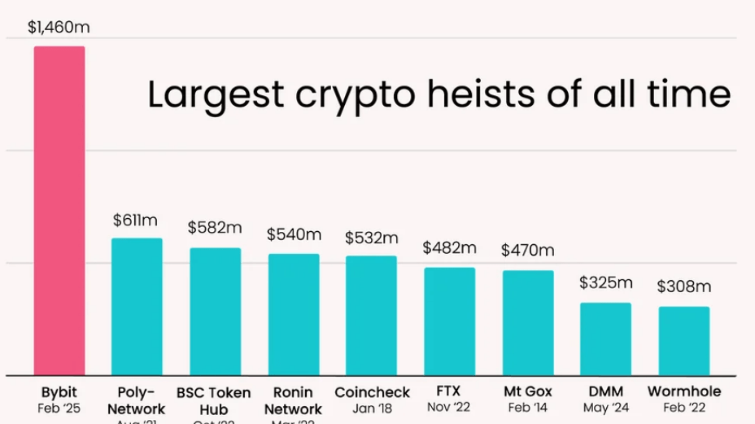

# Bybit Hack
On February 21st 2025, approximately $1.46 billion in cryptoassets were stolen from Bybit, a Dubai-based exchange. 

Initial reports suggest that malware was used to trick the exchange into approving transactions that sent the funds to the thief.

This is by the far the largest crypto heist of all time, dwarfing the $611 million stolen from Poly Network in 2021 (and the vast majority of these funds were eventually returned by the hacker). 

In fact this incident is almost certainly the single largest known theft of any kind in all time, a record previously held by Saddam Hussein, who stole $1 billion from the Iraqi Central Bank on the eve of the 2003 Iraq War.

Elliptic has attributed the Bybit theft to North Korea's Lazarus Group, based on various factors, including our analysis of the laundering of the stolen cryptoassets. North Korea-linked actors have stolen over $6 billion in cryptoassets since 2017, with the proceeds reportedly spent on the country’s ballistic missile program.

Lazarus Group has developed a powerful and sophisticated capability to not only breach target organisations and steal cryptoassets, but also to launder these proceeds through thousands of blockchain transactions. Following this theft, Elliptic has been working around the clock with Bybit, cryptocurrency service providers and fellow investigators, to trace the stolen funds and work to prevent them being cashed out.

Lazarus Group's laundering process typically follows a characteristic pattern. The first step is to exchange any stolen tokens for a “native” blockchain asset such as Ether. This is because tokens have issuers who in some cases can “freeze” wallets containing stolen assets, whereas there is no central party who can freeze Ether or Bitcoin. 

This is exactly what happened in the minutes following the Bybit theft, with hundreds of millions of dollars in stolen tokens such as stETH and cmETH exchanged for Ether. Decentralised exchanges (DEXs) were used to achieve this, likely to avoid any asset freezing that might be encountered when using a centralised exchange to launder stolen funds.

The second step of the laundering process is to “layer” the stolen funds in order to attempt to conceal the transaction trail. The transparency of blockchains means that this transaction trail can be followed, but these layering tactics can complicate the tracing process, buying the launderers valuable time to cash-out the assets. This layering process can take many forms, including:

* Sending funds through large numbers of cryptocurrency wallets

* Moving funds to other blockchains, using cross-chain bridges or exchanges

* Switching between different cryptoassets, using DEXs, coinswap services or exchanges

* Using “mixers” such as Tornado Cash or Cryptomixer.

Lazarus are currently engaged in this second stage of laundering. Within two hours of the theft, the stolen funds were sent to 50 different wallets, each holding approximately 10,000 ETH. These are now being systematically emptied - as of 1pm UTC on February 24, 14.5% of the stolen assets (now worth $195 million) have been moved from these wallets.

Once moved out of these wallets, the funds are being laundered through various services, including DEXs, cross-chain bridges and centralized exchanges. However, one service has emerged as a major and willing facilitator of this laundering. eXch is a cryptocurrency exchange, notable for allowing its users to swap cryptoassets anonymously. This has led them to being used to exchange hundreds of millions of dollars in cryptoassets derived from criminal activity, including multiple thefts perpetrated by North Korea. Despite attempting to conceal this activity, our analysis shows that since the hack, cryptoassets stolen from Bybit worth over $75 million have been exchanged using eXch. Despite direct requests from Bybit, eXch has refused to block this activity.

The stolen Ether is steadily being converted to bitcoin, using eXch and other services. If previous laundering patterns are followed we might expect to see the use of mixers next, to further obfuscate the transaction trail. However this may prove challenging due to the sheer volume of stolen assets.

North Korea's Lazarus Group is the most sophisticated and well-resourced launderer of cryptoassets in existence, continually adapting its techniques to evade identification and seizure of stolen assets. Beginning minutes after the theft from Bybit, the Elliptic team have been working around the clock with Bybit, our customers and fellow investigators, to trace these funds and prevent the North Korean regime from benefitting from them.

## Reaction
Where there was not immediate reaction, a heavy reaction came in after the weeked with institutional investors are losing trust into the system and a lot of auto-triggered sells. 

