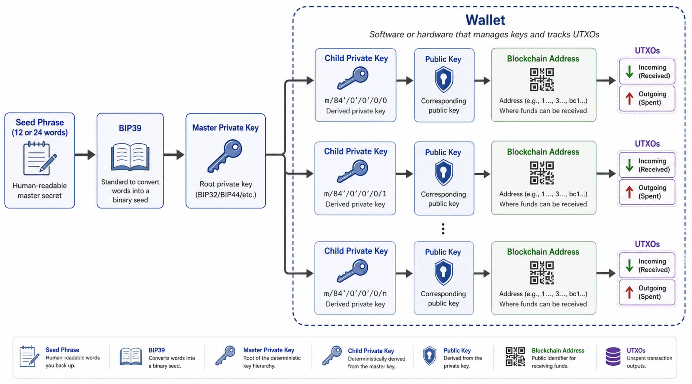

# Einer BTC-Wallet wieder aus einer SeedPhrase herstellen

* **[SeedVerwaltung](../../../PRIV/_KEY/Admin/PW/SeedVerwaltung.md)** || [Seedkarten](../../../PRIV/GLOSSAR/S/Seedkarten.md)

* **[CredNot Booklet](../../../PRIV/_KEY/Admin/PW/CredNot.md)**

* **[SeedChecker App](../../../PRJ/SeedChecker/_SeedChecker.md)**

* aktuelle **[CryptoAssets](../../../PRIV/_KEY/Assets/Crypto/_CryptoVerwaltung.md)**: 
    * [Relai](../../../PRIV/_KEY/Assets/Services/R/Relai/RelaiKonten.md)
    * [Swissborg](../../SERVICES/S/Swissborg/Swissborg.md)
    * [Binance](../../SERVICES/B/Binance/Binance.md)
    * [Metamask](../../../PRIV/_KEY/Assets/Services/M/Metamask.md)
    * [Macadamia](../../../PRIV/_KEY/Assets/Services/M/Macadamia/_Macadamia.md)
    * [Mt. Pelerin](../../../PRIV/_KEY/Assets/Services/M/MtPelerin/_Mt.%20Pelerin.md)
    
---

## Merkpunkte zur Generierung neuer BlockChain Adress aus Seepharese 

1. **Ausgangspunkt** sind **immer die 12 oder 24 Wörter** der Seedphrase.

2. Man könnte diese Aderssen auch ohne Tools/Wallet generieren, aber aber in der Praxis kaum jemand da der manuelle Prozess viel technische KnowHow erfordert. 

3. die Seedphrase **kann auch auf alternativen Wallets und parallel / zusätzlich zu bereits besthenden Wallets hergestellt werden**, sofern die neue Wallet mit der alten "kompatibel" ist (Sie WalletTyp in den WalletKontoBeschreibungen). 

4. Mit derselben Seedphrase kann man auch mehrer Wallets parallel aufsetzen ohne dass sich diese beissen (da die effektiven Daten ja alle auf der Blockchain sind, und die Wallets nur den Zugriff darauf ermöglichen). 

5. Aus jeder Seedphrase werden per default immer mehrere Privat/Public/Adresse Tripel generiert - auch wenn man sie nicht braucht.

6. Die aus einer SeedPhrase generierten Key/Adressen sind in der Reihenfolge fix und werden auch in dieser Reihenfolge verwendet, resp. kann/sollte man bei Uebeweisungen keine Adresse überspringen oder einfach eine beliebige nehmen! 

7. die Anzahl  der auw einer Seedphrase  generierten Private/Publi-Key/Adress-Tripel ist in der Praxis theoretisch unlimitiert

8. Die in der Wallet angezeigt Bitcoin-Betrag ist die Summe aller UTXOs auf allen so abgeleiteten Addressen (sobald ein paar Adressen leer sind, bricht die Suche ab). 

## Weitere Informationen
Die Details zur Generierung und Verwaltung von SeedPhrases, Keys und Adressen entnehmen man der **Dokumentation der jeweiligen Wallet**. Auch **KIs** liefer gute Erklärungen. 

---

## Der Generierungs/Wiederherstellungsprozess einer Wallet

### 1. Daten zur Original & Backup Wallet finden
Unbedingt die Notizen zur wiederherzustellenden Wallets lesen!

Ev. wurde bereits eine [Backup/FallBackWallet]() aufgesetzt!

Links zu den aktuell verwendete Wallets findet man der [AssetListe](../../../PRIV/_KEY/Assets/AssetListe.md). 
Wichtig sind vor allem um welchen WalletProvider und Wallettyp es sich handelt damit man Seedphrase möglichst auf einer identischen Wallet verwendet auf der sie erzeugt wurde damit man im Notfall auch entsprechenden Support erhält. 

Alternativ ist auch ein Restore auf einer alternativen Wallet möglich, sofern diese mit dem WalletTyp übereinstimmt (z.B. "standard BIP39 12‑word seed with native SegWit  Bech32 (bc1…) addresses"). 

### 2. Ueberprüfe den Kontostand
Lies mit Hilfe der Mempool App an hand der in der KontoBeschreibung erfassten PublicKeys die Summe deiner UTXOs aus die du nach der Wiederherstellung in der neuen Wallet haben solltest, resp. eruire die Summe der BitCoins aus einem ev. vorhanden Transaktionslog zu dieser Wallet. 

### 3. Seedphrase wiederherstellen
Für die Wiederherstellung ist **die Seedphrase in Form der 12 oder 24 unverschlüsselten Wörter ZWINGEND erforderlich**! (Aufbewahrung, Verschlüsselung und Entschüsselung von [Seed Phrases](../../GLOSSAR/S/SeedPhrase.md) mittels **[Cred Not-Booklet](../../../PRIV/_KEY/Admin/PW/CredNot.md)** oder [Tangem Karten](../../../PRIV/_KEY/Assets/Products/Hardware/T/Tangem/_Tangem.md) sind im Dokument [Seed Verwaltung](../../../PRIV/_KEY/Admin/PW/SeedVerwaltung.md) beschrieben. 

ACHTUNG: Diese Wörter NICHT als GANZES ins System kopieren, sondern erst dann, EINZELN, wenn man von der Wallet App um die Eingabe der Wörter - EINZELN in zufälliger Reihenfolge - gefragt wird!

### 4. Kompatible Wallet Software runterladen
Falls man eine andere als die zuvor verwendete Wallet-Lösung verwenden möchte muss man sicherstellen dass der WalletTyp mit dem der ursprünglichen Wallet kompatibel ist. Der Wallet Typ ist in der ServiceBeschreibung, resp. den entsprechenden KontoDaten des Services vermerkt. Beispiel: Relai verwendet "standard BIP39 12‑word seed with native SegWit (bc1…) addresses". 

Falls die alte WalletSoftware noch installiert ist aber aus irgendeinem Grund nicht mehr funktioniert, ist es besser diese GANZ zu entfernen und wieder **neu (mit dem neusten Update) zu installlieren**. 

ACHTUNG:UNBEDINGT sicherstellen dass man die Wallet von der in der Servicebeschreibung vermerkten ORIGINAL URL runterlädt, um nicht eine Fake-Wallet zu laden! 

### 5. Seedphrase einlesen
Die Installation der App starten. 

ACHTUNG:Irgendwo bei der App-Installation, wird man gefragt ob man eine neue Wallet installieren möchte oder **von einer Seedphrase wiederherstellen möchte**. Diesen Punkt sollte man nicht verpassen! und hier **unbedingt WIEDERHERSTELLEN wählen**!!

Dann wirst du automatisch EINZELN in zufälliger Reihenfolge nach den Wörtern der Passphrase gefragt. Nach der Eingabe ALLER Wörter solltest du wieder Zugriff auf deine Bitcoins haben. 

### 6. Zugang zur Wallet-App sichern
Während dem Installationsprozess wirst du aufgefordert ein Passwort für den Start der WalletApp einzugeben oder die Installation via eMail oder 2 Factor Authentication zu bestätigen. 

### 7. Dokumentation
Dokumentiere die Daten für die neue Wallet und die Credentials für den Login auf die Wallet-App in der Servicebeschreibung und der KontoDatei mit den Credentials. Beachte dass jeder, der dein Handy in die Finger bekommt, und den LoginCode weiss, wie bei einem Bankkonto, den VOLLEN Zugriff auf die damit verwalteten Bitcoins hat!

### 8. Backup-Wallet einrichten
Falls du ev. eine bereits installierte Backup-Wallet nun zu deiner primären gemacht hast, installiere und teste und dokumentiere nun eine neue Backiup-Wallet. 

---

## Was bei der Wiederherstellung einer Seedphrase intern passiert. 

### Zusammengefasst passiert Folgendes
Ausgangspunkt sind immer die 12/24 Worte deiner **Seedphrase** die Du hoffentlich irgendwo in verschlüsselter Form gespeichert hast (Bei mir im [Cred Not-Booklet](../../../PRIV/_KEY/Admin/PW/CredNot.md). 

Diese Passphrase entspricht einem daraus 1:1 abgeleiteten digitalen **MasterKey** von dem wiederum all in der Wallet enthaltenen Private Keys mittels einem "hierarchical deterministic (HD) derivation (BIP32/43/44/84 etc.)" genannten Prozess abgeleitet werden. 

Aus diesem Private Keys werden mittels "elliptic‑curve math" entsprechende Public Keys und von denen wiederum die BlockChain-Adressen abgeleitet. 

### Unterschiede Zwischen Public Key und daraus abgeleiteter Adresse

ACHTUNG: Public Key und Adresse sind **nie IDENTISCH!** resp. sind das zwei unterschiedliche Dinge mit unterschiedlicher Funktion.

* **Public key**: long binary value (often shown as a long hex string) used to verify signatures; it is a direct cryptographic object.

* **Address**: shorter string created from the public key via one‑way hashes and encodings (e.g. RIPEMD‑160 over SHA‑256, then Base58 or Bech32), designed to be easier to handle and safer to share.

### 1. MasterKey Generation
Sobald alle 12 resp. 24 Wörter einer Passphrase eingegeben wurden erzeugt ein App-Algorithmus an Hand des BIP39 Standards einen Master- oder Root-Privat-Key der in der App durch das LoginPasswort VERSCHLUESSELT gespeichert wird. Aus diesem MasterKey können auch jederzeit wieder die 12 Wörter der Passphrase generiert werden (welche als solche NICHT in der App gespeichert sind). 

### 2. Erstellen der SchlüsselSätze und BitCoinAdressen
Abgeleitet vom Masterkey erstellt die App eine gewisse Anzahl Privat/Public-Keypaare mit zugehörigen BitCoin Adressen auf der Blockchain. ACHTUNG: Zwar wird die bc1... Blockchain-Adresse (die bei Zahlungen verwendet wird, resp. angegeben werden muss) vom Public-Key abgeleitet, ist aber nicht mit diesem identisch!!

### 3. Zugriff auf die Blockchain
Nun sucht die Wallet alle so erzeugten bc1.. BitCoin-Adressen nach UTXOs ab deren Summe den in der Wallet angegebenen Betrag in Bitcoin macht. Sobald mindestens 20 Adressen leer sind, bricht die Suche ab da der Algorithmus davon ausgeht, dass danach auch alle anderen Adressen leer sind. (Falls das nicht der Fall ist, dann man die Menge der zu prüfenden LeerAdressen in der WalletConfiguration erhöhen). 

## Merkpunkte

### Ohne Seedphrase ist alles verloren
Ohne die 12/24-Wörter geht nichts. Dann sind deine Bitcoins für immer und ewig verloren! Punkt!

### Alternative Wallets als Backup einrichten
1. Um Ueberraschungen zu vermeiden **empfielt es sich für die Wiederherstellung eine Wallet des selben Providers zu verwenden**,  den man im Notfall auch kontaktieren könnte. 

2. Die **Verwendung einer alternativen Wallet ist nicht nur möglich** sondern wird im Sinne einer parallel installierten FallBack-Lösung auch so empfohlen. 
So kann man die Fallback- oder BackupWallet parallel zur primären Wallet testen. 
Bei erfolgreichem Test sollte man in der primären Assetbeschreibung auf diese Backuplösung verweisen. Aus Sicherheitsgründen sollte man die BackupLösung nur im Bedarfsfall mit dem Internet verbinden (Alternatives Handy oder PC / Laptop). 

2. Die Wallet für die Wiederherstellung muss mit der ursprünglichen Wallet kompatibel sein. Für Relai ist das z.B. "standard BIP39 12‑word seed with native SegWit (bc1…) addresses". Diese Angaben findet man in der Assetbeschreibung/KontoInformation zum Provider der ursprünglichen Wallet. Natürlich empfielt es sich, wieder die Wallet des selben Herstellers zu verwenden. 
