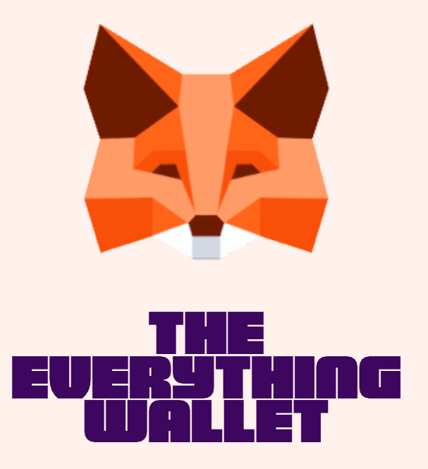
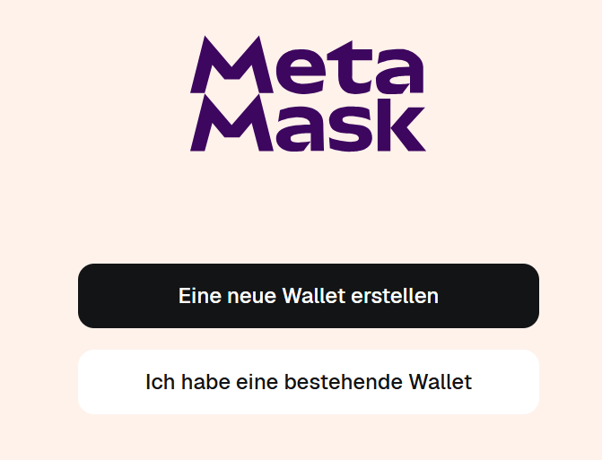

# Metamask (MM)
> AssedID = **ass001**

* [MM **Homepage**](https://metamask.io/)

* [MM **Credentials**](../../../../../../PRIV/_KEY/Assets/Services/M/Metamask.md)

* [Nord Pass](../../../../../../PRIV/_KEY/Assets/Services/N/NordPass.md): Login-Management

## Chrome-Extension
Aktuell verwende ich Metamask lediglich als "Metamask" benannte Chrome-Extension (Kann im Chrome Extension Manager ein- und ausgeschaltet werden.

## Credentials
Login-Passwörter, Seedphrase, damit gehandelte CryptoWährungen und Transaktionen verwalte ich in einem separaten [MM **Credentials**](../../../../../../PRIV/_KEY/Assets/Services/M/Metamask.md) Dokument. 

## Wiederherstellung der Wallet
1. Mittels 

1. Metamask-Extension mit Klick im Google Chrome Webbroser starten.   

2. Auf dem folgenden Schirm "Ich habe eine bestehende Wallet" klicken:  

3. **"Import mit geheimer Wiederherstellungsphrase**" klicken

4. Eingabe der 12 Wörter der Seedphrase

