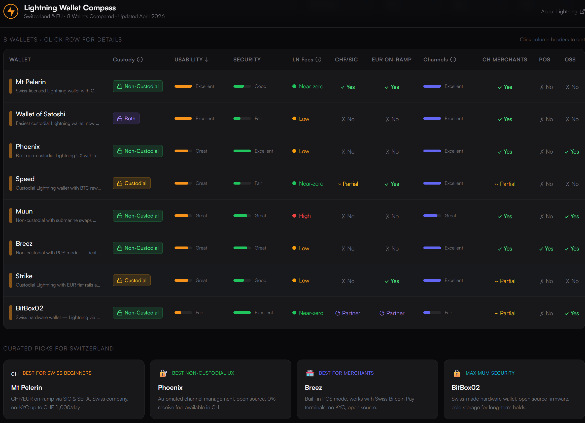

# Liste der in der Schweiz und für Schweizer relevanten Wallets

Dieser Chart wurde von mir am 21. April 2026 mittels folgendem Perplexity Prompt erstellt: 

> Build a comparison dashboard for top Lightning wallets suitable for Switzerland including Mt Pelerin Lightning Wallet, BitBox02, Wallet of Satoshi, Phoenix, Speed, Muun, Breez, and Strike. Compare usability ratings, custodial vs non-custodial, Swiss/EU fiat on-ramp support, channel management, fees, security features, and merchant acceptance in Switzerland and Europe with sortable tables and filters

## My Favorites

* **[Mt. Perlen](MtPerlen/_Mt.%20Perlen.md)**: Used for [Swiss Bitcoin Conference](../../../../INFO/Events/Swiss%20Bitcoin%20Conference.md)

