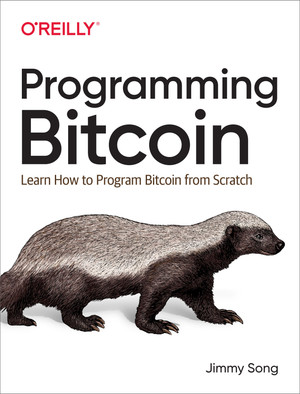

# BitCoinCore Entwickler Setup

* ! [**BitCoinCore installieren**](BitCoinCore-installieren.md): Voraussetzung!

* [BCore FileSystem](BCore_FileSystem.md): eine Uebersicht über die standardmässig installierten, Chain spezifischen Verzeichnisse und ([Konfigurations-](bitcoin.config.md)) Dateien.


    
    

* [Bitcoin Kommandozeilenprogrammierung](https://github.com/cmdruid/bitcoin-programming)

* [List of Bitcoin Resources](https://github.com/igorbarinov/awesome-bitcoin)

* [Bitcoiner.guide](https://bitcoiner.guide)

* [Bitcoin Optech Newsletter](https://bitcoinops.org)

* [Bitcointalk Forums](https://bitcointalk.org): Original Bitcoin discussion forum, founded by Theymos and Satoshi Nakamoto.

* [Bitcoin Developer's Mailing List](https://lists.linuxfoundation.org/mailman/listinfo/bitcoin-dev)


---


Im folgenden erläutere ich **wie wir BitCoinCore in der für Entwickler benötigten RegTest-Chain starten** resp. wir wir damit lokal **eine rein private, nicht synchronisierte und damit leere und deshalb höchst performante Test-Blockchain erstellen**. 

Danach erläutere ich die verschieden Art und Weisen wie man mittels Tools und HTTP RCP-Requests direkt auf den BCore Server zu greifen kann. 


## 1. BCore mit RegTest-Chain starten. 
Nachdem man BitCoinCore gem. [Installationsanleitung](BitCoinCore-installieren.md) installiert hat, kann man das **GUI in den EntwicklerModus switchen** indem man die ***bitcoin.conf*-Datei** (bei mir aktuell im *D:\@ME\DATA\BitcoinBlockchainData* Verzeichnis) **mit folgenden Werten überschreibt**:


```plaintext
regtest = 1
server = 1
txindex = 1
```
> Details zu diesen **Optionen findet man in meiner [bitcoin.config Beschreibung](bitcoin.config.md)**

> Den **aktuellen Pfad** für die bitcoin.config KonfigDatei erhält man indem man im GUI auf "**Settings**" -> "**Options**" und dort auf dem  Button **[Open Configuratoin File]** klickt. 

Nach einem **Restart** des BCore GUIS (ACHTUNG: nicht mit dem in der Windows Konsole mit [bitcoind](bitcoind.md) gestarteten Daemons verwechseln, der nach wie vor auf das "main"-Netz zeigt) erscheint nun an Stelle des orangen Startschirms (main-Netz) ein blauer, resp. **zeigt das GUI oben links nun ein BLAUES Icon**. 

Die dabei jeweils beim Starten aufpoppenden OutOfSync Warnung muss man dann (leider wiederholt) wegklicken!

## 2. Eine Wallet erstellen
* Im Menu des GUIs "**File**" wählen und darin -> "**Create Wallet**" wählen
* Ich nenne sie "***myTestWallet***"

## 3. GUI Kommandozeilen Konsole
Im Folgenden sollte man die Konsole des GUIS verwenden: Ctrl+T (T für Terminal) oder über das Menu "Windows" -> "Console". Diese GUI Konsole bietet in der Kommandozeile eine Eingabehilfe für bitcoin-Komandos. 

Ausserdem muss man in dieser Konsole auch nicht bitcoin-cli voranstellen. 

<span style="color:red; font-weight:bold">ACHTUNG</span>:die WindowsKonsole läuft i.d.R. immer noch gegen das mit "*domaind*" defaultmässig gestartete "main" Netzwerk!

## 4. RegTestnetz testen
Mit der Eingabe von 

> getblockchaininfo

erhälte man den folgenden Output

```plaintext
{
  "chain": "regtest",
  "blocks": 0,
  "headers": 0,
  "bestblockhash": "0f9188f13cb7b2c71f2a335e3a4fc328bf5beb436012afca590b1a11466e2206",
  "difficulty": 4.656542373906925e-10,
  "time": 1296688602,
  "mediantime": 1296688602,
  "verificationprogress": 1,
  "initialblockdownload": true,
  "chainwork": "0000000000000000000000000000000000000000000000000000000000000002",
  "size_on_disk": 293,
  "pruned": false,
  "warnings": [
  ]
}
```

Wichtig ist hier, **dass wir bei "chain" den Wert "regtest" stehen haben** um so sicher zu gehen, dass wir nicht auf der life main-chain sind. 


