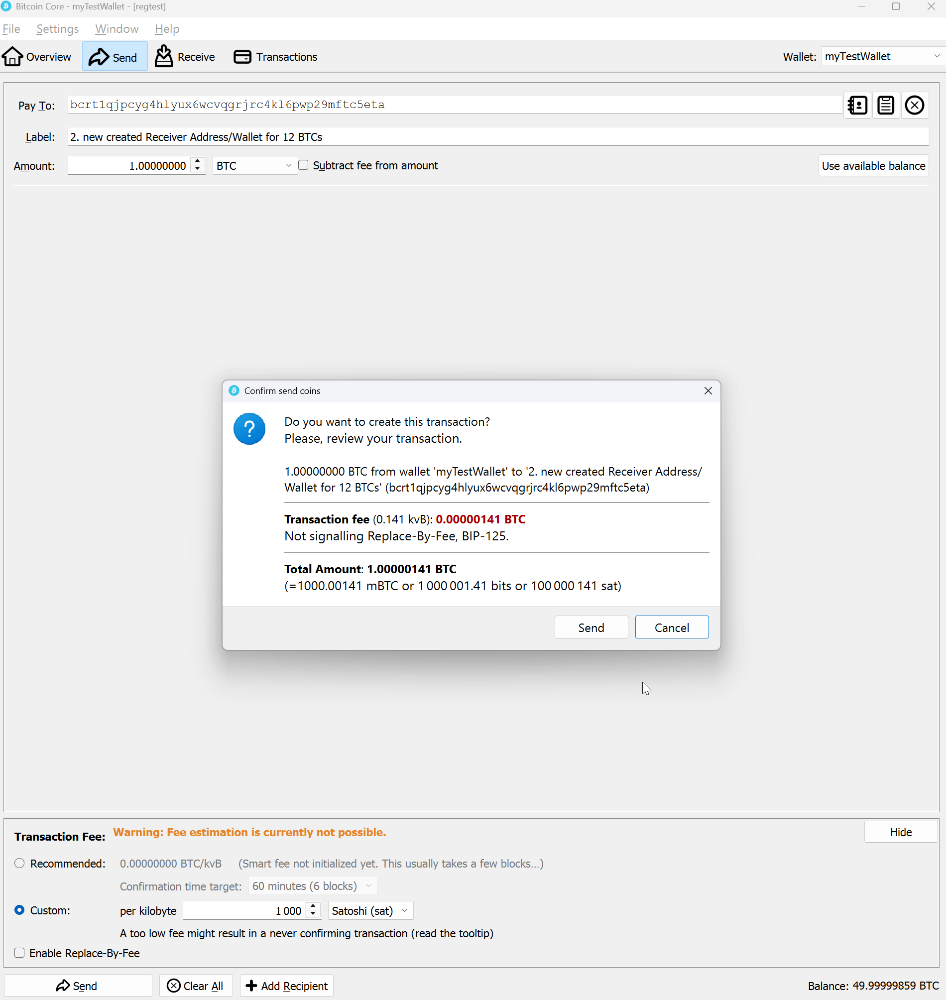

# BitCoinCore Funktionalität

## Bitcoins an sich selbst überweisen
In der BitCoinCore Wallet ist es sehr einfach sich selber Bitcoins zu überweisen. 

1. BitCoinCore im richtigen Netzwerk (Life oder TestNetz) starten. 

2. Eine Wallet auswählen und sicherstellen dass sie Geld drauf hat (Available Balance). 

3. In der Konsole mit dem [***getnewaddress***](../RPC-Calls/G/getnewaddress.md)-Kommando eine neue "bcrt"-Adressse wie z.b. "*bcrt1qjpcyg4hlyux6wcvqgrjrc4kl6pwp29mftc5eta*" generieren, und diese in die Zwischenablage kopieren. 

4. Im Menu "SEND" wählen und das Formular wie folgt ausfüllen: 

**Parameter:** 

* **Pay To**: Eine mit ***bcrt..***. beginnende, hexadezimale Empfängeradresse, die man entweder vom Empfänger erhalten hat oder die man sich z.B. mit dem [getnewaddress](../RPC-Calls/G/getnewaddress.md)-Kommando (zu Testzwecken) selbst erstellt hat. 

* **Label**: freiwillige und rein persönliche Notiz zur Empfängeradresse die dann auch so in deinem persönlichen Transaktionsprotokoll erscheinen, aber nicht auf der Blockchain verbucht wird.

* **Amount**: Den zu überweisenden Betrag in wahlweise BTC oder Satoshis. Zudem kann man hier wählen ob die Transaktionsfees automatisch abgezogen weden sollen. 

* **Custom Transaction Fee**: Im Testsystem kann man hier was Beliebibes eingeben. 1000 Satoshisi haben sich hier als "normal" eingebürgert. 

5. Mit der Betätigung des **SEND-Buttons**, werden zwei Transaktionen mit jeweils identischem Betrag eine Sender- und eine Receiver Transaktion erstellt und gelistet: 

Nach der Ueberweisung fehlen dann natürlich die Transaktionskosten im Konto (obwohl die Transaktion noch gar nicht auf die Blockchain geschrieben wurde). 

 

