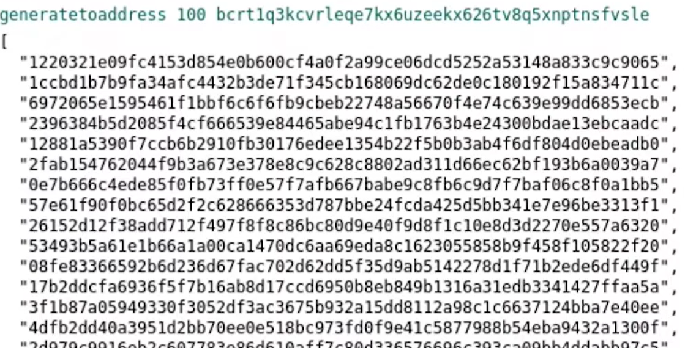

# generateToAddress (RPC Call fürs "Mining")

Das generateToAddress Kommando **generiert** die im ersten Parameter angegebene **Anzahl neuer Blocks** auf der aktuellen Blockchain (Life oder TestChain) und sendet die damit als implizite Belohnung fürs Minen (Am Anfang standardmässig immer die bekannten 50$) der so generierten neuen Bitcoins (CoinBase **Reward**) an die im zweiten Parameter angegebenen Empfänger-Adresse (Public Key).

Dieser Vorgang wird **Mining** genannt

Der MiningVorgang versucht dann die ev. im lokalen Mainpool vorhandenen Transaktionen in den Block zu schreiben. Sind keine Transaktionen vorhanden, dann bleiben diese Blocks einfach leer - werden aber trotzdem erstellt und werden as is - resp. als leere Blocks der aktuellen Blockchain angehängt und verifiziert.

Diese Funktion gibt die Kontrolle erst nach erfolgreicher Beendigung des MiningProzesses (oder einem implizit festgelegten Timeout) wieder an die Konsole zurück. Bis dahin bleibt die Konsole (entsprechend lange) blockiert und zeigt den Text "Executing...". 

Für 100 Adressen auf dem regtest-Netz dauert das Minen dieser 100 Adressen dann trotzdem gute 2 Minuten!

Die fürs Minen, resp. das Verbuchen der Bitcoins (Coinbase) benötigten Transaktionen werden in der Wallet im TransaktionsFenster aufgelistet, resp. kann man dort den Status des Miningvorgangs überprüfen. 

<span style="color:red; font-weight:bold">ACHTUNG</span>: Die damit pro Block generierten CoinBase Rewards werden erst nach jeweils weiteren 100 Blocks freigegeben und erscheinen in der Wallet dann vorläufig mal als "Immature" bis sie nach jeweils weiteren 100 neu generierten Blöcken als bestätigt gelten und in der Wallet als "Available" angezeigt werden. 

Konkret muss man nach dem Erstellen von z.B. hundert neuen Blocke, einen 101. neuen Block erstellen, um den CoinbaseReward für den so erstellten ersten Block "freizuschalten" resp. zu veranlassen, dass der CoinBase Reward in der aktiven Wallet unter "Available" angezeigt wird. 


## Syntax

> generatetoaddress nblocks "address" (maxtries)

## Input Parameter

### #1 nblocks (numeric, required)
Die Anzahl der auf diese Adresse verweisenden, neu zu erstellenden Blocks.

### #2 - address (string, required)
Die Empfängeradresse wohin die Bitcoins als Belohnung fürs Minen gesendet werden sollen. 

### #3 - maxtries (numeric, optional, default=1000000)
Nach wievielen vergeblichen Versuchen einen Block zu generieren die Iteration abgebrochen werden soll

## Output
Output ist eine Liste (Array) mit hexadezimal codierter Adressen (BlockHashes) aller so neu generierten Blocks. 

```json
[           (json array) hashes of blocks generated
  "hex",    (string) blockhash
  ...
]
```

## Beispiel 
Generiere 11 neue Blocks an meine (zuvor i.d.R mit "*bitcoin-cli getnewaddress*" neu erstellte) InputAdresse:

> bitcoin-cli generatetoaddress 11 "InputAdresse"



## Notizen
### Geblockte Belohnung
Obwohl die Belohnung an die im zweiten Input-Parameter angegebene Adresse überwiesen wurde, kann man aus Sicherheitsgründen erst nach 100 weiteren so erstellten Blocks (und auf der LifeChain durch entsprechende Verifizierung durch Peers) auf diese Bitcoins zugreifen (Escrow). 

Konkret muss man einen 101. neuen Block erstellen um den CoinbaseReward für den 1. Block "freizuschalten". 

### Führende Nullen wegen der Difficulty Adjustment
Beim Mining auf der richtigen Blockchain hätten sämtliche Adressen, wegen der aktuellen "Difficulty zur Erschwerung Minings", am Anfang viele Nullen!

Auf der der regTest Blockchain ist die Difficulty 0 und damit haben die Adressen auch nur selten Nullen am Anfang. 