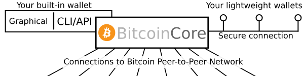

# BitCoin-Core (BCore)

* [BCores **offizielle Webseite**](https://bitcoincore.org/)  

* [Libra Bitcon Chat](https://web.libera.chat/#bitcoin)

* [BitCoinCore **Installationsnaleitung**](BitCoinCore-installieren.md)

* [UserInterface](https://bitcoin.org/en/bitcoin-core/features/user-interface)  

* [Entwickler Seite](https://developer.bitcoin.org/devguide/index.html)

* [Entwickler Docs auf GitHub](https://github.com/bitcoin-dot-org/developer.bitcoin.org)

## Was ist BitCoin Core?

## I. Technische Sicht
### Dokumentation 
BitcoinCore Dokc sind leider über drei verschiedenen Orte verteilt: 
1. Bitcoin Core App Beschreibung, 
2. dem Bitcoin Wiki, 
3. auf der Webseite von Bitcoin.org wie folgt: 

#### BitconCore Docs 
Das [GitHub Docs Verzeichnis auf developer.bitcoin.org](https://github.com/bitcoin-dot-org/developer.bitcoin.org) richtet sich vor allem an Entwickler und Test und weniger an Enduser.

#### Bitcoin Wiki
The [Bitcoin Wiki](https://bitcoin.org/en/bitcoin-core/contribute/documentation#bitcoin-wiki)
uses the popular MediaWiki software

#### Bitcoin.org RPC/REST API Reference
The [Bitcoin.org developer reference](https://developer.bitcoin.org/) contains over 100 printed pages worth of documentation for the Bitcoin Core RPC and REST interfaces, which are mainly used by Bitcoin Core command line users and developers of apps depending on Bitcoin Core.

#### Bandwidth Sharing Guide
The [Bitcoin.org bandwidth sharing guide](https://bitcoin.org/en/full-node) currently provides instructions for how to install Bitcoin Core on multiple operating systems, configure it to automatically start at boot, and manually open port 8333 so it accepts incoming connections.

## II. BenutzerSicht
Die mit BitcoinCore (im Folgenden kurz BCore genannt) gebotene Wallet verfügt sowohl über eine Benutzeroberfläche als auch eine über die Kommandozeile (CLI)  zugängliche API. 

Zudem unterstützt BCore  sogenannte Lightweight Wallets. 

> ACHTUNG:: you only get the security and privacy benefits in supported lightweight wallets if they make a secure and private connection to your Bitcoin Core every time you use them. This usually requires special configuration.

### Funktionalität der grafischen Benutzeroberläche 
#### Konto-Uebersicht
In der Uebersicht werden, sobald dein Konto eingerichtet ist, dein aktueller Kontostand, sowie deine letzten Transaktionen angezeigt. 

#### Fee-Slider
Hier kann man Kosten (low fees) versus Ausführungszeit (fast confirmation) selber einstellen

#### Coin Control
Mehr Privacy und tiefere Fees durch manuelle Auswahl der an einer Transaktion beteiligten Tokens.

#### QR Codes
QR-Codes für das Empfangen von Bitcoins

#### Invoicing
Uebersicht wer dich wann bezahlt hat

#### Proxy
verwende TOR oder einen Proxy um deine Identität besser zu schützen

#### NetzMonitoring
Ueberwachung der von dir beanspruchten Netzkapazität

#### WatchOnly support  
Verwalten von Offline gespeicherten Coins -> Cold Wallets

### Funktionalität der API
#### Neue Receiver-Adressen erstellen

#### BitCoin Konto überblicken
    
#### Geld versenden

#### List Unspent
Welche UXTOs Du noch ausgeben kannst

