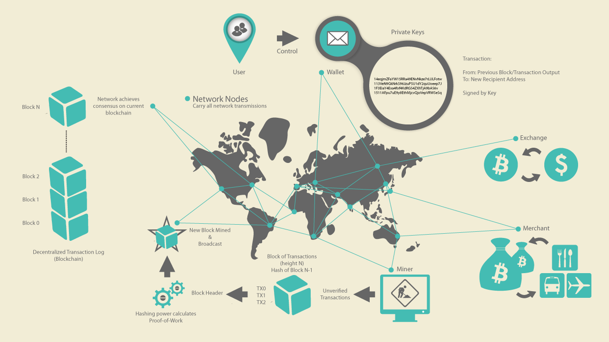

# BitCoin: eine erste Uebersicht
This folder is about specific Bitcoin-tech and its related ecology with many parts derived from the [Mastering Bitcoin eBook (`MBA`)](https://cypherpunks-core.github.io/bitcoinbook/) by [Andreas Antonopoulos](https://antonopoulos.com/) representing the status quo of 2017, which I have enhanced and updated with whatever has come in and changed since then. 

* [Technische Intro](b$TECH/BitCoin-Intro.md)

## What Is Bitcoin?
-> [(`MBA`)](https://cypherpunks-core.github.io/bitcoinbook/) 

From an investor's perspective **Bitcoin is a longterm generative asset like farmland that will generate ongoing value and profits for generations.** 

From  a technical viewpoint **Bitcoin is a collection of concepts and technologies that form the basis of a digital money ecosystem**, which, already today is used by millions. 

At its core the bitcoin system, unlike traditional banking and payment systems, is based on decentralized trust. Instead of a central trusted authority, in bitcoin, trust is achieved as an emergent property from the interactions of different participants in the bitcoin system.

In the overview diagram above, the bitcoin system consists of users with [wallets](GLOSSAR/W/Wallet.md) containing [Address Keys](GLOSSAR/A/Address.md), [Transactions](GLOSSAR/T/Transaction.md) propagated across the network, and [miners]() who produce (through competitive computation) the consensus blockchain, which is the authoritative ledger of all transactions.

Despite its relative simplicity, the system cannot be explained in a few words and needs some dedication and time to fully understand its mathematical beauty as well as its global transformative, real-world-impact. 

## How it works (high level abstract for users)
Units of currency called "bitcoin" are used to store and transmit value among participants in a so called decentralized "Bitcoin network" that nobody can  control nor take down.

Users using some kind of "bitcoin apps" communicate with each other over a standardized **bitcoin protocol** primarily via the internet (other transport networks supported for independence from increasingly centralized  infrastructure providers). 

The **Github hosted bitcoin code is open source** is run on a wide range of  devices like laptops and smartphones (independence of manfacturars). 

Users can **transfer bitcoin over the network** to buy and sell goods, send money, or extend credit (and other stuff FIAT money can do). 

Bitcoin can be purchased, sold, and exchanged for other currencies at specialized **currency exchanges**. 

However, **coins do not exist** as a persistent entity. "Coins" are only a metaphore for explaining transactions where value (expressed by coins) is transferred from a sender to a recipient or, when value is earned by miners,  in exchange for spending energy when running the underlying infrastrcture. The only thing persistently tracked is the AMOUNT of coins somebody owns (thre are no coins that can be counted!)

> Note here, that the bitcoin community has used names like "coin", "key", "wallet" etc. to visualize things to pre-crypto people, who needed analogies as some kind of bridge from their old FIAT world concepts into the new crypto-space. But it is key, that these people will understand that analogies are not the real thing and nothing must be concluded further from the original meaning to mean someting in crypto, as for example the fact: that in the FIAT world "coins" have a haptical meaning, whereas in crypto "coins" do not even exist!

Users of bitcoin own keys that allow them to prove ownership of a specific amount of bitcoin in the bitcoin network. 

With these keys they can sign transactions to unlock the value and spend it by transferring it to a new owner. Keys are often stored in a digital wallet on each user’s computer or smartphone. Possession of the key that can sign a transaction is the only prerequisite to spending bitcoin, putting the control entirely in the hands of each user.

Bitcoin is a distributed, peer-to-peer system. As such there is no "central" server or point of control. Bitcoin are created through a process called "mining," which involves competing to find solutions to a mathematical problem while processing bitcoin transactions. Any participant in the bitcoin network (i.e., anyone using a device running the full bitcoin protocol stack) may operate as a miner, using their computer’s processing power to verify and record transactions. Every 10 minutes, on average, a bitcoin miner is able to validate the transactions of the past 10 minutes and is rewarded with brand new bitcoin. Essentially, bitcoin mining decentralizes the currency-issuance and clearing functions of a central bank and replaces the need for any central bank.

The bitcoin protocol includes built-in algorithms that regulate the mining function across the network. The difficulty of the processing task that miners must perform is adjusted dynamically so that, on average, someone succeeds every 10 minutes regardless of how many miners (and how much processing) are competing at any moment. The protocol also halves the rate at which new bitcoin are created every 4 years, and limits the total number of bitcoin that will be created to a fixed total just below 21 million coins. The result is that the number of bitcoin in circulation closely follows an easily predictable curve that approaches 21 million by the year 2140. Due to bitcoin’s diminishing rate of issuance, over the long term, the bitcoin currency is deflationary. Furthermore, bitcoin cannot be inflated by "printing" new money above and beyond the expected issuance rate.

Behind the scenes, bitcoin is also the name of the protocol, a peer-to-peer network, and a distributed computing innovation. The bitcoin currency is really only the first application of this invention. Bitcoin represents the culmination of decades of research in cryptography and distributed systems and includes four key innovations brought together in a unique and powerful combination. Bitcoin consists of:

A decentralized peer-to-peer network (the bitcoin protocol)

A public transaction ledger (the blockchain)

A set of rules for independent transaction validation and currency issuance (consensus rules)

A mechanism for reaching global decentralized consensus on the valid blockchain (Proof-of-Work algorithm)

As a developer, I see bitcoin as akin to the internet of money, a network for propagating value and securing the ownership of digital assets via distributed computation. There’s a lot more to bitcoin than first meets the eye.

## Birth as an alternative currency
Bitcoin came into the world **in the wake of the Great Financial Crisis of 2008**, when the U.S. government in conjunction **with the U.S. Federal Reserve opted to print U.S. dollars en masse (debase the currency) to bail out failing banks**, the burden of which was laid both on the U.S. taxpayers and U.S. dollar holders worldwide.

Bitcoin is a decentralized money that was created as an alternative to the U.S. dollar and all other fiat currencies. Trying to convince people that bitcoin is not this is disingenuous at best, deeply manipulative at worst.

## Coins don't exist!
Analogies are just stories helping us understand something by referring to something different which we already know about. 

However, for Bitcoin some analogies are misleading: **Wallets** never contain money. **Keys** don't open locks. The **blockchain** is not a ledger and a **coin** has never existed and can never be found. 

Analogies are just starting points for understanding, but it won't take you far. After a while you have - for instance - to avoid thinking about coins, if you want to have a better understand what is REALLY happening!

