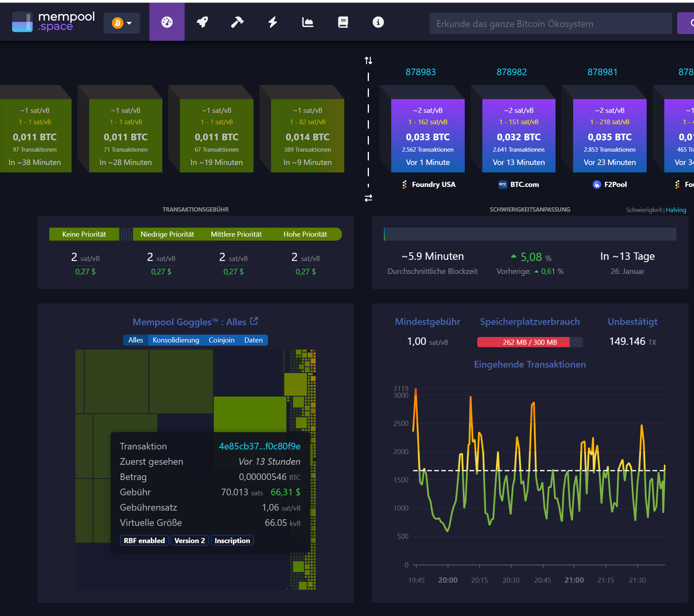

# Bitcoin Transaction Fees
-> https://mempool.space/de/

## Merkpunkte

### 1. Nur auf dem LayerOne relevant
Transaktionsgebühren sind **nur auf dem Layer One ein Thema**, resp. wenn man Transaktionen für die Ewigkeit in der Blockchain verewigen will oder muss, währenddem z.B. die "gleichen" Transaktionen auf dem Lightning-Netzwerk ausgeführt nicht nur um den Faktor 100 günstiger sind, sondern auch beträchtlich weniger Energie benötigen. 

### 2. Transaktionskosten basieren auf der Anzahl UXTOs
Transaktionsgebühren werden i.d.R in SATS berechnet.

Transaktsionsgebühren haben NICHTS (auch nicht prozentual) mit den übermittelten BitCoin-Beträgen zu tun hat, sondern lediglich mit der ANZAHL der dafür benötigten [UTXO's](../../../../../GLOSSAR/U/UTXO.md), resp. der benötigen Datenmenge, um diese Transaktion auf dem Layer-One als eine für den BitCoin-Betrag benötigten UTXOs auf der Bitcoin-Blockchain für die Ewigkeit zu vermerken. 

Die effektiven Transaktionskosten berechnen sich aus dem sich laufende änderden Preis für die im nächsten Block zu schreibende Datenmenge, also die Anzanl der an der Transaktion beteiligten UTXOs multipliziert mit deren Grösse in [Virtual Bytes (vB)](../../GLOSSAR/V/vB.md) mal die aktuellen Kosten pro [vB](../../GLOSSAR/V/vB.md). 

-> Transaktionskosten = (`Anzahl UTXOs` x `UTXO Grösse` in vB x `sat/vB`) 

> Man merke: **Viele kleine UTXOs = hohe Transaktionskosten**. 

### 3. dynamische Netzwerkkosten
Die mittleren Transaktionskosten (in SATS) pro [vB](../../GLOSSAR/V/vB.md) richten sich nach der aktuellen Auslastung der Blockchain, rsp. der Anzahl der noch pendenten Transaktionen. 

Die z.B. im auf [Mem Pool.Space](../DataStructures/MemPool.md) angezeigten sat/vb sind damit nicht verbindlich sondern nur ein Richtwert, resp. liegt es einzig und allein am Absender einer Transaktion seine Fees richtig einzuschätzen und so festzulegen dass seine Transaktion nicht ewig im MemPool hängen bleibt. 

### 4. Transaktionsgebühren werden vom Absender festgelegt
Auch wenn einige Wallets und Online-Börsen automatisch Transaktionsgebühren festlegen (i.d.R ihre eigenen Gebühren nämlich, die absolut nichts mit dem LayerOne-BitCoin Netzwerk zu tun haben und rein Anbieter intern verrechnet werden) werden und **muss die Höhe der Transaktionsgebühr explizit immer vom Absender resp. Owner der Transaktion SELBST BESTIMMT werden!**. 

Der vom Absender festzulegende Preis wird in SATS ausgedrückt und ist für die GESAMTE Transaktion, resp. liegt es am Absender - resp. seiner Wallet  - diese Gebühr auf Grund der Anzahl an der Transaktion beteiligten UTXOs resp. der dafür benötigten Datenmenge und dem aktuellen z.B. auf MemPool.spacce abzulesenen sat/vB Preis abzuschätzen. 

Es ist nun aber einfach so, dass Transaktionen mit vom Absender festgelegten für die gesamte Transaktoin höheren Fees bevorzugt in den nächsten Block aufgenommen weden, währendem Transaktionen mit (zu) wenig Fees unter Umständen ewig im Mempool hängen bleiben (und dort insbesondere von Anfängern nur mit viel Aufwand und Geld wieder gelöst werden können!). 

### 5. Transaktionsgebühren erhöhen
Die Transaktionsgebühren von Bitcoin passen sich stets an die aktuelle Nachfrage im Netzwerk an. Schließlich ist der Speicherplatz in den Blöcken auf 4 MegaByte begrenzt, und Nutzer müssen entsprechend, ähnlich wie bei einer Auktion, möglichst hoch bieten, um von den Minern bevorzugt zu werden.

Schnell kann es passieren, dass man die Transaktionsgebühr zu niedrig wählt, oder die allgemeine Nachfrage plötzlich so stark zunimmt, sodass man von anderen schnell überboten wird. 

Mittels den zwei Verfahren
1. "Replace By Fee" (RBF) oder 
2. "Child Pays For Parent" (CPFP)

kann man relativ einfach die Gebühr der Transaktion nachträglich erhöhen und damit die Bestätigung einer "feststeckenden Transaktion" beschleunigen. 
Diese Funktionen werden zwar (noch) nicht von allen Wallets unterstützt, aber es gibt diese Verfahren. Und damit sollte man sich nie wegen feststeckenden Transaktionen sorgen, oder aus Angst, stecken zu bleiben, unnötig überhöhte Transaktionsgebühren bezahlen!

### 6. Transaktionskosten gehen an den Miner
Die gesamten Transaktionskosten gehen an den Miner des Blocks, in welchem deine Transaktion (inkl. deiner von DIR festgesetzten Transaktionsgebühr) auf der Blockchain für die Ewigkeit verbucht wurde. 

## Transaktionskosten und [Halving](../../GLOSSAR/H/Halving-BTC.md)

Durch das im BTC-Code fix codierte [Halving](../../GLOSSAR/H/Halving-BTC.md) sinkt die Belohnung für BTC-Schürfer in Form von BTCs fortwährend bis im Jahr 2140 auf Null. Diese "Ertragsminderungen" werden deshalb laufend durch Transactionfees ersetzt (deren zukünftige Höhe schlecht abschätzbar sind, aber auch nicht unbedingt immer höher sein werden). 

Die Höhe dieser Transaction Fee richten sich nach dem globalen Transaktonsvolumen und was deren Beteiligte zu zahlen bereit sind. 

Bei einer Transaktion zeigt jede Wallet die geschätzten Transaktionfee an. Diese Fees können im Web - z.B. über https://mempool.space/de/ - auch in Echtzeit verfolgt werden: 

