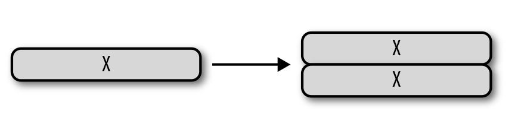

# Die SCRIPT Programmiersprache (für die BTC Programmierung)

* [Script](../../GLOSSAR/S/Script.md) (im Glossar)

# SCRIPT die Programmiersprache der Blockchain-Technologie (GLOSSAR)

* [Bitcont Script 101](https://kingslanduniversity.com/bitcoin-script-101/)

Script ist die "Mini"-Programmiersprache der Bitcoin-Technologie, um den Zugriff auf die in der Blockchain gespeicherten "Bitcoins" zu verwalten.

Scriptcode ist i.d.R. nicht Teil des Sourcecodes von BitCoinCore, sondern Teil der in der Blockchain gespeicherten Transaktions-Daten, und wird nur ausgeführt, um letztere zu verschlüsseln, zu entschlüsseln und/oder "BitCoins" resp. UTXOs zu transferieren. 

## Grundlegende Script Mechanik 
-> Mehr highlevel Details findet man im [Glossar zum Thema "Scrip"](../../GLOSSAR/S/Script.md)
Die Logik mit der Bitcoin-Transaktionen ausgeführt werden, ist nicht statisch im Code von Bitcoin-Core gespeichert, sondern in Form eines Scripts Bestandteil von [BitCoin-Transaktionen](../T/Transaction/Transaction.md). 

Rein funktional beschränkt sich SCRIPET-Kommandos darauf, **auszudrücken, unter welchen Bedingungen UTXOs ausgegeben (unlocked) werden**. 

Die Summe aller im Script codierten Regeln bilden den "**Smart Contract**". 

Die "Ausführung" resp. die "Verifikation" einer Transaktion besteht  darin, das Script dieser Transaktion auszuführen und das Endresultat zu testen: Kommt dabei "TRUE" heraus, ist die Transaktion gültig, sonst nicht. 

Dies erlaubt die Definition einer schier unendliche Anzahl verschiedener Scripts "on the fly" im Sinne von "programmierbarem Geld", ohne den statischen BitCoin-Core-Code anpassen zu müssen.

Technisch Script ist eine [stack-based](#stack-based-programmierprinzipien) Scriptsprache und erinnert an Forth, welche ebenfalls Zwischenwerte auf dem Stack speichert, kombiniert und wieder löscht.

Scripts sind Teil der TransactionsDaten, resp. umfasst jede Transaktion i.d.R zwei Scripts: 

1. ein **LockingScript** für das **Verschlüsseln (locking) von UTXOs**, so dass diese nur noch vom Empfänger entsperrt werden können und 

2. ein **UnLockingScript** für das **Entschlüsseln (unlocking) von UTXOs** durch den Empfänger.

Durch diese lock/unlock-Mechanik (einem sogenannten "**Smart Contract**") werden UTXOs auf anderen Konto gutgeschrieben (und damit "transferiert"). Hierzu verwendet Script (die Programmiersprache) mathematische Funktionen, u.a. die der "elliptische KurvenKryptografie". 

### 1. Locking Script
Das "LockingScript" ist innerhalb der Transaktion im **"ScriptPubKey"** benannten Datenfeld codiert. Es funktioniert wie ein Schliessfach für die dort deponierten UTXOs auf die, nachdem die Transaktion in die Blockchain geschrieben wurde, nur noch der Empfänger über seinen Privaten Schlüssel Zugriff hat. 

### 2. Unlocking Script
Das Script für das Unlocking befindet sich im **"ScriptSig"** benannten DatenFeld der Transaktion. Mit der Ausführung dieses Scripts mittels PrivatKey bezeugt der Empfänger, dass er der rechtmässige Empfänger der UTXOS ist (Weil der Absender zum Verschlüsseln den PublicKey des Empfängers verwendet hatt). 

## Funktionsweise von Script
Script, die für die sogenannten “Smart Contracts” der Bitcoin Blockchain verwendete ProgrammierSprache, kennt keine Schleifen, und ist damit nicht "Turing complete". 

Sie arbeitet Kommandos damit stur von ob nach unten zeilenweise ab.

Kommandos enthalten Elemente (Daten) und Operatoren welche mit diesen Elementen arbeiten. 

**Elemente** sind 1 bis maximal 520 Bytes lange ByteStrings die auf den Stack gepushed werden. Beispiele sind die DER-signature oder der SEC-pubkey 

**Operationen** nehmen Null, ein oder mehrere dieser Elemente vom Stack, berechnen daraus Null, ein oder mehrere neue Elemente und pushen diese wieder auf den Stack. 

Zum Beispiel verdoppelt der "*OP_DUP*"-Operator das oberste Stackelement wie folgt:   

Am Ende des Scripts sollte ein einziges Element mit einem Nicht-Null Wert überig bleiben. Ist der Stack am Ende leer oder das Element 0, dann wurde das Script nicht erfolgreich ausgeführt: damit wird die Transaktion bei der Validierung nicht in den Block und damit nicht in die Blockchain aufgenommen.  

### Stack Based Programmierprinzipien
“Stack-based” means instead of defining variables that act like named memory locations, and passing them around like that to functions, we use a stack data structure: functions take their parameters from the top of the stack, and return their results at the top of the stack.

---
**Example 1 **: 

---

**Example 2 **: 

To calculate the expression `(2 + 3) * (6 + 1)`: 

1. press 2 and [ENTER] to push  “2” onto the stack.

2. press 3 and [ENTER], to push “3” onto the stack. 

3. press `[+]`, which takes the two top-most values from the stack (e.g. deletes them from the stack), adds them, and pushes the result = "5" back on top of the stack so that at the end the stack has "5" at the top as the only value stored.
---
Script is deliberately limited  and has no loops and no complex flow control other than conditional flow control. 

This ensures that scripts have limited complexity and predictable execution times and ensures that it cannot be used to create an infinite loop or other forms of denial-of-service attack against the bitcoin network when every transaction is validated by every full node on the bitcoin network. 

When a transaction is validated, the unlocking script in each input is executed alongside the corresponding locking script to see if it satisfies the spending condition.

Today, most transactions processed through the bitcoin network have the form "Payment to Bob’s bitcoin address" and are based on a script called a `Pay-to-Public-Key-Hash` script. 

However, bitcoin transactions are not limited to this. In fact, **locking scripts can be written to express a vast variety of complex conditions**. 

---

## Bitcoin Transaction Scripts

### How a Bitcoin Transaction works (abstract)
In Bitcoin, every [Transaction](../T/Transaction/Transaction.md) has a number of associated inputs and outputs. The inputs “fund” the transaction, while the outputs specify the destinations and the respective amounts. When your wallet shows you how much money you have, it’s showing you the sum of the unspent transaction outputs (UTXOs) that you have the keys for to use as inputs – the Bitcoin that you can spend.

A UTXO can be spent only once, and is always spent completely – if you want to spend less Bitcoin than the UTXO is for, just create additional transaction outputs that “return” some BTC back to you (in other words, create new UTXOs that you control, for the amount that you want to receive as “change”).

### Input Validation
To verify whether a [Transaction](../T/Transaction/Transaction.md) is valid **for all a transaction's inputs Bitcoin will run the input’s attached script, and, immediately after that, it will run the script of the referenced transaction’s output**. Those two halves of the script are traditionally called `scriptSig` (the one that supplies the values) and `scriptPubKey` (the one that does the check).

---

